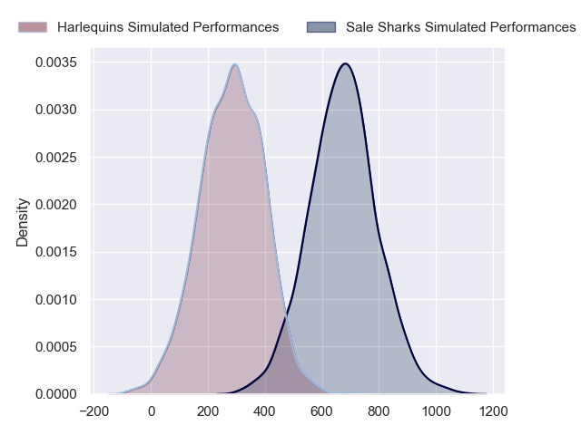
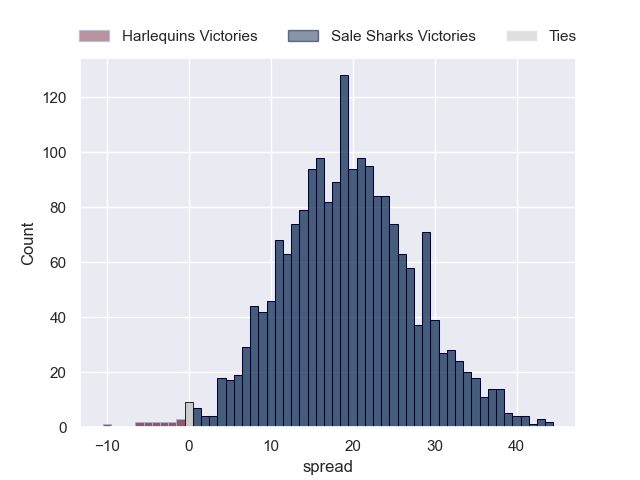
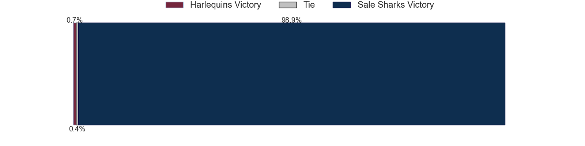

---  
layout: page  
title: Harlequins at Sale Sharks  
date: 2024-09-22 18:00:00 -0500  
categories: "Premiership 2024" match projection  
---
# Harlequins at Sale Sharks

# Club Level Predictions

The first set of predictions treats a club as the smallest object, as the club develops its members, organizes a gameplan, and deploys its players as needed for each match. This club model has a prediction of 0.547, which translates to predicting Sale Sharks to win by 5.0.

Our Over/Under is 58.5 - and combined with the spread above, we have a predicted scoreline of 27 to 32

Each club has a rating and a rating deviation (similar to a Glicko rating), and expected performances can be generated. This allows for simulated matches and spreads like the ones below.
## Projected Performances - Club Model

## Projected Spreads - Club Model

## Projected Results - Club Model

# Player Level Predictions

Treating teams instead as an entity made up of the currently active players, I have ratings for each player in an altogether different system. These can be combined to form team ratings once teamsheets are announced, weighting starters a bit higher than the reserves. After the match is played, players can be weighted by their minutes on the field, allowing for an accurate measure of the team's composition. With these compiled team ratings, we can make predictions, measure inaccuracy, and update the individual player ratings.
## Prediction without Player Minutes: Sale Sharks by 20.2

Sale Sharks by 12.3 on a neutral pitch

## Projected Performances - Player Model

## Projected Spreads - Player Model

## Projected Results - Player Model

| Away Player     |   Away Percentile |   Number |   Home Percentile | Home Player                    |
|:----------------|------------------:|---------:|------------------:|:-------------------------------|
| Fin Baxter      |             37.58 |        1 |             95.14 | Bevan Rodd                     |
| Jack Walker     |              3.67 |        2 |             92.11 | Luke Cowan-Dickie              |
| Titi Lamositele |             50.31 |        3 |             91.51 | Asher Opoku-Fordjour           |
| Irne Herbst     |             59.05 |        4 |             92.01 | Ernst van Rhyn                 |
| Stephan Lewies  |             76.03 |        5 |             41.07 | Hyron Andrews                  |
| Jack Kenningham |             39.98 |        6 |             91.58 | Tom Curry                      |
| Will Evans      |             78.41 |        7 |             70.32 | Ben Curry                      |
| Alex Dombrandt  |             81.54 |        8 |             99.53 | Jean-Luc du Preez              |
| Will Porter     |             26.57 |        9 |             63    | Gus Warr                       |
| Jarrod Evans    |             90.65 |       10 |             96.88 | George Ford                    |
| nan             |            nan    |       11 |             96.53 | Tom O'Flaherty                 |
| Lennox Anyanwu  |             41.72 |       12 |            nan    | Rob Du Preez                   |
| Luke Northmore  |             77.51 |       13 |             97.44 | Waisea Nayacalevu Vuidravuwalu |
| Nick David      |             71.53 |       14 |             86.73 | Tom Roebuck                    |
| Leigh Halfpenny |             82.24 |       15 |             14.02 | Joe Carpenter                  |
| Nathan Jibulu   |            nan    |       16 |            nan    | Ethan Caine                    |
| Jordan Els      |             51.02 |       17 |             21.49 | Tumy Onasanya                  |
| Simon Kerrod    |             65.61 |       18 |             21.4  | James Harper                   |
| Joe Launchbury  |             98.22 |       19 |             87.13 | Josh Beaumont                  |
| Dino Lamb       |             94.35 |       20 |            nan    | nan                            |
| Danny Care      |             99.24 |       21 |             32.23 | Sam Dugdale                    |
| nan             |            nan    |       22 |            nan    | Nye Thomas                     |
| Cassius Cleaves |             37.96 |       23 |             94.29 | Will Addison                   |

