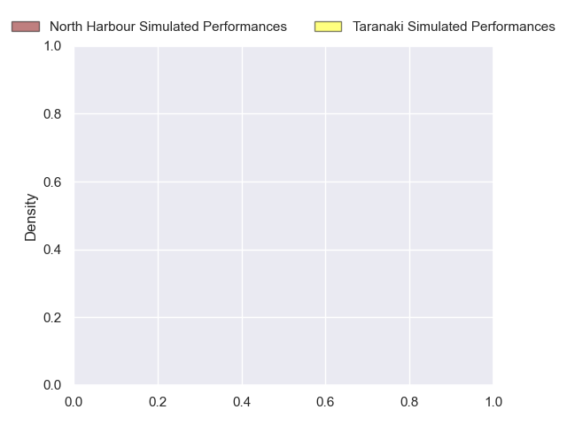
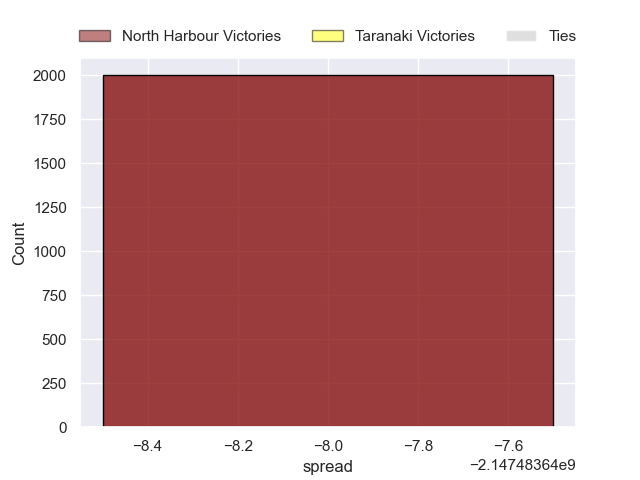

---  
layout: page  
title: North Harbour at Taranaki  
date: 2024-09-25 18:00:00 -0500  
categories: "National Provence Championship 2024" match projection  
---
# North Harbour at Taranaki

# Club Level Predictions

The first set of predictions treats a club as the smallest object, as the club develops its members, organizes a gameplan, and deploys its players as needed for each match. This club model has a prediction of 0.812, which translates to predicting Taranaki to win by 13.2.

Each club has a rating and a rating deviation (similar to a Glicko rating), and expected performances can be generated. This allows for simulated matches and spreads like the ones below.
## Projected Performances - Club Model

## Projected Spreads - Club Model

## Projected Results - Club Model

# Player Level Predictions

Treating teams instead as an entity made up of the currently active players, I have ratings for each player in an altogether different system. These can be combined to form team ratings once teamsheets are announced, weighting starters a bit higher than the reserves. After the match is played, players can be weighted by their minutes on the field, allowing for an accurate measure of the team's composition. With these compiled team ratings, we can make predictions, measure inaccuracy, and update the individual player ratings.
## Prediction without Player Minutes: North Harbour by nan

North Harbour by 2.9 on a neutral pitch

## Projected Performances - Player Model

## Projected Spreads - Player Model

## Projected Results - Player Model

| Away Player       |   Away Percentile |   Number |   Home Percentile | Home Player                   |
|:------------------|------------------:|---------:|------------------:|:------------------------------|
| Ben Ruzich        |               nan |        1 |               nan | Mitch O'Neill                 |
| Bryn Gordon       |               nan |        2 |               nan | Bradley Slater                |
| Sione Mafile’o    |               nan |        3 |               nan | Reuben O'Neill                |
| Mahonri Ngakuru   |               nan |        4 |               nan | Jesse Parete                  |
| Cameron Suafoa    |               nan |        5 |               nan | Josh Lord                     |
| Tristyn Cook      |               nan |        6 |               nan | Arese Poliko                  |
| Jed Melvin        |               nan |        7 |               nan | Michael Loft                  |
| Lotu Inisi        |               nan |        8 |               nan | Kaylum Boshier                |
| Siaosi Nginingini |               nan |        9 |               nan | Logan Crowley                 |
| Tane Edmed        |               nan |       10 |               nan | Josh Jacomb                   |
| Moses Leo         |               nan |       11 |               nan | Kini Naholo                   |
| James Little      |               nan |       12 |               nan | Daniel Rona                   |
| Fine Inisi        |               nan |       13 |               nan | Josh Setu                     |
| Tima Fainga'anuku |               nan |       14 |               nan | Vereniki Tikoisolomone        |
| Kade Banks        |               nan |       15 |               nan | Jacob Ratumaitavuki-Kneepkens |
| Shilo Klein       |               nan |       16 |               nan | Ricky Riccitelli              |
| Tevita Mafile’o   |               nan |       17 |               nan | Perry Lawrence                |
| Fatongia Paea     |               nan |       18 |               nan | Michael Bent                  |
| Sam Slade         |               nan |       19 |               nan | Jayden Sa                     |
| Felix Kalapu      |               nan |       20 |               nan | Nathaniel Peters              |
| Bryn Hall         |               nan |       21 |               nan | Adam Lennox                   |
| Tom Barham        |               nan |       22 |               nan | Ethan Reti                    |
| Shaun Stevenson   |               nan |       23 |               nan | Obey Samate                   |

