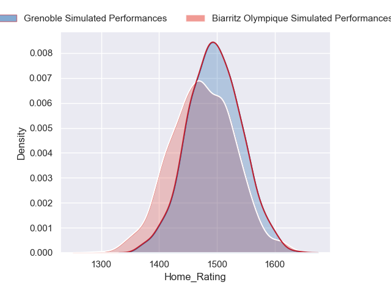
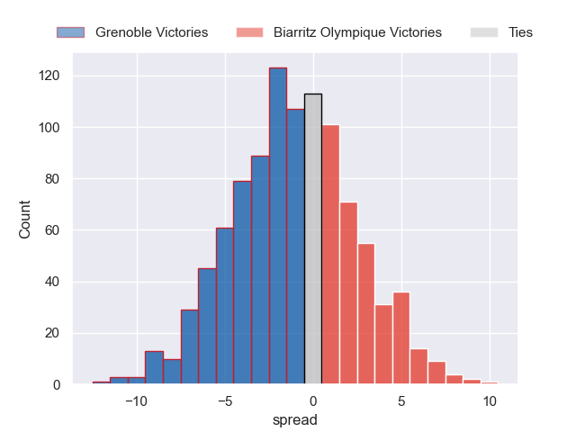
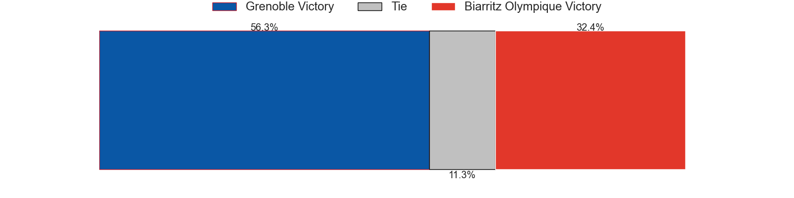
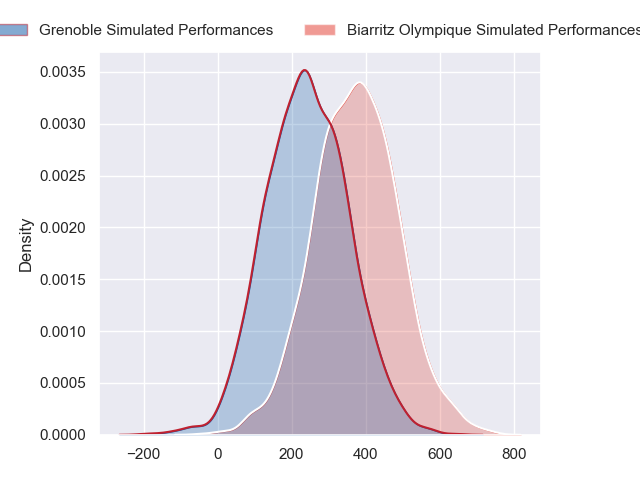
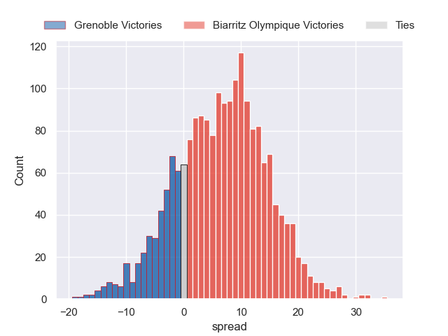
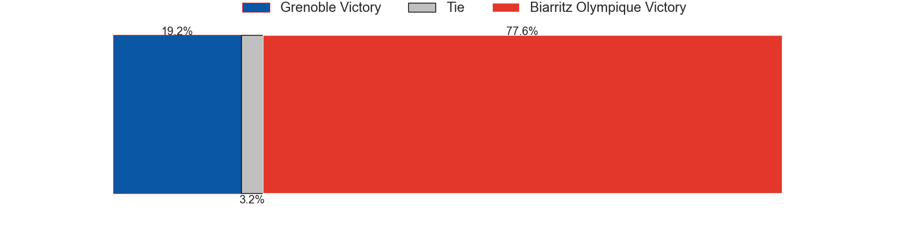

---  
layout: page  
title: Grenoble at Biarritz Olympique  
date: 2024-09-26 18:00:00 -0500  
categories: "Pro D2 2024" match projection  
---
# Grenoble at Biarritz Olympique

# Club Level Predictions

The first set of predictions treats a club as the smallest object, as the club develops its members, organizes a gameplan, and deploys its players as needed for each match. This club model has a prediction of 0.374, which translates to predicting Grenoble to win by 1.1.

Our Over/Under is 34.5 - and combined with the spread above, we have a predicted scoreline of 18 to 17

Each club has a rating and a rating deviation (similar to a Glicko rating), and expected performances can be generated. This allows for simulated matches and spreads like the ones below.
## Projected Performances - Club Model

## Projected Spreads - Club Model

## Projected Results - Club Model

# Player Level Predictions

Treating teams instead as an entity made up of the currently active players, I have ratings for each player in an altogether different system. These can be combined to form team ratings once teamsheets are announced, weighting starters a bit higher than the reserves. After the match is played, players can be weighted by their minutes on the field, allowing for an accurate measure of the team's composition. With these compiled team ratings, we can make predictions, measure inaccuracy, and update the individual player ratings.
## Prediction without Player Minutes: Biarritz Olympique by 6.8

Grenoble by 2.2 on a neutral pitch

## Projected Performances - Player Model

## Projected Spreads - Player Model

## Projected Results - Player Model

| Away Player        |   Away Percentile |   Number |   Home Percentile | Home Player             |
|:-------------------|------------------:|---------:|------------------:|:------------------------|
| Zack Gauthier      |            nan    |        1 |            nan    | Alexandre Plantier      |
| Bastien Soury      |            nan    |        2 |            nan    | Clément Martinez        |
| Johannes Jonker    |             68.26 |        3 |            nan    | Giorgi Dzmanashvili (2) |
| Pierce Phillips    |            nan    |        4 |            nan    | Adrian Motoc            |
| Brandon Nansen     |            nan    |        5 |             82.93 | Piula Fa'asalele        |
| Antonin Berruyer   |            nan    |        6 |            nan    | Filimo Taofifenua       |
| Jose Madeira       |            nan    |        7 |            nan    | Jessy Jegerlehner       |
| Pio Muarua         |            nan    |        8 |            nan    | Masivesi Dakuwaqa       |
| Barnabé Couilloud  |            nan    |        9 |             62.88 | Kerman Aurrekoetxea     |
| Max Clément        |            nan    |       10 |            nan    | Thomas Dolhagaray       |
| Kaminieli Rasaku   |            nan    |       11 |            nan    | Baptiste Fariscot       |
| Julien Heriteau    |            nan    |       12 |            nan    | Tyler Morgan            |
| Romain Fusier      |            nan    |       13 |            nan    | Mathieu Acebes          |
| Wilfried Hulleu    |            nan    |       14 |            nan    | Zach Kibirige           |
| Julien Farnoux     |            nan    |       15 |            nan    | Kylian Jaminet          |
| Mathis Sarragallet |            nan    |       16 |            nan    | Brendan Lebrun          |
| Tommy Raynaud      |            nan    |       17 |            nan    | Giorgi Nutsubidze       |
| Thomas Lainault    |            nan    |       18 |            nan    | Levi Douglas            |
| Richard Hardwick   |             76.28 |       19 |            nan    | Ekain Imaz Agirre       |
| Eric Escande       |            nan    |       20 |            nan    | Edgar Retière           |
| Yan Lestrade       |            nan    |       21 |            nan    | Yoni Tuataane           |
| Marc Palmier       |            nan    |       22 |            nan    | Yann David              |
| Cody Thomas        |            nan    |       23 |            nan    | Nikoloz Narmania        |

