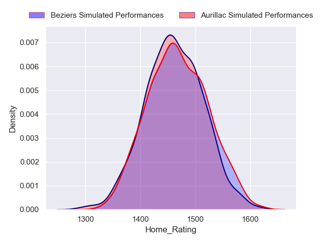
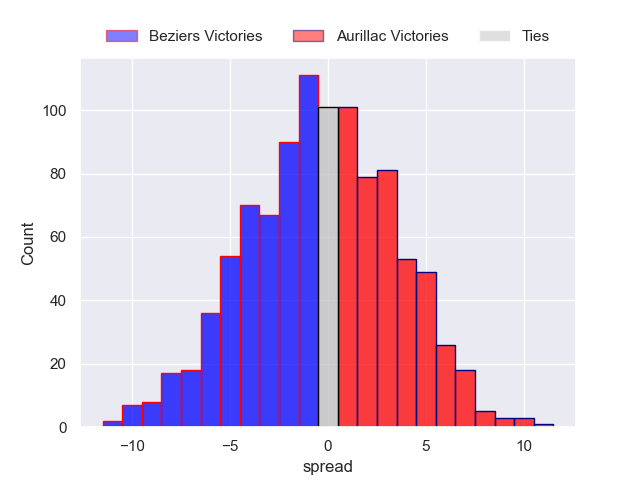
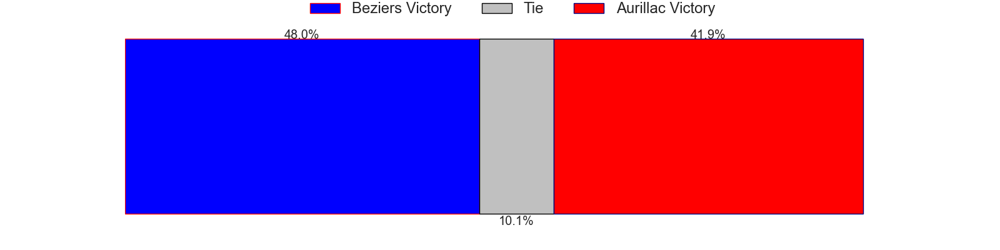
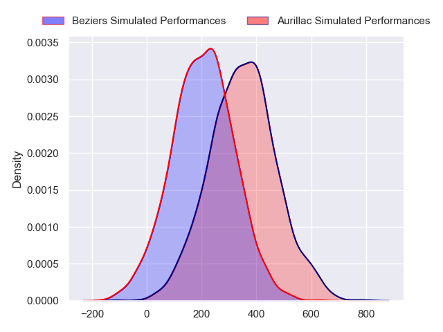
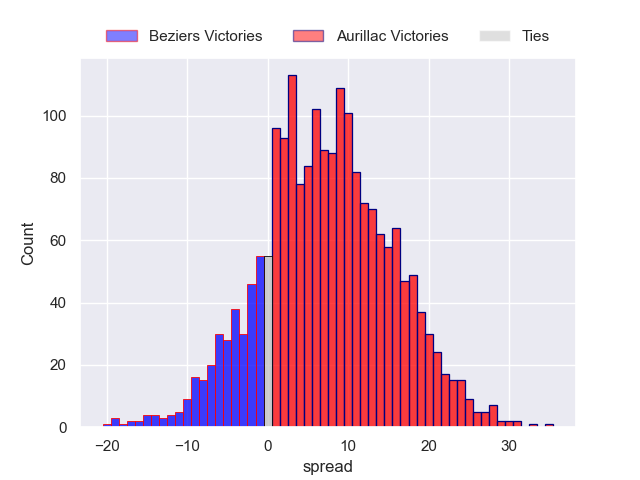
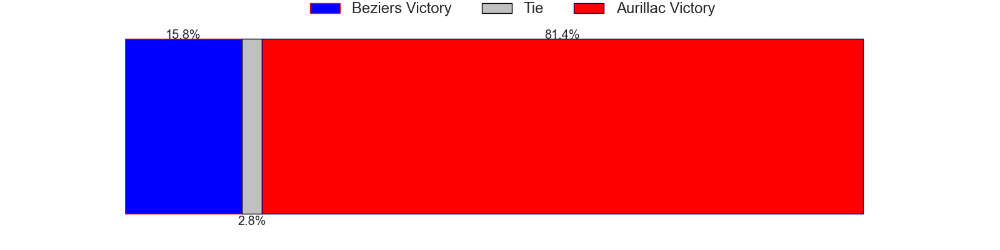

---  
layout: page  
title: Beziers at Aurillac  
date: 2024-09-27 18:00:00 -0500  
categories: "Pro D2 2024" match projection  
---
# Beziers at Aurillac

# Club Level Predictions

The first set of predictions treats a club as the smallest object, as the club develops its members, organizes a gameplan, and deploys its players as needed for each match. This club model has a prediction of 0.397, which translates to predicting Beziers to win by 0.3.

Our Over/Under is 33.5 - and combined with the spread above, we have a predicted scoreline of 17 to 17

Each club has a rating and a rating deviation (similar to a Glicko rating), and expected performances can be generated. This allows for simulated matches and spreads like the ones below.
## Projected Performances - Club Model

## Projected Spreads - Club Model

## Projected Results - Club Model

# Player Level Predictions

Treating teams instead as an entity made up of the currently active players, I have ratings for each player in an altogether different system. These can be combined to form team ratings once teamsheets are announced, weighting starters a bit higher than the reserves. After the match is played, players can be weighted by their minutes on the field, allowing for an accurate measure of the team's composition. With these compiled team ratings, we can make predictions, measure inaccuracy, and update the individual player ratings.
## Prediction without Player Minutes: Aurillac by 7.5

Beziers by 0.4 on a neutral pitch

## Projected Performances - Player Model

## Projected Spreads - Player Model

## Projected Results - Player Model

| Away Player         |   Away Percentile |   Number |   Home Percentile | Home Player           |
|:--------------------|------------------:|---------:|------------------:|:----------------------|
| Francisco Fernandes |              8.82 |        1 |            nan    | Irakli Mchedlidze     |
| Yanis Boulassel     |            nan    |        2 |            nan    | Ronan Loughnane       |
| Christian Judge     |            nan    |        3 |            nan    | Giorgi Kartvelishvili |
| Cam Dodson          |            nan    |        4 |            nan    | Eoghan Masterson      |
| Pierre Gayraud      |            nan    |        5 |             76.12 | Koen Bloemen          |
| Clement Doumenc     |            nan    |        6 |             35.01 | Tim De Jong           |
| Gillian Benoy       |            nan    |        7 |            nan    | Didier Tison          |
| Sias Koen           |            nan    |        8 |            nan    | Abongile Nonkontwana  |
| Samuel Marques      |            nan    |        9 |            nan    | David Delarue         |
| Charly Malié        |            nan    |       10 |             71.51 | Tedo Abzhandadze      |
| Paul Réau           |            nan    |       11 |            nan    | Lucas Oudard          |
| Watisoni Votu       |            nan    |       12 |            nan    | Ofa Manuofetoa        |
| Branden Holder      |            nan    |       13 |            nan    | Hugo Bastard          |
| Pierre Courtaud     |            nan    |       14 |            nan    | Simeli Yabaki         |
| Gabin Lorre         |            nan    |       15 |            nan    | Dachi Papunashvili    |
| Jose Luis Gonzalez  |            nan    |       16 |            nan    | Luka Nioradze         |
| Yahnis El Maslouhi  |            nan    |       17 |            nan    | Robbie Rodgers        |
| Hans N'Kinsi        |            nan    |       18 |            nan    | Martial Rolland       |
| William Van Bost    |            nan    |       19 |            nan    | Mehdi Slamani         |
| Damien Añon         |            nan    |       20 |            nan    | Hugo Huurman          |
| Shahn Eru           |            nan    |       21 |             65.67 | Mikheil Alania        |
| Maxime Vacquier     |            nan    |       22 |            nan    | Axel Bévia            |
| John Henry Fincham  |            nan    |       23 |            nan    | Valentin Welsch       |

