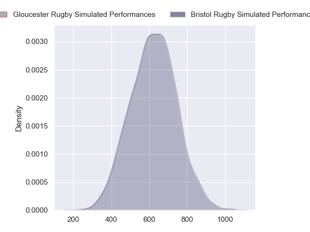
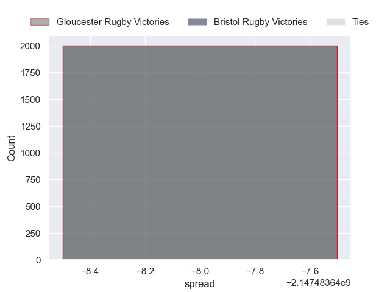

---  
layout: page  
title: Gloucester Rugby at Bristol Rugby  
date: 2024-09-27 18:00:00 -0500  
categories: "Premiership 2024" match projection  
---
# Gloucester Rugby at Bristol Rugby

# Club Level Predictions

The first set of predictions treats a club as the smallest object, as the club develops its members, organizes a gameplan, and deploys its players as needed for each match. This club model has a prediction of 0.616, which translates to predicting Bristol Rugby to win by 7.5.

Our Over/Under is 46.5 - and combined with the spread above, we have a predicted scoreline of 19 to 27

Each club has a rating and a rating deviation (similar to a Glicko rating), and expected performances can be generated. This allows for simulated matches and spreads like the ones below.
## Projected Performances - Club Model

## Projected Spreads - Club Model

## Projected Results - Club Model

# Player Level Predictions

Treating teams instead as an entity made up of the currently active players, I have ratings for each player in an altogether different system. These can be combined to form team ratings once teamsheets are announced, weighting starters a bit higher than the reserves. After the match is played, players can be weighted by their minutes on the field, allowing for an accurate measure of the team's composition. With these compiled team ratings, we can make predictions, measure inaccuracy, and update the individual player ratings.
## Prediction without Player Minutes: Bristol Rugby by 11.2

Bristol Rugby by 6.2 on a neutral pitch

## Projected Performances - Player Model

## Projected Spreads - Player Model

## Projected Results - Player Model

| Away Player         |   Away Percentile |   Number |   Home Percentile | Home Player                |
|:--------------------|------------------:|---------:|------------------:|:---------------------------|
| Mayco Vivas         |            nan    |        1 |            nan    | Ellis Genge                |
| Jack Singleton      |            nan    |        2 |            nan    | Gabriel Oghre              |
| Kirill Gotovtsev    |             92.8  |        3 |            nan    | George Kloska              |
| Freddie Thomas      |            nan    |        4 |            nan    | James Dun                  |
| Matias Alemanno     |            nan    |        5 |            nan    | Joe Batley                 |
| Jack Clement        |             66.04 |        6 |            nan    | Steven Luatua              |
| Harry Taylor        |             73.26 |        7 |            nan    | Jake Heenan                |
| Zach Mercer         |            nan    |        8 |            nan    | Fitz Harding               |
| Tomos Williams      |            nan    |        9 |            nan    | Harry Randall              |
| Gareth Anscombe     |            nan    |       10 |            nan    | AJ MacGinty                |
| Max Llewellyn       |            nan    |       11 |            nan    | Gabriel Ibitoye            |
| Sebastien Atkinson  |             38.34 |       12 |            nan    | James Williams             |
| Chris Harris        |            nan    |       13 |            nan    | Benhard Janse van Rensburg |
| Christian Wade      |            nan    |       14 |            nan    | Ratu Naulago               |
| George Barton       |            nan    |       15 |            nan    | Max Malins                 |
| Seb Blake           |             77.15 |       16 |             21.38 | Will Capon                 |
| Jamal Ford-Robinson |             22.72 |       17 |             85.09 | Jake Woolmore              |
| Afolabi Fasogban    |            nan    |       18 |            nan    | Max Lahiff                 |
| Freddie Clarke      |             79.85 |       19 |             69.7  | Josh Caulfield             |
| Ruan Ackermann      |            nan    |       20 |            nan    | Benjamín Grondona          |
| Albert Tuisue       |            nan    |       21 |             33.91 | Kieran Marmion             |
| Caolan Englefield   |             91.85 |       22 |             36.28 | Joe Jenkins                |
| Charlie Atkinson    |             70.95 |       23 |             80.17 | Richard Lane               |

