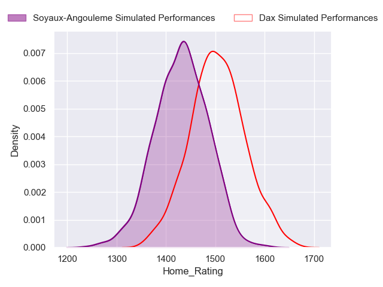
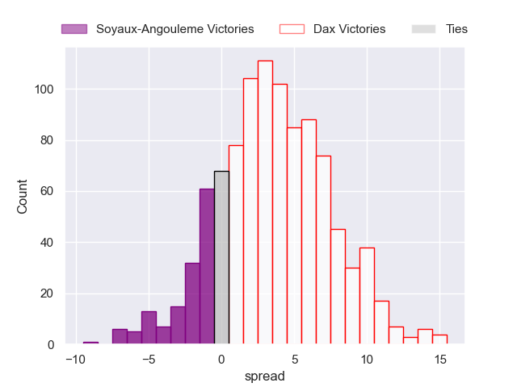
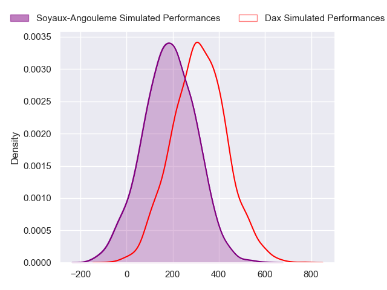
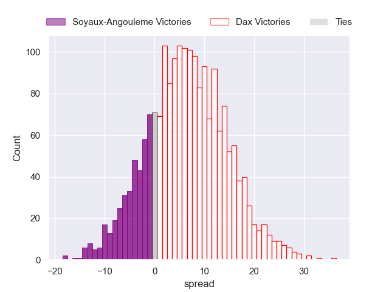
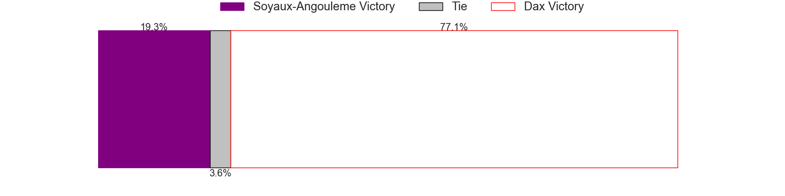

---  
layout: page  
title: Soyaux-Angouleme at Dax  
date: 2024-09-27 18:00:00 -0500  
categories: "Pro D2 2024" match projection  
---
# Soyaux-Angouleme at Dax

# Club Level Predictions

The first set of predictions treats a club as the smallest object, as the club develops its members, organizes a gameplan, and deploys its players as needed for each match. This club model has a prediction of 0.511, which translates to predicting Dax to win by 3.6.

Our Over/Under is 29.5 - and combined with the spread above, we have a predicted scoreline of 13 to 17

Each club has a rating and a rating deviation (similar to a Glicko rating), and expected performances can be generated. This allows for simulated matches and spreads like the ones below.
## Projected Performances - Club Model

## Projected Spreads - Club Model

## Projected Results - Club Model

# Player Level Predictions

Treating teams instead as an entity made up of the currently active players, I have ratings for each player in an altogether different system. These can be combined to form team ratings once teamsheets are announced, weighting starters a bit higher than the reserves. After the match is played, players can be weighted by their minutes on the field, allowing for an accurate measure of the team's composition. With these compiled team ratings, we can make predictions, measure inaccuracy, and update the individual player ratings.
## Prediction without Player Minutes: Dax by 6.8

Soyaux-Angouleme by 0.8 on a neutral pitch

## Projected Performances - Player Model

## Projected Spreads - Player Model

## Projected Results - Player Model

| Away Player        |   Away Percentile |   Number |   Home Percentile | Home Player           |
|:-------------------|------------------:|---------:|------------------:|:----------------------|
| Paul Tailhades     |            nan    |        1 |            nan    | Louis Mary            |
| Patxi Bidart       |            nan    |        2 |            nan    | Louis Barrère         |
| Omar Dahir         |            nan    |        3 |              6.59 | Diogo Hasse Ferreira  |
| Léo Morand-Bruyat  |            nan    |        4 |            nan    | Etienne Loiret        |
| Enzo Morand-Bruyat |            nan    |        5 |            nan    | Jean-Baptiste Singer  |
| Gautier Gibouin    |            nan    |        6 |            nan    | Jean-Baptiste Barrère |
| Clément Sentubéry  |            nan    |        7 |            nan    | Théo Trémeau          |
| Maxence Lemardelet |            nan    |        8 |            nan    | Sam Wasley            |
| Emmanuel Saubusse  |            nan    |        9 |            nan    | Sylvère Réteau        |
| Rémi Brosset       |            nan    |       10 |            nan    | Hugo Cerisier         |
| Nathan Farissier   |            nan    |       11 |            nan    | Jope Naseara (2)      |
| Mathis Lafon       |            nan    |       12 |             46.07 | Noah Nene             |
| Ledua Mau          |            nan    |       13 |            nan    | Bastien Daguerre      |
| Matthys Gratien    |            nan    |       14 |            nan    | Maxime Oltmann        |
| Jules Dubecq       |            nan    |       15 |            nan    | Théo Gatelier         |
| Rayne Barka        |            nan    |       16 |            nan    | Iban Hiriart-Urruty   |
| Vivien Devisme     |            nan    |       17 |            nan    | Raphaêl Laboille      |
| Matthew Dalton     |            nan    |       18 |            nan    | Alexandre Manukula    |
| Samuel Nollet      |            nan    |       19 |            nan    | Paul Arnaud Ausset    |
| Adrien Bau         |            nan    |       20 |            nan    | Paul Ravier           |
| Adrian Mitu        |             30.73 |       21 |            nan    | Romuald Séguy         |
| George Tilsley     |            nan    |       22 |            nan    | Benjamin Puntous      |
| Seydou Diakité     |            nan    |       23 |            nan    | Nephi Leatigaga       |

