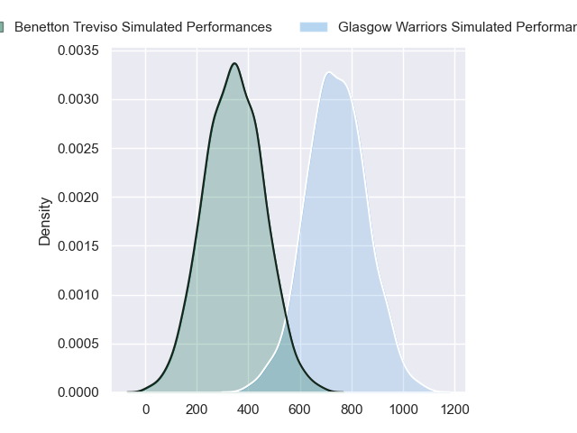
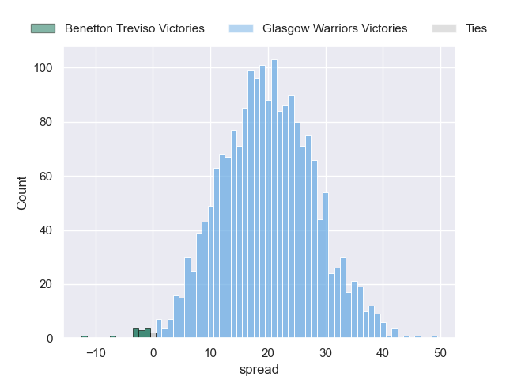
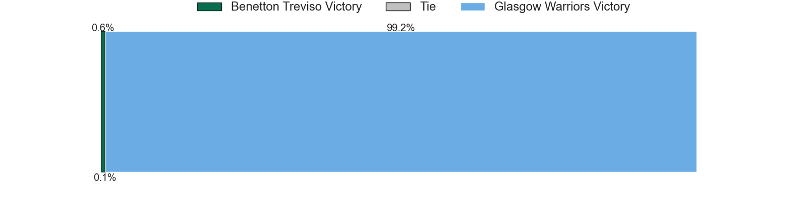

---  
layout: page  
title: Benetton Treviso at Glasgow Warriors  
date: 2024-09-27 18:00:00 -0500  
categories: "United Rugby Championship 2024" match projection  
---
# Benetton Treviso at Glasgow Warriors

# Club Level Predictions

The first set of predictions treats a club as the smallest object, as the club develops its members, organizes a gameplan, and deploys its players as needed for each match. This club model has a prediction of 0.66, which translates to predicting Glasgow Warriors to win by 9.2.

Our Over/Under is 37.5 - and combined with the spread above, we have a predicted scoreline of 14 to 23

Each club has a rating and a rating deviation (similar to a Glicko rating), and expected performances can be generated. This allows for simulated matches and spreads like the ones below.
## Projected Performances - Club Model

## Projected Spreads - Club Model

## Projected Results - Club Model

# Player Level Predictions

Treating teams instead as an entity made up of the currently active players, I have ratings for each player in an altogether different system. These can be combined to form team ratings once teamsheets are announced, weighting starters a bit higher than the reserves. After the match is played, players can be weighted by their minutes on the field, allowing for an accurate measure of the team's composition. With these compiled team ratings, we can make predictions, measure inaccuracy, and update the individual player ratings.
## Prediction without Player Minutes: Glasgow Warriors by 20.1

Glasgow Warriors by 13.6 on a neutral pitch

## Projected Performances - Player Model

## Projected Spreads - Player Model

## Projected Results - Player Model

| Away Player        |   Away Percentile |   Number |   Home Percentile | Home Player       |
|:-------------------|------------------:|---------:|------------------:|:------------------|
| Mirco Spagnolo     |            nan    |        1 |             76.77 | Nathan McBeth     |
| Siua Maile         |            nan    |        2 |             71.28 | Gregor Hiddleston |
| Simone Ferrari     |             98.38 |        3 |             99.9  | Zander Fagerson   |
| Scott Scrafton     |            nan    |        4 |            nan    | Max Williamson    |
| Eli Snyman         |            nan    |        5 |            nan    | Richie Gray       |
| Alessandro Izekor  |            nan    |        6 |             54.26 | Euan Ferrie       |
| Manuel Zuliani     |            nan    |        7 |            nan    | Rory Darge        |
| Sebastian Negri    |             94.32 |        8 |            nan    | Matt Fagerson     |
| Andy Uren          |            nan    |        9 |            nan    | Jamie Dobie       |
| Jacob Umaga        |            nan    |       10 |             98.6  | Adam Hastings     |
| Onisi Ratave       |            nan    |       11 |             84.8  | Kyle Rowe         |
| Marco Zanon        |            nan    |       12 |            nan    | Tom Jordan        |
| Malakai Fekitoa    |            nan    |       13 |            nan    | Sione Tuipulotu   |
| Louis Lynagh       |            nan    |       14 |            nan    | Kyle Steyn        |
| Matt Gallagher     |             96.93 |       15 |            nan    | Josh McKay        |
| Marco Manfredi     |              7.97 |       16 |            nan    | Johnny Matthews   |
| Destiny Aminu      |            nan    |       17 |             68.97 | Rory Sutherland   |
| Riccardo Genovese  |            nan    |       18 |            nan    | Sam Talakai       |
| Riccardo Favretto  |             36.33 |       19 |             73.43 | Alex Samuel       |
| Toa Halafihi       |            nan    |       20 |             99.49 | Scott Cummings    |
| Alessandro Garbisi |             76.18 |       21 |             87.55 | Gregor Brown      |
| Leonardo Marin     |             73.74 |       22 |            100    | George Horne      |
| Paolo Odogwu       |             90.74 |       23 |             82.96 | Duncan Weir       |

