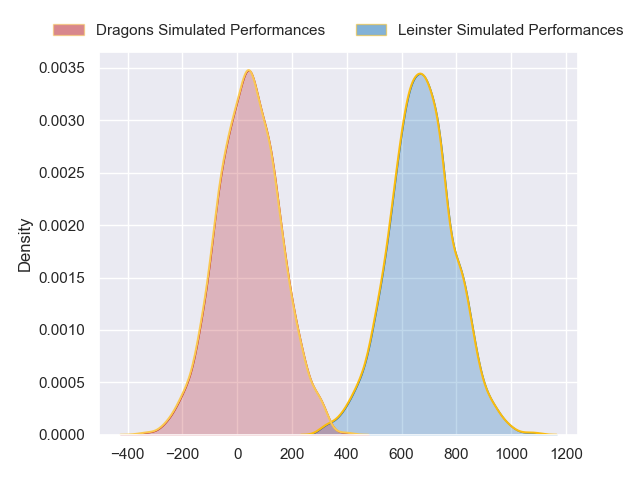
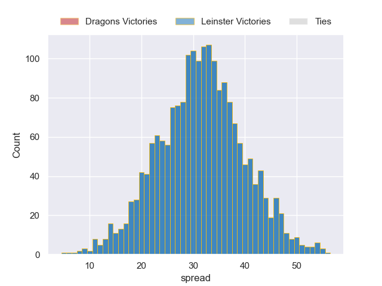

---  
layout: page  
title: Dragons at Leinster  
date: 2024-09-27 18:00:00 -0500  
categories: "United Rugby Championship 2024" match projection  
---
# Dragons at Leinster

# Club Level Predictions

The first set of predictions treats a club as the smallest object, as the club develops its members, organizes a gameplan, and deploys its players as needed for each match. This club model has a prediction of 0.905, which translates to predicting Leinster to win by 22.6.

Our Over/Under is 31.5 - and combined with the spread above, we have a predicted scoreline of 5 to 27

Each club has a rating and a rating deviation (similar to a Glicko rating), and expected performances can be generated. This allows for simulated matches and spreads like the ones below.
## Projected Performances - Club Model

## Projected Spreads - Club Model

## Projected Results - Club Model

# Player Level Predictions

Treating teams instead as an entity made up of the currently active players, I have ratings for each player in an altogether different system. These can be combined to form team ratings once teamsheets are announced, weighting starters a bit higher than the reserves. After the match is played, players can be weighted by their minutes on the field, allowing for an accurate measure of the team's composition. With these compiled team ratings, we can make predictions, measure inaccuracy, and update the individual player ratings.
## Prediction without Player Minutes: Leinster by 32.3

Leinster by 25.9 on a neutral pitch

## Projected Performances - Player Model

## Projected Spreads - Player Model

## Projected Results - Player Model

| Away Player        |   Away Percentile |   Number |   Home Percentile | Home Player        |
|:-------------------|------------------:|---------:|------------------:|:-------------------|
| Rodrigo Martinez   |            nan    |        1 |             95.54 | Cian Healy         |
| Brodie Coghlan     |            nan    |        2 |            nan    | Gus McCarthy       |
| Chris Coleman      |             25.05 |        3 |            nan    | Thomas Clarkson    |
| Ben Carter         |            nan    |        4 |             55.46 | Brian Deeny        |
| George Nott        |             19    |        5 |            nan    | James Ryan         |
| Ryan Woodman       |            nan    |        6 |            nan    | Max Deegan         |
| Harrison Keddie    |            nan    |        7 |             86.3  | Will Connors       |
| Shane Lewis-Hughes |            nan    |        8 |            nan    | Jack Conan         |
| Dane Blacker       |            nan    |        9 |             98.93 | Luke McGrath       |
| Lloyd Evans        |            nan    |       10 |             96.65 | Ross Byrne         |
| Jared Rosser       |            nan    |       11 |             93.3  | Jimmy O'Brien      |
| Steffan Hughes     |             85.38 |       12 |            nan    | Charlie Tector     |
| Harry Wilson       |             52    |       13 |             48.1  | Liam Turner        |
| Rio Dyer           |            nan    |       14 |            nan    | Jordan Larmour     |
| Angus O'Brien      |            nan    |       15 |            nan    | Jamie Osborne      |
| Oli Burrows        |            nan    |       16 |             57.23 | Lee Barron         |
| Rhodri Jones       |              2.54 |       17 |            nan    | Michael Milne      |
| Luke Yendle        |             53.85 |       18 |             92.29 | Rabah Slimani      |
| Matthew Screech    |            nan    |       19 |             86.78 | Joe McCarthy       |
| George Young       |             47.67 |       20 |             99.35 | Josh van der Flier |
| Rhodri Williams    |             89.91 |       21 |            nan    | Fintan Gunne       |
| Joe Westwood       |            nan    |       22 |             90.22 | Harry Byrne        |
| Ewan Rosser        |             31.01 |       23 |            nan    | Aitzol King        |

