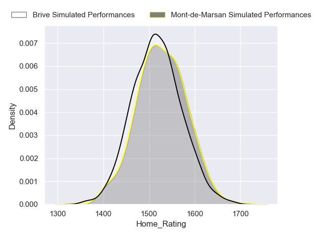
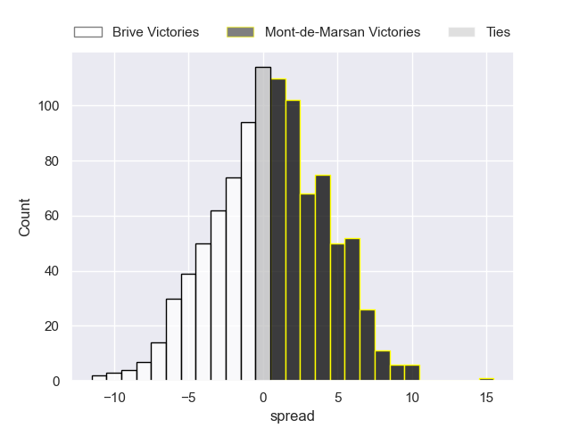
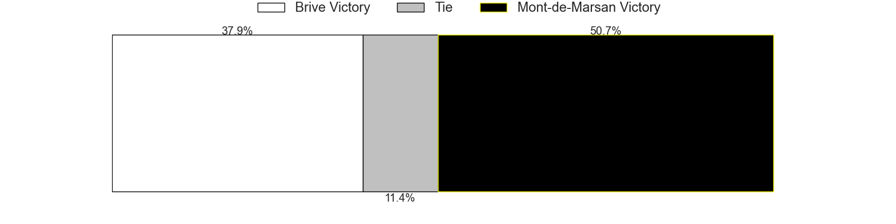
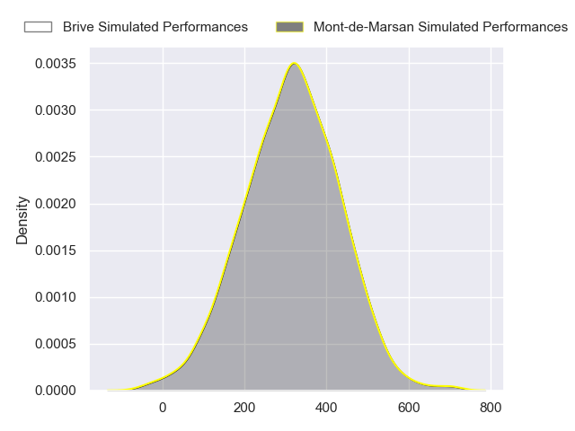
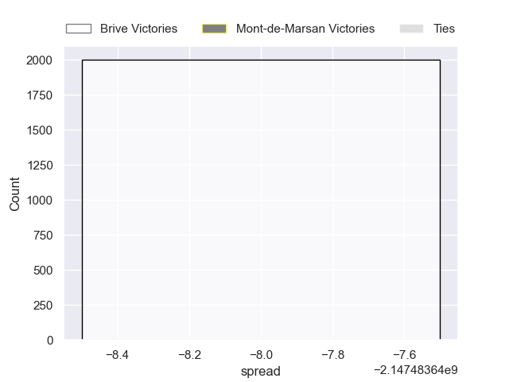

---  
layout: page  
title: Brive at Mont-de-Marsan  
date: 2024-09-27 18:00:00 -0500  
categories: "Pro D2 2024" match projection  
---
# Brive at Mont-de-Marsan

# Club Level Predictions

The first set of predictions treats a club as the smallest object, as the club develops its members, organizes a gameplan, and deploys its players as needed for each match. This club model has a prediction of 0.418, which translates to predicting Brive to win by -0.5.

Our Over/Under is 32.5 - and combined with the spread above, we have a predicted scoreline of 16 to 17

Each club has a rating and a rating deviation (similar to a Glicko rating), and expected performances can be generated. This allows for simulated matches and spreads like the ones below.
## Projected Performances - Club Model

## Projected Spreads - Club Model

## Projected Results - Club Model

# Player Level Predictions

Treating teams instead as an entity made up of the currently active players, I have ratings for each player in an altogether different system. These can be combined to form team ratings once teamsheets are announced, weighting starters a bit higher than the reserves. After the match is played, players can be weighted by their minutes on the field, allowing for an accurate measure of the team's composition. With these compiled team ratings, we can make predictions, measure inaccuracy, and update the individual player ratings.
## Prediction without Player Minutes: Mont-de-Marsan by 6.4

Brive by 1.6 on a neutral pitch

## Projected Performances - Player Model

## Projected Spreads - Player Model

## Projected Results - Player Model

| Away Player             |   Away Percentile |   Number |   Home Percentile | Home Player          |
|:------------------------|------------------:|---------:|------------------:|:---------------------|
| Simon-Pierre Chauvac    |            nan    |        1 |            nan    | Thomas Bultel        |
| Lucas Da Silva          |            nan    |        2 |            nan    | Samuel Lagrange      |
| Marcel Van Der Merwe    |            nan    |        3 |            nan    | Anthony Alves        |
| Courtney Lawes          |            nan    |        4 |            nan    | Romain Durand        |
| Konstantin Mikautadze   |            nan    |        5 |            nan    | Aston Fortuin        |
| Retief Marais           |            nan    |        6 |            nan    | Ioane Iashagashvili  |
| Ross Moriarty           |            nan    |        7 |            nan    | Raphaël Robic        |
| Rahboni Warren-Vosayaco |            nan    |        8 |            nan    | Michael Faleafa      |
| Léo Carbonneau          |             59.87 |        9 |            nan    | Nicolas Darquier     |
| Curwin Bosch            |            nan    |       10 |             48.04 | Willie Du Plessis    |
| Erwan Dridi             |            nan    |       11 |            nan    | Eroni Sau            |
| Sam Johnson             |            nan    |       12 |            nan    | Nacani Wakaya        |
| Georges Shvelidze       |            nan    |       13 |            nan    | Semi Lagivala (2)    |
| Asaeli Tuivuaka         |            nan    |       14 |             46.32 | Pierre Sayerse       |
| Mathis Ferté            |             58.94 |       15 |            nan    | Alexandre de Nardi   |
| Benjamin Boudou         |            nan    |       16 |            nan    | Florian Dufour       |
| Nathan Fraissenon       |            nan    |       17 |            nan    | Luka Goginava        |
| Tevita Ratuva           |            nan    |       18 |            nan    | Myles Edwards        |
| Asier Usarraga Latierro |            nan    |       19 |            nan    | Waël Ponpon          |
| Taniela Sadrugu         |            nan    |       20 |            nan    | Christophe Loustalot |
| Hugo Verdu              |            nan    |       21 |            nan    | Théo Cortes          |
| Timilai Rokoduru        |            nan    |       22 |            nan    | Gatien Massé         |
| Vakh Abdaladze          |            nan    |       23 |             48.07 | Gheorghe Gajion      |

