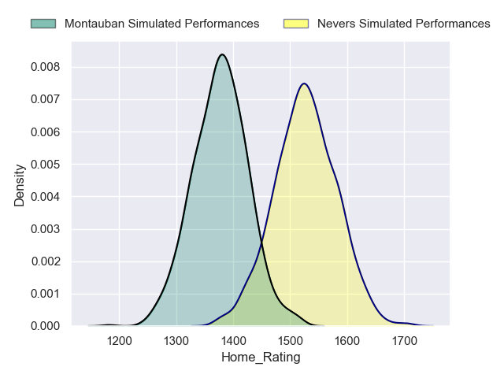
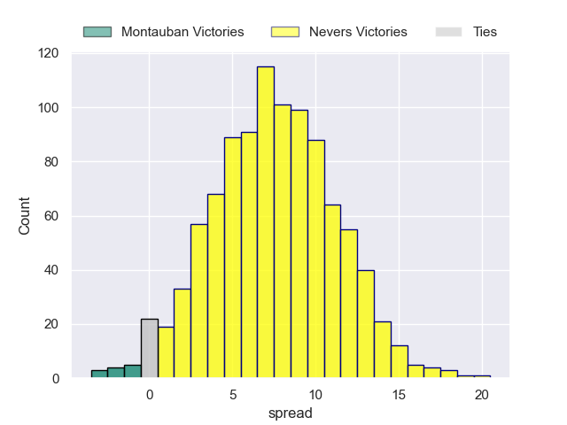
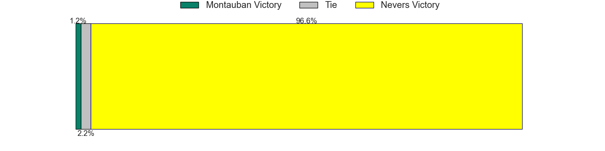
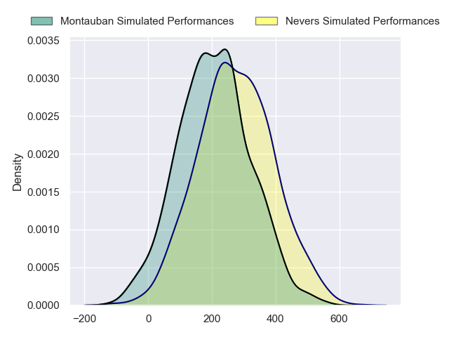
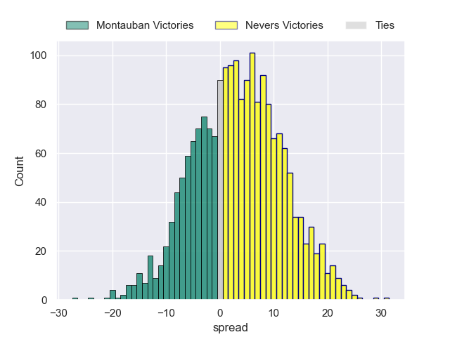
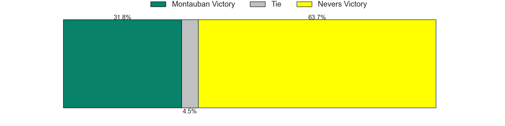

---  
layout: page  
title: Montauban at Nevers  
date: 2024-09-27 18:00:00 -0500  
categories: "Pro D2 2024" match projection  
---
# Montauban at Nevers

# Club Level Predictions

The first set of predictions treats a club as the smallest object, as the club develops its members, organizes a gameplan, and deploys its players as needed for each match. This club model has a prediction of 0.613, which translates to predicting Nevers to win by 7.5.

Our Over/Under is 29.5 - and combined with the spread above, we have a predicted scoreline of 11 to 18

Each club has a rating and a rating deviation (similar to a Glicko rating), and expected performances can be generated. This allows for simulated matches and spreads like the ones below.
## Projected Performances - Club Model

## Projected Spreads - Club Model

## Projected Results - Club Model

# Player Level Predictions

Treating teams instead as an entity made up of the currently active players, I have ratings for each player in an altogether different system. These can be combined to form team ratings once teamsheets are announced, weighting starters a bit higher than the reserves. After the match is played, players can be weighted by their minutes on the field, allowing for an accurate measure of the team's composition. With these compiled team ratings, we can make predictions, measure inaccuracy, and update the individual player ratings.
## Prediction without Player Minutes: Nevers by 3.4

Montauban by 0.4 on a neutral pitch

## Projected Performances - Player Model

## Projected Spreads - Player Model

## Projected Results - Player Model

| Away Player       |   Away Percentile |   Number |   Home Percentile | Home Player                |
|:------------------|------------------:|---------:|------------------:|:---------------------------|
| Léo Aouf          |             nan   |        1 |               nan | Aitor Kitutu               |
| Kévin Firmin      |             nan   |        2 |               nan | Jonathan Maïau             |
| Facundo Pomponio  |             nan   |        3 |               nan | Cleopas Kundiona           |
| Tjiuee Uanivi     |             nan   |        4 |               nan | Ugo Vignolles              |
| Victor Moreaux    |             nan   |        5 |               nan | Lasha Jaiani               |
| Karl Wilkins      |             nan   |        6 |               nan | Luka Plataret              |
| Kyllian Ringuet   |             nan   |        7 |               nan | Hugues Bastide             |
| Tyrone Viiga      |             nan   |        8 |               nan | Kévin Noah                 |
| Hugo Zabalza      |             nan   |        9 |               nan | Hugo Bouyssou              |
| Jérôme Bosviel    |             nan   |       10 |               nan | Yohan Le Bourhis           |
| Yvan Reilhac      |             nan   |       11 |               nan | Arthur Mathiron            |
| Simon Renda       |             nan   |       12 |               nan | Nicolas Ragoevi            |
| Maxime Espeut     |             nan   |       13 |               nan | Rudy Derrieux              |
| Stephane Ahmed    |             nan   |       14 |               nan | Gabin Rocher               |
| Baptiste Mouchous |             nan   |       15 |               nan | Tom Deleuze                |
| Ru-Hann Greyling  |             nan   |       16 |               nan | Jean-Maxence Jules-Rosette |
| Thomas Bué        |             nan   |       17 |               nan | Tornike Mataradze          |
| Frank Bradshaw    |             nan   |       18 |               nan | Chris Gabriel              |
| Dimitri Vaotoa    |             nan   |       19 |               nan | Julien Kazubek             |
| Fred Quercy       |             nan   |       20 |               nan | Rati Zazadze (2)           |
| Joe Powell        |              60.3 |       21 |               nan | Simon Tarel                |
| Thomas Fortunel   |             nan   |       22 |               nan | Dylan Jaminet              |
| Mirian Burduli    |             nan   |       23 |               nan | Lasha Pkhakadze (2)        |

