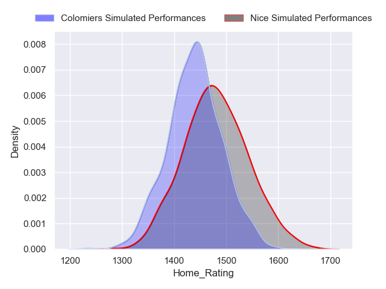
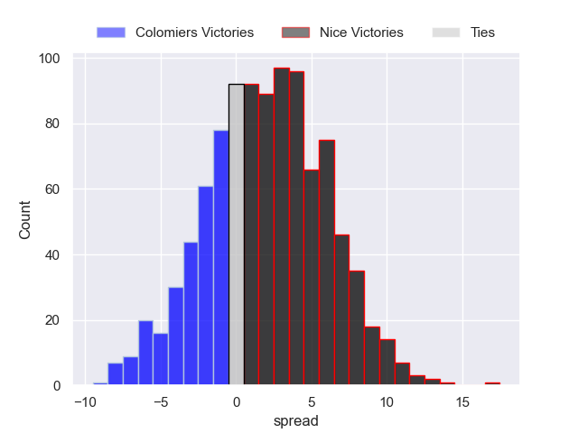
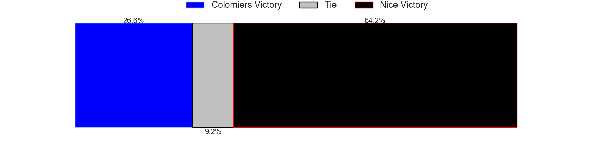
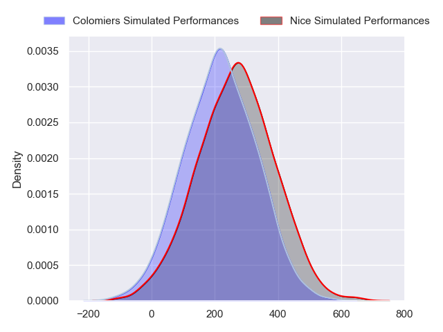
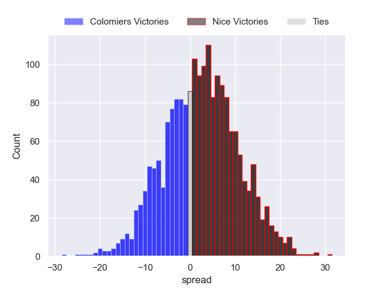
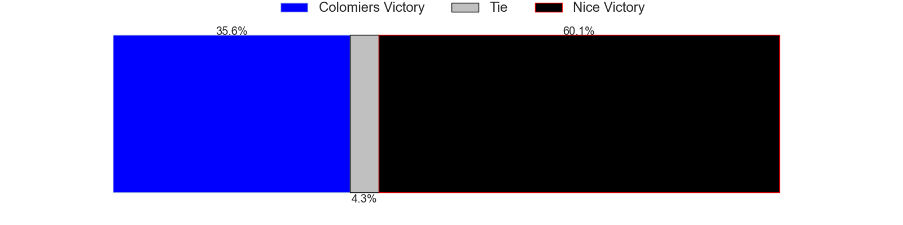

---  
layout: page  
title: Colomiers at Nice  
date: 2024-09-27 18:00:00 -0500  
categories: "Pro D2 2024" match projection  
---
# Colomiers at Nice

# Club Level Predictions

The first set of predictions treats a club as the smallest object, as the club develops its members, organizes a gameplan, and deploys its players as needed for each match. This club model has a prediction of 0.461, which translates to predicting Colomiers to win by -2.0.

Our Over/Under is 36.5 - and combined with the spread above, we have a predicted scoreline of 17 to 19

Each club has a rating and a rating deviation (similar to a Glicko rating), and expected performances can be generated. This allows for simulated matches and spreads like the ones below.
## Projected Performances - Club Model

## Projected Spreads - Club Model

## Projected Results - Club Model

# Player Level Predictions

Treating teams instead as an entity made up of the currently active players, I have ratings for each player in an altogether different system. These can be combined to form team ratings once teamsheets are announced, weighting starters a bit higher than the reserves. After the match is played, players can be weighted by their minutes on the field, allowing for an accurate measure of the team's composition. With these compiled team ratings, we can make predictions, measure inaccuracy, and update the individual player ratings.
## Prediction without Player Minutes: Nice by 2.8

Colomiers by 0.1 on a neutral pitch

## Projected Performances - Player Model

## Projected Spreads - Player Model

## Projected Results - Player Model

| Away Player             |   Away Percentile |   Number |   Home Percentile | Home Player        |
|:------------------------|------------------:|---------:|------------------:|:-------------------|
| Pierre-Emmanuel Pacheco |            nan    |        1 |            nan    | Facundo Gigena     |
| Théo Lachaud            |            nan    |        2 |            nan    | Pierre Strippoli   |
| Hugo Pirlet             |             65.72 |        3 |            nan    | Luvuyo Pupuma      |
| Maxime Granouillet      |            nan    |        4 |            nan    | Clément Chartier   |
| Janse Roux              |            nan    |        5 |            nan    | Tom Murday         |
| Alexis Caumel           |            nan    |        6 |            nan    | Arthur Vignolles   |
| Aldric Lescure          |            nan    |        7 |            nan    | Louis Suaud        |
| Caleb Timu              |            nan    |        8 |            nan    | Jordan Taufua      |
| Mathis Galthié          |            nan    |        9 |            nan    | Jules Solinas      |
| Joaquin De La Vega      |            nan    |       10 |            nan    | Mathis Viard       |
| Rodrigo Marta           |             90.48 |       11 |            nan    | Andrzej Charlat    |
| Ray Nu'U                |            nan    |       12 |            nan    | Luca Cutayar       |
| Enzo Salles             |            nan    |       13 |            nan    | Tom Daly           |
| Valentin Saurs          |            nan    |       14 |            nan    | Christiaan Erasmus |
| Ugo Pacome              |            nan    |       15 |            nan    | Paul Auradou       |
| Thomas Larrieu          |            nan    |       16 |             40.25 | Sacha Idoumi       |
| Eliès El Ansari         |            nan    |       17 |            nan    | Fabio Gonzalez     |
| Louis Descoux           |            nan    |       18 |            nan    | Yann Tivoli        |
| Anthony Coletta         |            nan    |       19 |            nan    | Martin Freytes     |
| Dorian Laborde          |            nan    |       20 |            nan    | Bastien Berenguel  |
| Arthur Diaz             |            nan    |       21 |            nan    | Corentin Penc'Hoat |
| Anzelo Tuitavuki        |             12.11 |       22 |            nan    | Romain Riguet      |
| Robin Bellemand         |            nan    |       23 |            nan    | Nicolás Ciancio    |

