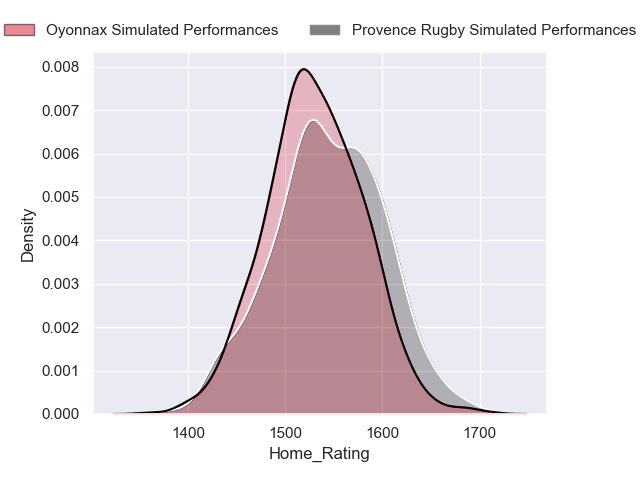
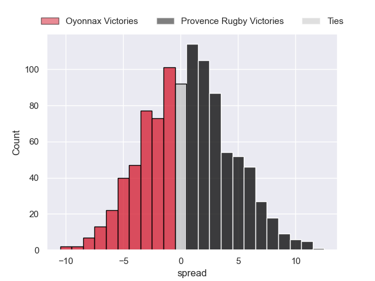
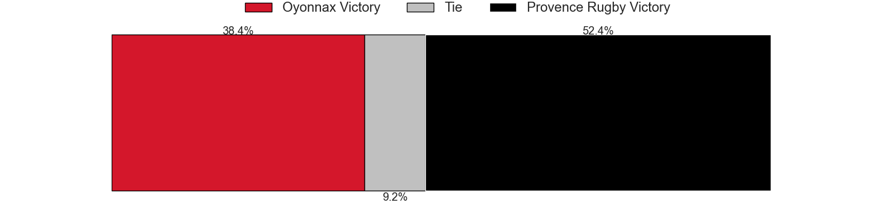
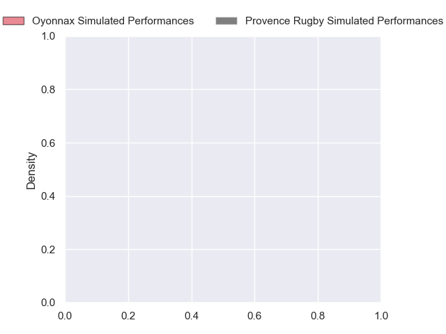
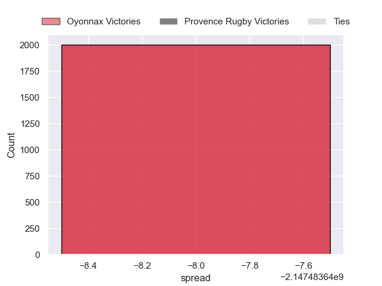

---  
layout: page  
title: Oyonnax at Provence Rugby  
date: 2024-09-27 18:00:00 -0500  
categories: "Pro D2 2024" match projection  
---
# Oyonnax at Provence Rugby

# Club Level Predictions

The first set of predictions treats a club as the smallest object, as the club develops its members, organizes a gameplan, and deploys its players as needed for each match. This club model has a prediction of 0.422, which translates to predicting Oyonnax to win by -0.7.

Our Over/Under is 36.5 - and combined with the spread above, we have a predicted scoreline of 18 to 18

Each club has a rating and a rating deviation (similar to a Glicko rating), and expected performances can be generated. This allows for simulated matches and spreads like the ones below.
## Projected Performances - Club Model

## Projected Spreads - Club Model

## Projected Results - Club Model

# Player Level Predictions

Treating teams instead as an entity made up of the currently active players, I have ratings for each player in an altogether different system. These can be combined to form team ratings once teamsheets are announced, weighting starters a bit higher than the reserves. After the match is played, players can be weighted by their minutes on the field, allowing for an accurate measure of the team's composition. With these compiled team ratings, we can make predictions, measure inaccuracy, and update the individual player ratings.
## Prediction without Player Minutes: Oyonnax by nan

Oyonnax by 1.9 on a neutral pitch

## Projected Performances - Player Model

## Projected Spreads - Player Model

## Projected Results - Player Model

| Away Player          |   Away Percentile |   Number |   Home Percentile | Home Player       |
|:---------------------|------------------:|---------:|------------------:|:------------------|
| Oli Kebble           |            nan    |        1 |            nan    | Thomas Vernet     |
| Teddy Durand         |            nan    |        2 |            nan    | Loick Jammes      |
| Paulo Tafili         |            nan    |        3 |            nan    | Paul Mallez       |
| Phoenix Battye       |            nan    |        4 |            nan    | Josh Tyrell       |
| Hugo Fabregue        |            nan    |        5 |            nan    | Izack Rodda       |
| Kevin Lebreton       |            nan    |        6 |            nan    | Teimana Harrison  |
| Hugo Hermet          |            nan    |        7 |            nan    | Bilel Taieb       |
| Loic Godener         |            nan    |        8 |            nan    | Tornike Jalagonia |
| Vasil Lobzhanidze    |            nan    |        9 |            nan    | Arthur Coville    |
| Justin Bouraux       |            nan    |       10 |            nan    | Jules Plisson     |
| Daniel Ikpefan       |            nan    |       11 |            nan    | Léo Drouet        |
| Lucas Mensa          |            nan    |       12 |            nan    | Inga Finau        |
| Eddie Sawailau       |            nan    |       13 |            nan    | Atila Septar      |
| Martin Bogado        |            nan    |       14 |            nan    | Adrien Lapègue    |
| Darren Sweetnam      |             77.37 |       15 |            nan    | Mathias Colombet  |
| Peniami Narisia      |            nan    |       16 |            nan    | Ian Boubila       |
| Antoine Abraham      |            nan    |       17 |            nan    | Julius Nostadt    |
| Ewan Johnson         |            nan    |       18 |            nan    | Andrés Zafra      |
| Kevin Kornath        |             16.54 |       19 |             72.02 | Charly Gambini    |
| Yvan David           |            nan    |       20 |            nan    | Joris Cazenave    |
| Chris William Smith  |             34.36 |       21 |            nan    | Jules Soulan      |
| Souleymane Coulibaly |             33.97 |       22 |            nan    | Eto Bainivalu     |
| Ali Oz               |            nan    |       23 |            nan    | Tomas Francis     |

