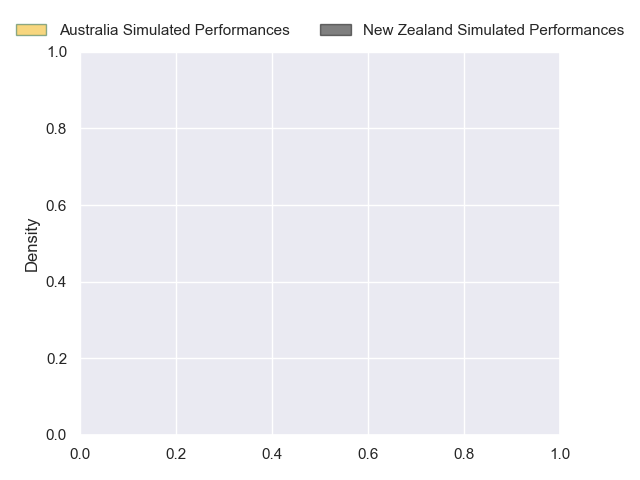
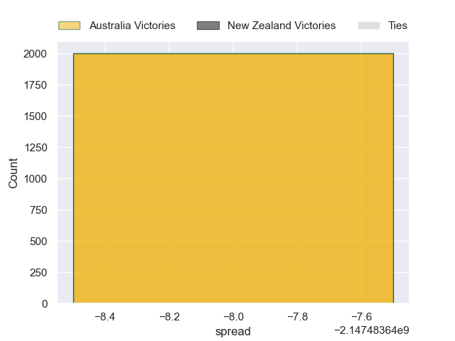

---  
layout: page  
title: Australia at New Zealand  
date: 2024-09-28 18:00:00 -0500  
categories: "Rugby Championship 2024" match projection  
---
# Australia at New Zealand

# Club Level Predictions

The first set of predictions treats a club as the smallest object, as the club develops its members, organizes a gameplan, and deploys its players as needed for each match. This club model has a prediction of 0.776, which translates to predicting New Zealand to win by 14.0.

Our Over/Under is 52.5 - and combined with the spread above, we have a predicted scoreline of 19 to 33

Each club has a rating and a rating deviation (similar to a Glicko rating), and expected performances can be generated. This allows for simulated matches and spreads like the ones below.
## Projected Performances - Club Model

## Projected Spreads - Club Model

## Projected Results - Club Model

# Player Level Predictions

Treating teams instead as an entity made up of the currently active players, I have ratings for each player in an altogether different system. These can be combined to form team ratings once teamsheets are announced, weighting starters a bit higher than the reserves. After the match is played, players can be weighted by their minutes on the field, allowing for an accurate measure of the team's composition. With these compiled team ratings, we can make predictions, measure inaccuracy, and update the individual player ratings.
## Prediction without Player Minutes: New Zealand by 19.2

New Zealand by 15.6 on a neutral pitch

## Projected Performances - Player Model

## Projected Spreads - Player Model

## Projected Results - Player Model

| Away Player          |   Away Percentile |   Number |   Home Percentile | Home Player         |
|:---------------------|------------------:|---------:|------------------:|:--------------------|
| Angus Bell           |            nan    |        1 |            nan    | Ethan de Groot      |
| Matt Faessler        |            nan    |        2 |            nan    | Codie Taylor        |
| Taniela Tupou        |            nan    |        3 |            nan    | Tyrel Lomax         |
| Nick Frost           |            nan    |        4 |            nan    | Scott Barrett       |
| Jeremy Williams      |            nan    |        5 |            nan    | Tupou Vaa'i         |
| Rob Valetini         |            nan    |        6 |            nan    | Wallace Sititi      |
| Fraser McReight      |            nan    |        7 |            nan    | Sam Cane            |
| Harry Wilson         |            nan    |        8 |            nan    | Ardie Savea         |
| Jake Gordon          |            nan    |        9 |             97.64 | TJ Perenara         |
| Noah Lolesio         |            nan    |       10 |            100    | Beauden Barrett     |
| Dylan Pietsch        |             81.12 |       11 |            nan    | Caleb Clarke        |
| Hunter Paisami       |            nan    |       12 |             96.55 | Anton Lienert-Brown |
| Len Ikitau           |            nan    |       13 |            nan    | Rieko Ioane         |
| Andrew Kellaway      |            nan    |       14 |            nan    | Sevu Reece          |
| Tom Wright           |            nan    |       15 |            nan    | Will Jordan         |
| Brandon Paenga-Amosa |             87.63 |       16 |             95.6  | Asafo Aumua         |
| Isaac Aedo Kailea    |             31.85 |       17 |             91.18 | Tamaiti Williams    |
| Allan Alaalatoa      |             98.28 |       18 |            nan    | Pasilio Tosi        |
| Lukhan Salakaia-Loto |            nan    |       19 |            nan    | Patrick Tuipulotu   |
| Langi Gleeson        |             64.96 |       20 |            nan    | Luke Jacobson       |
| Tate McDermott       |             85.41 |       21 |            nan    | Cortez Ratima       |
| Ben Donaldson        |            nan    |       22 |            nan    | Damian McKenzie     |
| Josh Flook           |             65.93 |       23 |            nan    | David Havili        |

