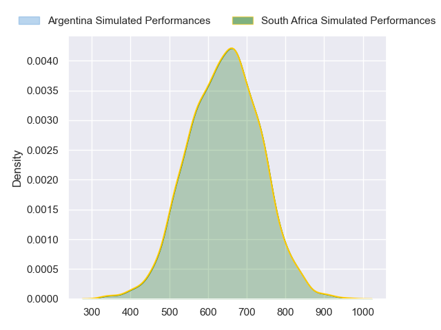
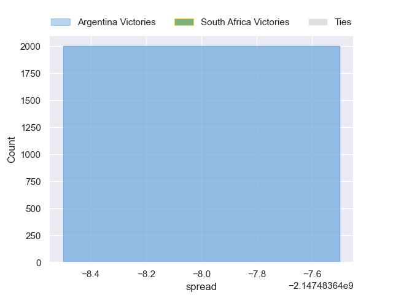

---  
layout: page  
title: Argentina at South Africa  
date: 2024-09-28 18:00:00 -0500  
categories: "Rugby Championship 2024" match projection  
---
# Argentina at South Africa

# Club Level Predictions

The first set of predictions treats a club as the smallest object, as the club develops its members, organizes a gameplan, and deploys its players as needed for each match. This club model has a prediction of 0.746, which translates to predicting South Africa to win by 12.5.

Our Over/Under is 41.5 - and combined with the spread above, we have a predicted scoreline of 14 to 27

Each club has a rating and a rating deviation (similar to a Glicko rating), and expected performances can be generated. This allows for simulated matches and spreads like the ones below.
## Projected Performances - Club Model

## Projected Spreads - Club Model

## Projected Results - Club Model

# Player Level Predictions

Treating teams instead as an entity made up of the currently active players, I have ratings for each player in an altogether different system. These can be combined to form team ratings once teamsheets are announced, weighting starters a bit higher than the reserves. After the match is played, players can be weighted by their minutes on the field, allowing for an accurate measure of the team's composition. With these compiled team ratings, we can make predictions, measure inaccuracy, and update the individual player ratings.
## Prediction without Player Minutes: South Africa by 25.2

South Africa by 21.7 on a neutral pitch

## Projected Performances - Player Model

## Projected Spreads - Player Model

## Projected Results - Player Model

| Away Player   |   Away Percentile |   Number |   Home Percentile | Home Player          |
|:--------------|------------------:|---------:|------------------:|:---------------------|
|               |             40.16 |        1 |            nan    | Ox Nche              |
|               |             40.16 |        2 |            nan    | Bongi Mbonambi       |
|               |             40.16 |        3 |            nan    | Frans Malherbe       |
|               |             40.16 |        4 |            nan    | Eben Etzebeth        |
|               |             40.16 |        5 |            nan    | Ruan Nortje          |
|               |             40.16 |        6 |            nan    | Siya Kolisi          |
| nan           |            nan    |        7 |            nan    | Pieter-Steph du Toit |
|               |             40.16 |        8 |            nan    | nan                  |
|               |             40.16 |        9 |            nan    | nan                  |
|               |             40.16 |       10 |            nan    | nan                  |
|               |             40.16 |       11 |            nan    | nan                  |
|               |             40.16 |       12 |            nan    | nan                  |
|               |             40.16 |       13 |            nan    | nan                  |
|               |             40.16 |       14 |            nan    | Cheslin Kolbe        |
|               |             40.16 |       15 |            nan    | Aphelele Fassi       |
|               |             40.16 |       16 |            nan    | Malcolm Marx         |
|               |             40.16 |       17 |             93.2  | Gerhard Steenekamp   |
|               |             40.16 |       18 |             67.85 | Vincent Koch         |
| nan           |            nan    |       19 |             93.26 | Elrigh Louw          |
| nan           |            nan    |       20 |             88.95 | Kwagga Smith         |
| nan           |            nan    |       21 |            nan    | Cobus Reinach        |
| nan           |            nan    |       22 |            nan    | Handre Pollard       |
| nan           |            nan    |       23 |            nan    | Lukhanyo Am          |

