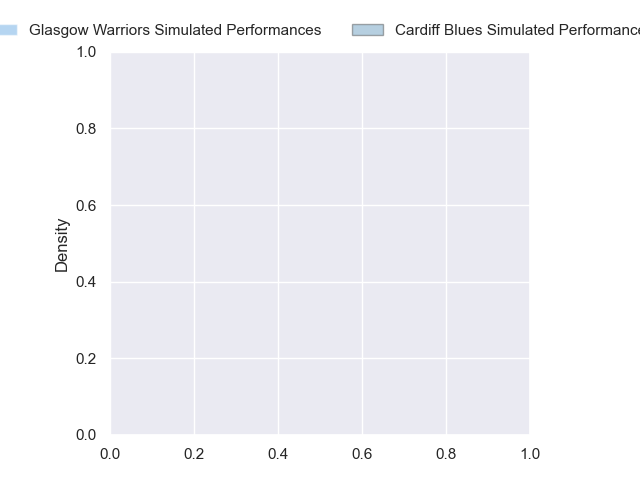
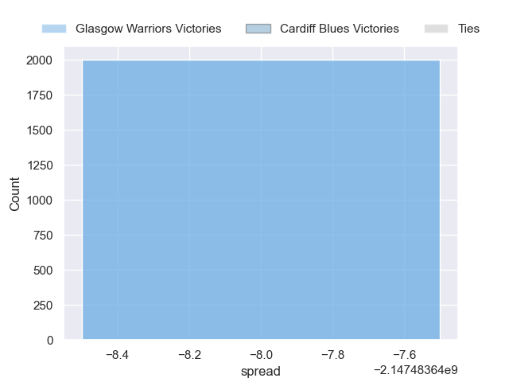

---  
layout: page  
title: Glasgow Warriors at Cardiff Blues  
date: 2024-10-04 18:00:00 -0500  
categories: "United Rugby Championship 2024" match projection  
---
# Glasgow Warriors at Cardiff Blues

# Club Level Predictions

The first set of predictions treats a club as the smallest object, as the club develops its members, organizes a gameplan, and deploys its players as needed for each match. This club model has a prediction of 0.238, which translates to predicting Glasgow Warriors to win by 6.6.

Our Over/Under is 30.5 - and combined with the spread above, we have a predicted scoreline of 18 to 12

Each club has a rating and a rating deviation (similar to a Glicko rating), and expected performances can be generated. This allows for simulated matches and spreads like the ones below.
## Projected Performances - Club Model

## Projected Spreads - Club Model

## Projected Results - Club Model

# Player Level Predictions

Treating teams instead as an entity made up of the currently active players, I have ratings for each player in an altogether different system. These can be combined to form team ratings once teamsheets are announced, weighting starters a bit higher than the reserves. After the match is played, players can be weighted by their minutes on the field, allowing for an accurate measure of the team's composition. With these compiled team ratings, we can make predictions, measure inaccuracy, and update the individual player ratings.
## Prediction without Player Minutes: Glasgow Warriors by nan

Glasgow Warriors by nan on a neutral pitch

## Projected Performances - Player Model

## Projected Spreads - Player Model

## Projected Results - Player Model

| Away Player          |   Away Percentile |   Number |   Home Percentile | Home Player        |
|:---------------------|------------------:|---------:|------------------:|:-------------------|
| Rory Sutherland      |            nan    |        1 |            nan    | Corey Domachowski  |
| Johnny Matthews      |             30.08 |        2 |            nan    | Liam Belcher       |
| Sam Talakai          |             41.17 |        3 |            nan    | Keiron Assiratti   |
| Alex Samuel          |             70.85 |        4 |            nan    | Josh McNally       |
| Scott Cummings       |            nan    |        5 |            nan    | Teddy Williams     |
| Gregor Brown         |            nan    |        6 |            nan    | Ben Donnell        |
| Matt Fagerson        |            nan    |        7 |            nan    | Daniel Thomas      |
| Jack Dempsey         |             78.69 |        8 |            nan    | Alun Lawrence      |
| Jamie Dobie          |            nan    |        9 |            nan    | Aled Davies        |
| Tom Jordan           |            nan    |       10 |            nan    | Callum Sheedy      |
| Facundo Cordero      |             91.15 |       11 |              7.08 | Harri Millard      |
| Sione Tuipulotu      |            nan    |       12 |            nan    | Ben Thomas         |
| Huw Jones            |            nan    |       13 |            nan    | Rey Lee-Lo         |
| Kyle Rowe            |            nan    |       14 |            nan    | Mason Grady        |
| Josh McKay           |            nan    |       15 |            nan    | Cameron Winnett    |
| Gregor Hiddleston    |            nan    |       16 |             42.42 | Evan Lloyd         |
| Jamie Bhatti         |             97.97 |       17 |             93.14 | Ed Byrne           |
| Patrick Schickerling |            nan    |       18 |             36.85 | Rhys Litterick     |
| Richie Gray          |            nan    |       19 |              7.73 | Rory Thornton      |
| Max Williamson       |            nan    |       20 |             44.67 | Mackenzie Martin   |
| Euan Ferrie          |            nan    |       21 |             68.42 | Ellis Bevan        |
| Ben Afshar           |             40    |       22 |             75.65 | Tinus de Beer      |
| Duncan Weir          |             84.13 |       23 |             93.22 | Gabriel Hamer-Webb |

