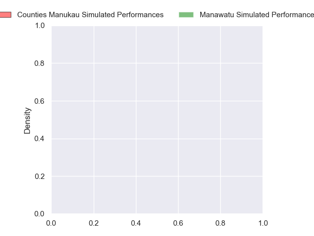
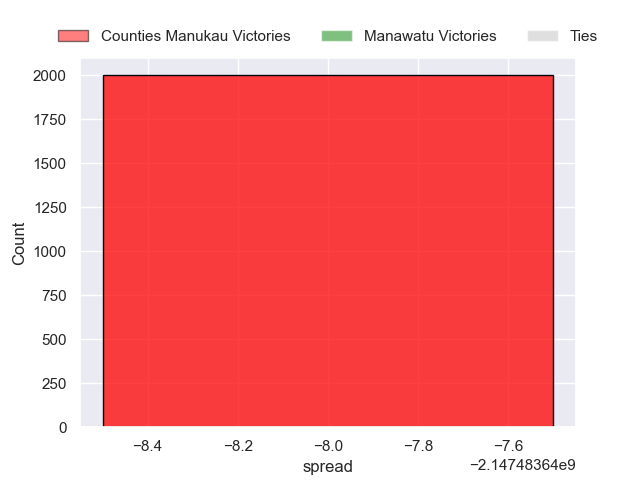

---  
layout: page  
title: Counties Manukau at Manawatu  
date: 2024-10-04 18:00:00 -0500  
categories: "NPC 2024" match projection  
---
# Counties Manukau at Manawatu

# Club Level Predictions

The first set of predictions treats a club as the smallest object, as the club develops its members, organizes a gameplan, and deploys its players as needed for each match. This club model has a prediction of 0.222, which translates to predicting Counties Manukau to win by 11.1.

Each club has a rating and a rating deviation (similar to a Glicko rating), and expected performances can be generated. This allows for simulated matches and spreads like the ones below.
## Projected Performances - Club Model

## Projected Spreads - Club Model

## Projected Results - Club Model

# Player Level Predictions

Treating teams instead as an entity made up of the currently active players, I have ratings for each player in an altogether different system. These can be combined to form team ratings once teamsheets are announced, weighting starters a bit higher than the reserves. After the match is played, players can be weighted by their minutes on the field, allowing for an accurate measure of the team's composition. With these compiled team ratings, we can make predictions, measure inaccuracy, and update the individual player ratings.
## Prediction without Player Minutes: Counties Manukau by nan

Counties Manukau by nan on a neutral pitch

## Projected Performances - Player Model

## Projected Spreads - Player Model

## Projected Results - Player Model

| Away Player          |   Away Percentile |   Number |   Home Percentile | Home Player             |
|:---------------------|------------------:|---------:|------------------:|:------------------------|
| Kauvaka Kaivelata    |               nan |        1 |               nan | Joe Gavigan             |
| Zuriel Togiatama     |               nan |        2 |               nan | Raymond Tuputupu        |
| Keran van Staden     |               nan |        3 |               nan | Flyn Yates              |
| William Furniss      |               nan |        4 |               nan | Johan Momsen            |
| James Thompson       |               nan |        5 |               nan | Lachlan Shaw            |
| Alamanda Motuga      |               nan |        6 |               nan | TK Howden               |
| Adam Brash           |               nan |        7 |               nan | Elyjah Crosswell        |
| Hoskins Sotutu       |               nan |        8 |               nan | Brayden Iose            |
| Jonathan Taumateine  |               nan |        9 |               nan | Jordi Viljoen           |
| AJ Alatimu           |               nan |       10 |               nan | Isaiah Armstrong-Ravula |
| Josh Gray            |               nan |       11 |               nan | Ataata Moeakiola        |
| Riley Hohepa         |               nan |       12 |               nan | Caleb Leef              |
| Tevita Ofa           |               nan |       13 |               nan | Kyle Brown              |
| Blake Makiri         |               nan |       14 |               nan | Taniela Filimone        |
| Simon-Peter Toleafoa |               nan |       15 |               nan | Drew Wild               |
| Ioane Moananu        |               nan |       16 |               nan | Sase Va'A               |
| Ezekiel Lindenmuth   |               nan |       17 |               nan | Malakai Hala            |
| Suetena Asomua       |               nan |       18 |               nan | Feleti Sae-Ta'Ufo'Ou    |
| Dalton Papalii       |               nan |       19 |               nan | Julian Goerke           |
| Cameron Church       |               nan |       20 |               nan | Vernon Bason            |
| Cam Roigard          |                60 |       21 |               nan | Luke Campbell           |
| Gibson Popoali'i     |               nan |       22 |               nan | Rihari Jobe             |
| Peniasi Malimali     |               nan |       23 |               nan | Sam Coles               |

