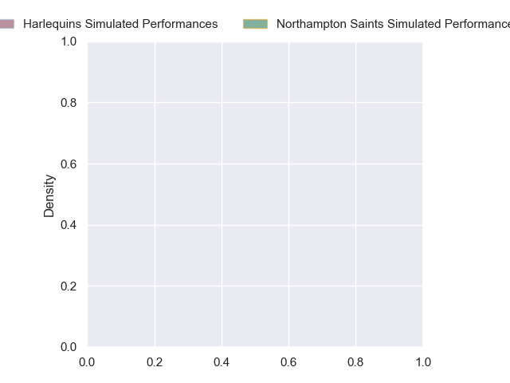
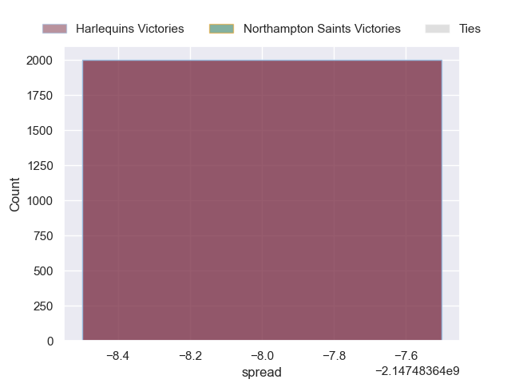

---  
layout: page  
title: Harlequins at Northampton Saints  
date: 2024-10-04 18:00:00 -0500  
categories: "Premiership 2024" match projection  
---
# Harlequins at Northampton Saints

# Club Level Predictions

The first set of predictions treats a club as the smallest object, as the club develops its members, organizes a gameplan, and deploys its players as needed for each match. This club model has a prediction of 0.553, which translates to predicting Northampton Saints to win by 5.4.

Our Over/Under is 58.5 - and combined with the spread above, we have a predicted scoreline of 27 to 32

Each club has a rating and a rating deviation (similar to a Glicko rating), and expected performances can be generated. This allows for simulated matches and spreads like the ones below.
## Projected Performances - Club Model

## Projected Spreads - Club Model

## Projected Results - Club Model

# Player Level Predictions

Treating teams instead as an entity made up of the currently active players, I have ratings for each player in an altogether different system. These can be combined to form team ratings once teamsheets are announced, weighting starters a bit higher than the reserves. After the match is played, players can be weighted by their minutes on the field, allowing for an accurate measure of the team's composition. With these compiled team ratings, we can make predictions, measure inaccuracy, and update the individual player ratings.
## Prediction without Player Minutes: Harlequins by nan

Harlequins by nan on a neutral pitch

## Projected Performances - Player Model

## Projected Spreads - Player Model

## Projected Results - Player Model

| Away Player               |   Away Percentile |   Number |   Home Percentile | Home Player        |
|:--------------------------|------------------:|---------:|------------------:|:-------------------|
| Fin Baxter                |            nan    |        1 |            nan    | Emmanuel Iyogun    |
| Jack Walker               |            nan    |        2 |            nan    | Curtis Langdon     |
| Titi Lamositele           |            nan    |        3 |            nan    | Trevor Davison     |
| Irne Herbst               |            nan    |        4 |            nan    | Chunya Munga       |
| Stephan Lewies            |            nan    |        5 |            nan    | Alex Coles         |
| Jack Kenningham           |             95.24 |        6 |            nan    | Josh Kemeny        |
| Will Evans                |            nan    |        7 |            nan    | Tom Pearson        |
| Chandler Cunningham-South |            nan    |        8 |             99.31 | Sam Graham         |
| Danny Care                |            nan    |        9 |            nan    | Tom James          |
| Jarrod Evans              |            nan    |       10 |            nan    | Fin Smith          |
| Oscar Beard               |            nan    |       11 |             96.17 | Ollie Sleightholme |
| Lennox Anyanwu            |             82.08 |       12 |            nan    | Rory Hutchinson    |
| Will Joseph               |             77.89 |       13 |            nan    | Fraser Dingwall    |
| Nick David                |            nan    |       14 |            nan    | Tommy Freeman      |
| Marcus Smith              |            nan    |       15 |            nan    | George Furbank     |
| Nathan Jibulu             |            nan    |       16 |            nan    | Robbie Smith       |
| Jordan Els                |            nan    |       17 |             65.82 | Tom West           |
| Simon Kerrod              |             73.82 |       18 |            nan    | Luke Green         |
| Dino Lamb                 |             95.4  |       19 |            nan    | Temo Mayanavanua   |
| James Chisholm            |             94.58 |       20 |            nan    | Henry Pollock      |
| Will Porter               |            nan    |       21 |             80.79 | Archie McParland   |
| Bryn Bradley              |             60.47 |       22 |              7.81 | Tom Seabrook       |
| Cameron Anderson          |             50.52 |       23 |            nan    | James Ramm         |

