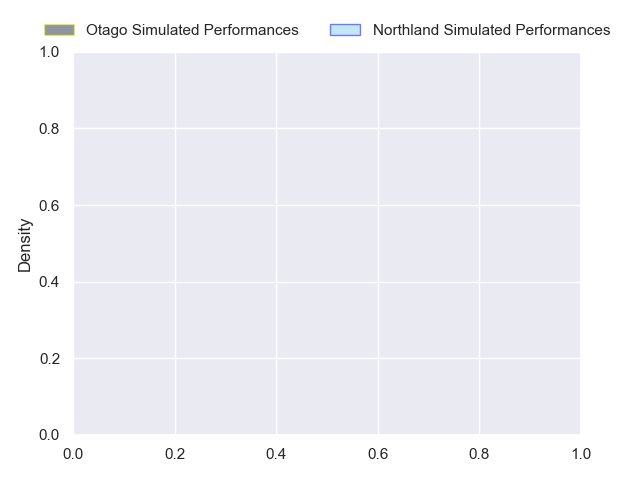
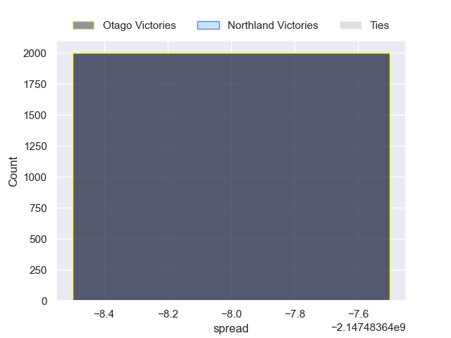

---  
layout: page  
title: Otago at Northland  
date: 2024-10-04 18:00:00 -0500  
categories: "NPC 2024" match projection  
---
# Otago at Northland

# Club Level Predictions

The first set of predictions treats a club as the smallest object, as the club develops its members, organizes a gameplan, and deploys its players as needed for each match. This club model has a prediction of 0.368, which translates to predicting Otago to win by 1.3.

Our Over/Under is 58.5 - and combined with the spread above, we have a predicted scoreline of 30 to 29

Each club has a rating and a rating deviation (similar to a Glicko rating), and expected performances can be generated. This allows for simulated matches and spreads like the ones below.
## Projected Performances - Club Model

## Projected Spreads - Club Model

## Projected Results - Club Model

# Player Level Predictions

Treating teams instead as an entity made up of the currently active players, I have ratings for each player in an altogether different system. These can be combined to form team ratings once teamsheets are announced, weighting starters a bit higher than the reserves. After the match is played, players can be weighted by their minutes on the field, allowing for an accurate measure of the team's composition. With these compiled team ratings, we can make predictions, measure inaccuracy, and update the individual player ratings.
## Prediction without Player Minutes: Otago by nan

Otago by nan on a neutral pitch

## Projected Performances - Player Model

## Projected Spreads - Player Model

## Projected Results - Player Model

| Away Player          |   Away Percentile |   Number |   Home Percentile | Home Player        |
|:---------------------|------------------:|---------:|------------------:|:-------------------|
| Rohan Wingham        |               nan |        1 |               nan | Rob Cobb           |
| Henry Bell           |               nan |        2 |               nan | Matt Moulds        |
| Saula Ma'u           |               nan |        3 |               nan | Chris Apoua        |
| Sam Fischli          |               nan |        4 |               nan | Allan Craig        |
| Will Stodart         |               nan |        5 |               nan | Sam Caird          |
| Oliver Haig          |               nan |        6 |               nan | Rob Rush           |
| Harry Taylor         |               nan |        7 |               nan | Terrell Peita      |
| Christian Lio-Willie |               nan |        8 |               nan | Simon Parker       |
| James Arscott        |               nan |        9 |               nan | Lisati Milo-Harris |
| Cameron Millar       |               nan |       10 |               nan | Rivez Reihana      |
| Hudson Creighton     |               nan |       11 |               nan | Heremaia Murray    |
| Ajay Faleafaga       |               nan |       12 |               nan | Corey Evans        |
| Thomas Umaga-Jensen  |               nan |       13 |               nan | Quinton Nichols    |
| Josh Whaanga         |               nan |       14 |               nan | Brady Rush         |
| Finn Hurley          |               nan |       15 |               nan | Jordan Trainor     |
| Liam Coltman         |               nan |       16 |               nan | Richie Asiata      |
| Benjamin Lopas       |               nan |       17 |               nan | Esile Fono         |
| George Bower         |               nan |       18 |               nan | Remsy Lemisio      |
| Fabian Holland       |               nan |       19 |               nan | Liam Hallam-Eames  |
| Lucas Casey          |               nan |       20 |               nan | Rory Woods         |
| Nathan Hastie        |               nan |       21 |               nan | Donald Boyd        |
| Joe Cooke            |               nan |       22 |               nan | Daniel Hawkins     |
| Waqa Nalaga          |               nan |       23 |               nan | Nathan Salmon      |

