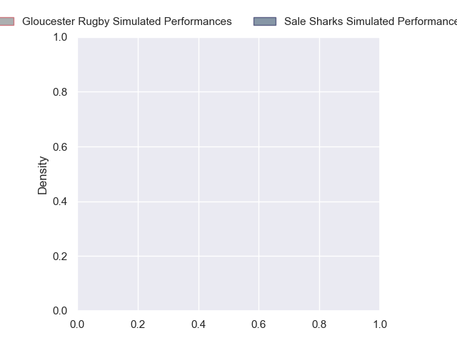
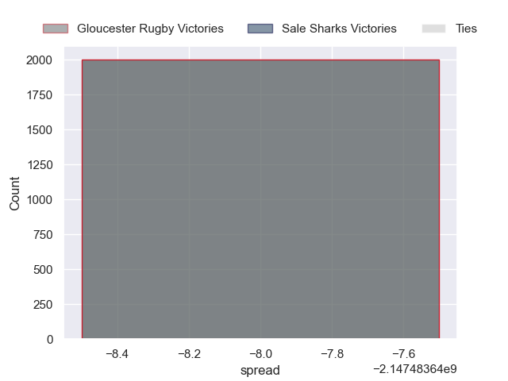

---  
layout: page  
title: Gloucester Rugby at Sale Sharks  
date: 2024-10-04 18:00:00 -0500  
categories: "Premiership 2024" match projection  
---
# Gloucester Rugby at Sale Sharks

# Club Level Predictions

The first set of predictions treats a club as the smallest object, as the club develops its members, organizes a gameplan, and deploys its players as needed for each match. This club model has a prediction of 0.571, which translates to predicting Sale Sharks to win by 5.7.

Our Over/Under is 65.5 - and combined with the spread above, we have a predicted scoreline of 30 to 36

Each club has a rating and a rating deviation (similar to a Glicko rating), and expected performances can be generated. This allows for simulated matches and spreads like the ones below.
## Projected Performances - Club Model

## Projected Spreads - Club Model

## Projected Results - Club Model

# Player Level Predictions

Treating teams instead as an entity made up of the currently active players, I have ratings for each player in an altogether different system. These can be combined to form team ratings once teamsheets are announced, weighting starters a bit higher than the reserves. After the match is played, players can be weighted by their minutes on the field, allowing for an accurate measure of the team's composition. With these compiled team ratings, we can make predictions, measure inaccuracy, and update the individual player ratings.
## Prediction without Player Minutes: Sale Sharks by 19.2

Sale Sharks by 11.2 on a neutral pitch

## Projected Performances - Player Model

## Projected Spreads - Player Model

## Projected Results - Player Model

| Away Player        |   Away Percentile |   Number |   Home Percentile | Home Player                    |
|:-------------------|------------------:|---------:|------------------:|:-------------------------------|
| Val Rapava-Ruskin  |             81.58 |        1 |            nan    | Simon McIntyre                 |
| Seb Blake          |             68.64 |        2 |            nan    | Luke Cowan-Dickie              |
| Afolabi Fasogban   |            nan    |        3 |            nan    | Asher Opoku-Fordjour           |
| Freddie Clarke     |             81    |        4 |            nan    | Ben Bamber                     |
| Arthur Clark       |             23.51 |        5 |             87.92 | Josh Beaumont                  |
| Jack Clement       |            nan    |        6 |             93.4  | Ernst van Rhyn                 |
| Harry Taylor       |             80.79 |        7 |            nan    | Sam Dugdale                    |
| Zach Mercer        |            nan    |        8 |            nan    | Roubs Birch                    |
| Tomos Williams     |            nan    |        9 |            nan    | Gus Warr                       |
| Gareth Anscombe    |            nan    |       10 |             83.92 | Robert du Preez                |
| Max Llewellyn      |            nan    |       11 |            nan    | Arron Reed                     |
| Sebastien Atkinson |            nan    |       12 |             87.94 | Sam Bedlow                     |
| Chris Harris       |            nan    |       13 |             95.64 | Will Addison                   |
| Christian Wade     |            nan    |       14 |            nan    | Tom Roebuck                    |
| George Barton      |            nan    |       15 |            nan    | Joe Carpenter                  |
| Jack Singleton     |            nan    |       16 |            nan    | Ethan Caine                    |
| Mayco Vivas        |            nan    |       17 |             19.06 | Tumy Onasanya                  |
| Ciaran Knight      |             23.51 |       18 |             18.04 | James Harper                   |
| Matias Alemanno    |            nan    |       19 |            nan    | Tom Burrow                     |
| Ruan Ackermann     |            nan    |       20 |             36.88 | Le Roux Roets                  |
| Albert Tuisue      |            nan    |       21 |            nan    | Nye Thomas                     |
| Caolan Englefield  |             88.16 |       22 |            nan    | Tom Curtis                     |
| Charlie Atkinson   |             71.96 |       23 |            nan    | Waisea Nayacalevu Vuidravuwalu |

