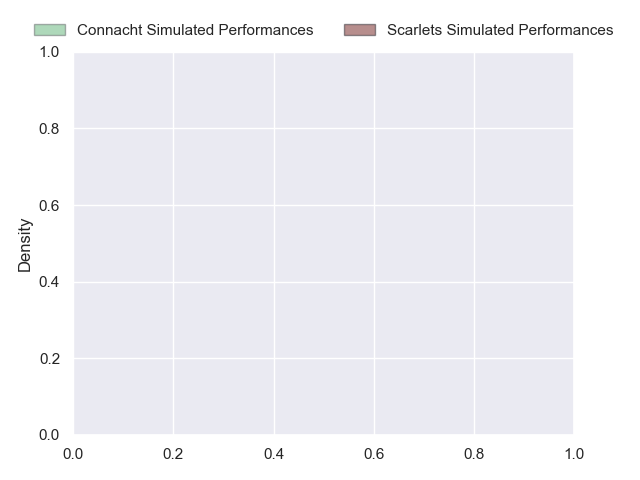
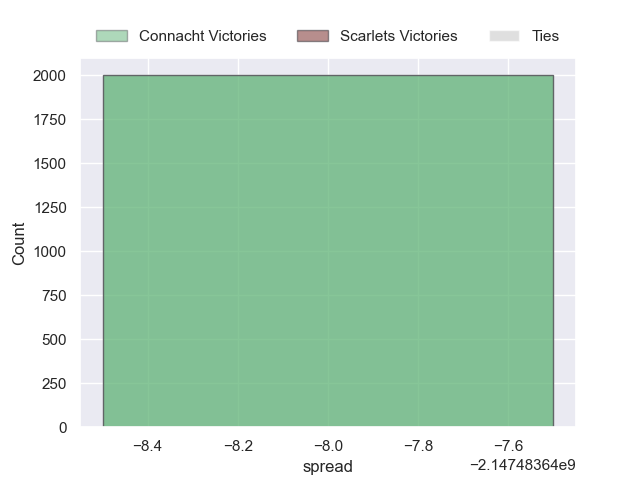

---  
layout: page  
title: Connacht at Scarlets  
date: 2024-10-04 18:00:00 -0500  
categories: "United Rugby Championship 2024" match projection  
---
# Connacht at Scarlets

# Club Level Predictions

The first set of predictions treats a club as the smallest object, as the club develops its members, organizes a gameplan, and deploys its players as needed for each match. This club model has a prediction of 0.289, which translates to predicting Connacht to win by 4.7.

Our Over/Under is 41.5 - and combined with the spread above, we have a predicted scoreline of 23 to 18

Each club has a rating and a rating deviation (similar to a Glicko rating), and expected performances can be generated. This allows for simulated matches and spreads like the ones below.
## Projected Performances - Club Model

## Projected Spreads - Club Model

## Projected Results - Club Model

# Player Level Predictions

Treating teams instead as an entity made up of the currently active players, I have ratings for each player in an altogether different system. These can be combined to form team ratings once teamsheets are announced, weighting starters a bit higher than the reserves. After the match is played, players can be weighted by their minutes on the field, allowing for an accurate measure of the team's composition. With these compiled team ratings, we can make predictions, measure inaccuracy, and update the individual player ratings.
## Prediction without Player Minutes: Connacht by 6.4

Connacht by 12.4 on a neutral pitch

## Projected Performances - Player Model

## Projected Spreads - Player Model

## Projected Results - Player Model

| Away Player          |   Away Percentile |   Number |   Home Percentile | Home Player          |
|:---------------------|------------------:|---------:|------------------:|:---------------------|
| Denis Buckley        |            nan    |        1 |             50.95 | Alec Hepburn         |
| Dave Heffernan       |            nan    |        2 |            nan    | Ryan Elias           |
| Finlay Bealham       |            nan    |        3 |             35.32 | Henry Thomas         |
| Niall Murray         |            nan    |        4 |             74.24 | Sam Lousi            |
| David O'Connor       |            nan    |        5 |            nan    | Max Douglas          |
| Josh Murphy          |            nan    |        6 |             38.42 | Josh Macleod         |
| Conor Oliver         |            nan    |        7 |             81.28 | Dan Davis            |
| Cian Prendergast     |            nan    |        8 |            nan    | Taine Plumtree       |
| Ben Murphy           |            nan    |        9 |            nan    | Gareth Davies        |
| Jack Carty           |             95.57 |       10 |             46.13 | Sam Costelow         |
| Piers O'Conor        |             28.81 |       11 |            nan    | Blair Murray         |
| Bundee Aki           |             99.5  |       12 |             44.39 | Eddie James          |
| Cathal Forde         |            nan    |       13 |            nan    | Johnny Williams      |
| Mack Hansen          |            nan    |       14 |            nan    | Tom Rogers           |
| Santiago Cordero     |            nan    |       15 |             12.32 | Ioan Nicholas        |
| Dylan Tierney-Martin |            nan    |       16 |            nan    | Marnus van der Merwe |
| Peter Dooley         |             97.71 |       17 |            nan    | Kemsley Mathias      |
| Temi Lasisi          |            nan    |       18 |            nan    | Sam Wainwright       |
| Oisin Dowling        |             74.56 |       19 |            nan    | Alex Craig           |
| Paul Boyle           |             65.29 |       20 |             59.11 | Carwyn Tuipulotu     |
| Caolin Blade         |             80    |       21 |             36.58 | Efan Jones           |
| David Hawkshaw       |             71.52 |       22 |            nan    | Ioan Lloyd           |
| Shayne Bolton        |             70.84 |       23 |            nan    | Macs Page            |

