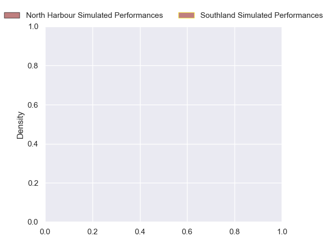
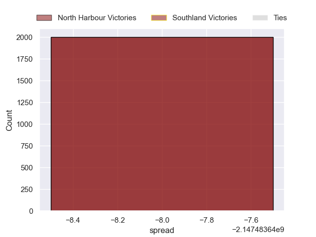

---  
layout: page  
title: North Harbour at Southland  
date: 2024-10-04 18:00:00 -0500  
categories: "NPC 2024" match projection  
---
# North Harbour at Southland

# Club Level Predictions

The first set of predictions treats a club as the smallest object, as the club develops its members, organizes a gameplan, and deploys its players as needed for each match. This club model has a prediction of 0.347, which translates to predicting North Harbour to win by 6.0.

Each club has a rating and a rating deviation (similar to a Glicko rating), and expected performances can be generated. This allows for simulated matches and spreads like the ones below.
## Projected Performances - Club Model

## Projected Spreads - Club Model

## Projected Results - Club Model

# Player Level Predictions

Treating teams instead as an entity made up of the currently active players, I have ratings for each player in an altogether different system. These can be combined to form team ratings once teamsheets are announced, weighting starters a bit higher than the reserves. After the match is played, players can be weighted by their minutes on the field, allowing for an accurate measure of the team's composition. With these compiled team ratings, we can make predictions, measure inaccuracy, and update the individual player ratings.
## Prediction without Player Minutes: North Harbour by nan

North Harbour by nan on a neutral pitch

## Projected Performances - Player Model

## Projected Spreads - Player Model

## Projected Results - Player Model

| Away Player     |   Away Percentile |   Number |   Home Percentile | Home Player           |
|:----------------|------------------:|---------:|------------------:|:----------------------|
| Fatongia Paea   |            nan    |        1 |               nan | Ethan de Groot        |
| Shilo Klein     |            nan    |        2 |               nan | Jack Taylor           |
| Sione Mafileo   |            nan    |        3 |               nan | Sean Paranihi         |
| Mahonri Ngakuru |            nan    |        4 |               nan | Mitchell Dunshea      |
| Sam Slade       |            nan    |        5 |               nan | Josh Bekhuis          |
| Tristyn Cook    |            nan    |        6 |               nan | Blair Ryall           |
| Jed Melvin      |            nan    |        7 |               nan | Sean Withy            |
| Cameron Suafoa  |            nan    |        8 |               nan | Semisi Tupou Ta'eiloa |
| Bryn Hall       |            nan    |        9 |               nan | Lachie Albert         |
| Tane Edmed      |            nan    |       10 |               nan | Byron Smith           |
| Mark Tele'a     |            nan    |       11 |               nan | Rory van Vugt         |
| Fine Inisi      |            nan    |       12 |               nan | Faletoi Peni          |
| Moses Leo       |            nan    |       13 |               nan | Isaac Te Tamaki       |
| Kade Banks      |            nan    |       14 |               nan | Michael Manson        |
| Shaun Stevenson |            nan    |       15 |               nan | Jake Strachan         |
| Bryn Gordon     |            nan    |       16 |               nan | Nic Souchon           |
| Tevita Mafileo  |            nan    |       17 |               nan | Jack Sexton           |
| Tevita Langi    |            nan    |       18 |               nan | Paula Latu            |
| Felix Kalapu    |            nan    |       19 |               nan | Shneil Singh          |
| Ben Grant       |             97.75 |       20 |               nan | Dylan Nel             |
| Karl Ruzich     |            nan    |       21 |               nan | Liam Howley           |
| Aisea Halo      |            nan    |       22 |               nan | Kaea Nikora-Balloch   |
| James Little    |            nan    |       23 |               nan | Tayne Harvey          |

