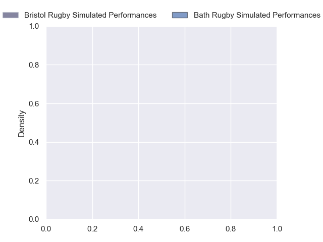
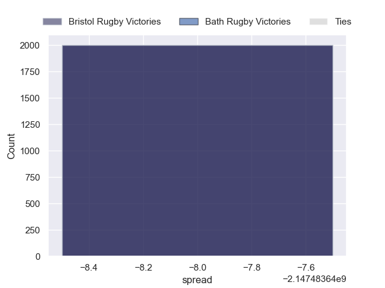

---  
layout: page  
title: Bristol Rugby at Bath Rugby  
date: 2024-10-05 18:00:00 -0500  
categories: "Premiership 2024" match projection  
---
# Bristol Rugby at Bath Rugby

# Club Level Predictions

The first set of predictions treats a club as the smallest object, as the club develops its members, organizes a gameplan, and deploys its players as needed for each match. This club model has a prediction of 0.588, which translates to predicting Bath Rugby to win by 6.5.

Our Over/Under is 63.5 - and combined with the spread above, we have a predicted scoreline of 28 to 35

Each club has a rating and a rating deviation (similar to a Glicko rating), and expected performances can be generated. This allows for simulated matches and spreads like the ones below.
## Projected Performances - Club Model

## Projected Spreads - Club Model

## Projected Results - Club Model

# Player Level Predictions

Treating teams instead as an entity made up of the currently active players, I have ratings for each player in an altogether different system. These can be combined to form team ratings once teamsheets are announced, weighting starters a bit higher than the reserves. After the match is played, players can be weighted by their minutes on the field, allowing for an accurate measure of the team's composition. With these compiled team ratings, we can make predictions, measure inaccuracy, and update the individual player ratings.
## Prediction without Player Minutes: Bristol Rugby by nan

Bristol Rugby by nan on a neutral pitch

## Projected Performances - Player Model

## Projected Spreads - Player Model

## Projected Results - Player Model

| Away Player                |   Away Percentile |   Number |   Home Percentile | Home Player         |
|:---------------------------|------------------:|---------:|------------------:|:--------------------|
| Ellis Genge                |            nan    |        1 |            nan    | Beno Obano          |
| Gabriel Oghre              |            nan    |        2 |             48.07 | Niall Annett        |
| Max Lahiff                 |             76.49 |        3 |            nan    | Thomas du Toit      |
| James Dun                  |            nan    |        4 |            nan    | Quinn Roux          |
| Joe Batley                 |            nan    |        5 |             75.52 | Charlie Ewels       |
| Steven Luatua              |            nan    |        6 |             90.97 | Ted Hill            |
| Santiago Grondona          |            nan    |        7 |            nan    | Guy Pepper          |
| Fitz Harding               |            nan    |        8 |             97.87 | Miles Reid          |
| Harry Randall              |            nan    |        9 |            nan    | Ben Spencer         |
| AJ MacGinty                |            nan    |       10 |            nan    | Finn Russell        |
| Richard Lane               |             72    |       11 |             86.43 | Ruaridh McConnochie |
| James Williams             |            nan    |       12 |            nan    | Will Butt           |
| Benhard Janse van Rensburg |            nan    |       13 |            nan    | Ollie Lawrence      |
| Gabriel Ibitoye            |            nan    |       14 |            nan    | Tom de Glanville    |
| Max Malins                 |            nan    |       15 |             47.27 | Sam Harris          |
| Will Capon                 |             35.22 |       16 |            nan    | Tom Dunn            |
| Jake Woolmore              |             89.83 |       17 |             91.23 | Francois van Wyk    |
| George Kloska              |             69.76 |       18 |            nan    | Will Stuart         |
| Joe Owen                   |            nan    |       19 |            nan    | Ross Molony         |
| Benjamín Grondona          |            nan    |       20 |             98.36 | Sam Underhill       |
| Kieran Marmion             |            nan    |       21 |             80.79 | Louis Schreuder     |
| Joe Jenkins                |            nan    |       22 |             68.84 | Cameron Redpath     |
| Jack Bates                 |            nan    |       23 |             61.17 | Jaco Coetzee        |

