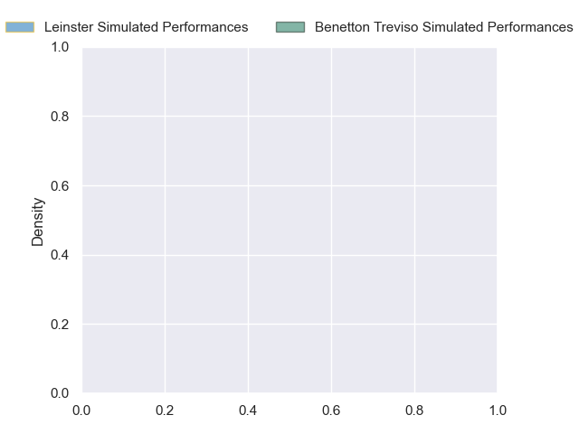
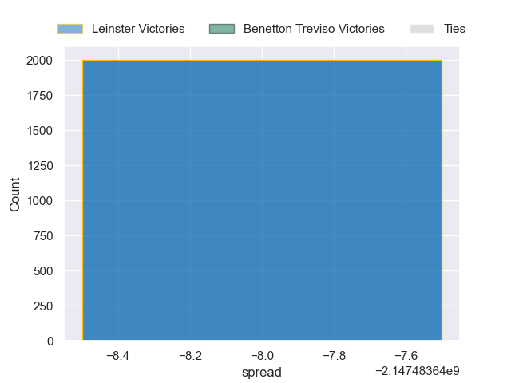

---  
layout: page  
title: Leinster at Benetton Treviso  
date: 2024-10-05 18:00:00 -0500  
categories: "United Rugby Championship 2024" match projection  
---
# Leinster at Benetton Treviso

# Club Level Predictions

The first set of predictions treats a club as the smallest object, as the club develops its members, organizes a gameplan, and deploys its players as needed for each match. This club model has a prediction of 0.244, which translates to predicting Leinster to win by 6.6.

Our Over/Under is 46.5 - and combined with the spread above, we have a predicted scoreline of 26 to 20

Each club has a rating and a rating deviation (similar to a Glicko rating), and expected performances can be generated. This allows for simulated matches and spreads like the ones below.
## Projected Performances - Club Model

## Projected Spreads - Club Model

## Projected Results - Club Model

# Player Level Predictions

Treating teams instead as an entity made up of the currently active players, I have ratings for each player in an altogether different system. These can be combined to form team ratings once teamsheets are announced, weighting starters a bit higher than the reserves. After the match is played, players can be weighted by their minutes on the field, allowing for an accurate measure of the team's composition. With these compiled team ratings, we can make predictions, measure inaccuracy, and update the individual player ratings.
## Prediction without Player Minutes: Leinster by nan

Leinster by nan on a neutral pitch

## Projected Performances - Player Model

## Projected Spreads - Player Model

## Projected Results - Player Model

| Away Player         |   Away Percentile |   Number |   Home Percentile | Home Player        |
|:--------------------|------------------:|---------:|------------------:|:-------------------|
| Andrew Porter       |             92.63 |        1 |            nan    | Mirco Spagnolo     |
| Ronan Kelleher      |             96.4  |        2 |            nan    | Siua Maile         |
| Tadhg Furlong       |             98.48 |        3 |            nan    | Simone Ferrari     |
| Joe McCarthy        |             85.51 |        4 |            nan    | Niccolo Cannone    |
| RG Snyman           |             99.68 |        5 |            nan    | Riccardo Favretto  |
| Jack Conan          |            nan    |        6 |            nan    | Sebastian Negri    |
| Josh van der Flier  |             99.18 |        7 |            nan    | Manuel Zuliani     |
| Caelan Doris        |             96.56 |        8 |            nan    | Michele Lamaro     |
| Jamison Gibson-Park |            nan    |        9 |             77.63 | Alessandro Garbisi |
| Ciaran Frawley      |             66.67 |       10 |            nan    | Jacob Umaga        |
| James Lowe          |            100    |       11 |             90.71 | Paolo Odogwu       |
| Jamie Osborne       |            nan    |       12 |            nan    | Malakai Fekitoa    |
| Garry Ringrose      |            nan    |       13 |            nan    | Tommaso Menoncello |
| Jimmy O'Brien       |             92.63 |       14 |            nan    | Ignacio Mendy      |
| Hugo Keenan         |             99.64 |       15 |            nan    | Matt Gallagher     |
| Lee Barron          |             55.01 |       16 |              8.23 | Marco Manfredi     |
| Michael Milne       |            nan    |       17 |            nan    | Destiny Aminu      |
| Thomas Clarkson     |            nan    |       18 |            nan    | Enzo Avaca         |
| Ryan Baird          |             90.48 |       19 |            nan    | Federico Ruzza     |
| Brian Deeny         |            nan    |       20 |            nan    | Giulio Marini      |
| Fintan Gunne        |            nan    |       21 |            nan    | Lorenzo Cannone    |
| Ross Byrne          |            nan    |       22 |            nan    | Andy Uren          |
| Scott Penny         |            nan    |       23 |             74.54 | Leonardo Marin     |

