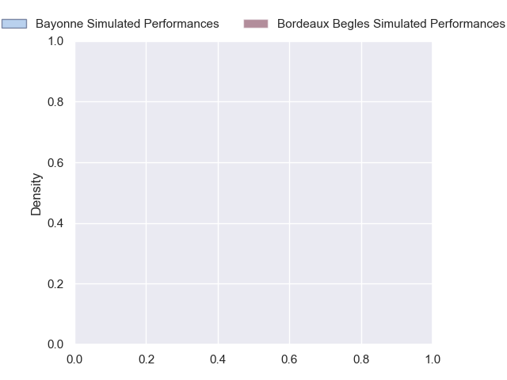
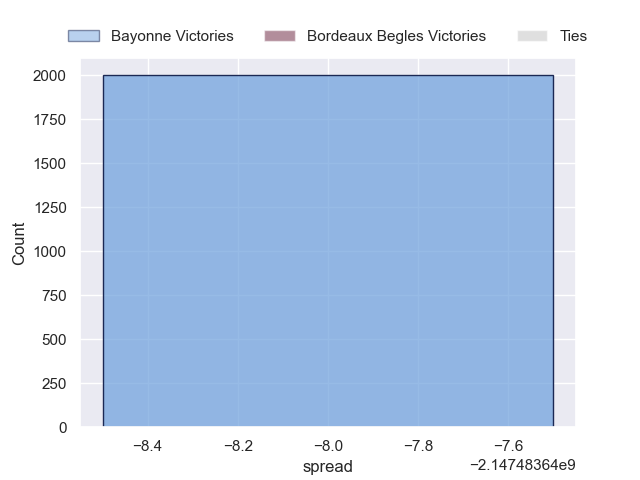

---  
layout: page  
title: Bayonne at Bordeaux Begles  
date: 2024-10-05 18:00:00 -0500  
categories: "Top 14 2024" match projection  
---
# Bayonne at Bordeaux Begles

# Club Level Predictions

The first set of predictions treats a club as the smallest object, as the club develops its members, organizes a gameplan, and deploys its players as needed for each match. This club model has a prediction of 0.711, which translates to predicting Bordeaux Begles to win by 11.1.

Our Over/Under is 54.5 - and combined with the spread above, we have a predicted scoreline of 22 to 33

Each club has a rating and a rating deviation (similar to a Glicko rating), and expected performances can be generated. This allows for simulated matches and spreads like the ones below.
## Projected Performances - Club Model

## Projected Spreads - Club Model

## Projected Results - Club Model

# Player Level Predictions

Treating teams instead as an entity made up of the currently active players, I have ratings for each player in an altogether different system. These can be combined to form team ratings once teamsheets are announced, weighting starters a bit higher than the reserves. After the match is played, players can be weighted by their minutes on the field, allowing for an accurate measure of the team's composition. With these compiled team ratings, we can make predictions, measure inaccuracy, and update the individual player ratings.
## Prediction without Player Minutes: Bayonne by nan

Bayonne by nan on a neutral pitch

## Projected Performances - Player Model

## Projected Spreads - Player Model

## Projected Results - Player Model

| Away Player             |   Away Percentile |   Number |   Home Percentile | Home Player              |
|:------------------------|------------------:|---------:|------------------:|:-------------------------|
| Andy Bordelai           |            nan    |        1 |            nan    | Matis Perchaud           |
| Facundo Bosch           |            nan    |        2 |            nan    | Maxime Lamothe           |
| Pascal Cotet            |            nan    |        3 |            nan    | Carlu Sadie              |
| Arthur Iturria          |            nan    |        4 |            nan    | Jonny Gray               |
| Lucas Paulos            |            nan    |        5 |            nan    | Cyril Cazeaux            |
| Rodrigo Bruni           |            nan    |        6 |            nan    | Mahamadou Diaby          |
| Esteban Capilla         |            nan    |        7 |            nan    | Temo Matiu               |
| Giovanni Habel-Kueffner |            nan    |        8 |            nan    | Marko Gazzotti           |
| Maxime Machenaud        |            nan    |        9 |            nan    | Maxime Lucu              |
| Joris Segonds           |            nan    |       10 |            nan    | Matthieu Jalibert        |
| Arnaud Erbinartegaray   |            nan    |       11 |            nan    | Louis Bielle-Biarrey     |
| Federico Mori           |             53.77 |       12 |            nan    | Ben Tapuai               |
| Sireli Maqala           |            nan    |       13 |            nan    | Nicolas Depoortere       |
| Victor Hannoun          |             59.44 |       14 |            nan    | Pablo Uberti             |
| Cheikh Tiberghien       |            nan    |       15 |            nan    | Romain Buros             |
| Lucas Martin            |            nan    |       16 |            nan    | Romain Latterrade        |
| Swan Cormenier          |            nan    |       17 |            nan    | Ugo Boniface             |
| Veikoso Poloniati       |            nan    |       18 |            nan    | Pierre Bochaton          |
| Baptiste Chouzenoux     |            nan    |       19 |            nan    | Tevita Tatafu            |
| Baptiste Germain        |            nan    |       20 |            nan    | Yann Lesgourgues         |
| Guillaume Martocq       |            nan    |       21 |             47.23 | Mateo Garcia             |
| Yohan Orabe             |            nan    |       22 |            nan    | Rohan Janse Van Rensburg |
| Pieter Scholtz          |              2.41 |       23 |            nan    | Sipili Falatea           |

