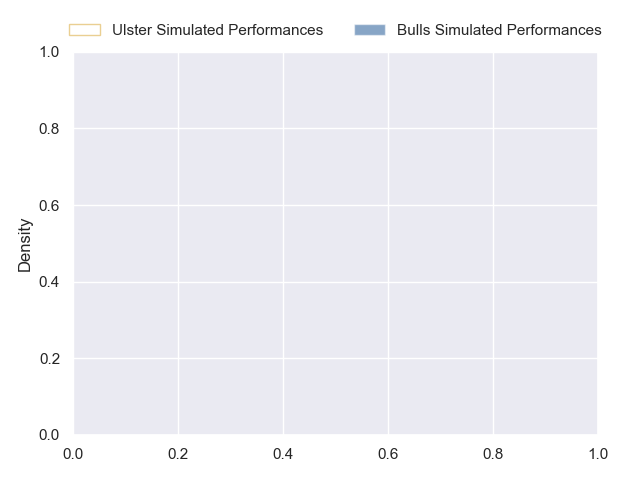
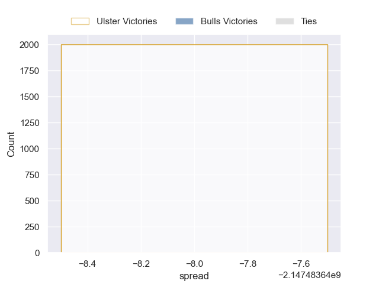

---  
layout: page  
title: Ulster at Bulls  
date: 2024-10-05 18:00:00 -0500  
categories: "United Rugby Championship 2024" match projection  
---
# Ulster at Bulls

# Club Level Predictions

The first set of predictions treats a club as the smallest object, as the club develops its members, organizes a gameplan, and deploys its players as needed for each match. This club model has a prediction of 0.637, which translates to predicting Bulls to win by 8.2.

Our Over/Under is 68.5 - and combined with the spread above, we have a predicted scoreline of 30 to 38

Each club has a rating and a rating deviation (similar to a Glicko rating), and expected performances can be generated. This allows for simulated matches and spreads like the ones below.
## Projected Performances - Club Model

## Projected Spreads - Club Model

## Projected Results - Club Model

# Player Level Predictions

Treating teams instead as an entity made up of the currently active players, I have ratings for each player in an altogether different system. These can be combined to form team ratings once teamsheets are announced, weighting starters a bit higher than the reserves. After the match is played, players can be weighted by their minutes on the field, allowing for an accurate measure of the team's composition. With these compiled team ratings, we can make predictions, measure inaccuracy, and update the individual player ratings.
## Prediction without Player Minutes: Ulster by nan

Bulls by 28.9 on a neutral pitch

## Projected Performances - Player Model

## Projected Spreads - Player Model

## Projected Results - Player Model

| Away Player     |   Away Percentile |   Number |   Home Percentile | Home Player         |
|:----------------|------------------:|---------:|------------------:|:--------------------|
| Andrew Warwick  |            nan    |        1 |             92.76 | Gerhard Steenekamp  |
| James Mccormick |            nan    |        2 |             97.17 | Johan Grobbelaar    |
| Corrie Barrett  |            nan    |        3 |             99.49 | Wilco Louw          |
| Iain Henderson  |            nan    |        4 |            nan    | Cobus Wiese         |
| Charlie Irvine  |            nan    |        5 |            nan    | Ruan Nortje         |
| James McNabney  |            nan    |        6 |            nan    | Marco van Staden    |
| Sean Reffell    |             78    |        7 |             91.75 | Elrigh Louw         |
| David McCann    |            nan    |        8 |            nan    | Cameron Hanekom     |
| Nathan Doak     |            nan    |        9 |            nan    | Embrose Papier      |
| Aidan Morgan    |            nan    |       10 |             83.03 | Boeta Chamberlain   |
| Jacob Stockdale |            nan    |       11 |            nan    | Kurt-Lee Arendse    |
| Ben Carson      |            nan    |       12 |            nan    | David Kriel         |
| Stewart Moore   |            nan    |       13 |            nan    | Canan Moodie        |
| Werner Kok      |            nan    |       14 |            nan    | Sebastian de Klerk  |
| Mike Lowry      |            nan    |       15 |            nan    | Willie le Roux      |
| Tadgh McElroy   |             23.39 |       16 |            nan    | Akker van der Merwe |
| Eric O'Sullivan |            nan    |       17 |             41.42 | Jan-Hendrik Wessels |
| Tom O'Toole     |            nan    |       18 |            nan    | François Klopper    |
| Alan O'Connor   |             81.8  |       19 |             93.72 | Sintu Manjezi       |
| Nick Timoney    |            nan    |       20 |             81.79 | Celimpilo Gumede    |
| Dave Shanahan   |            nan    |       21 |            nan    | Keagan Johannes     |
| James Humphreys |            nan    |       22 |            nan    | Stedman Gans        |
| Ben Moxham      |            nan    |       23 |              8.04 | Aphiwe Dyantyi      |

