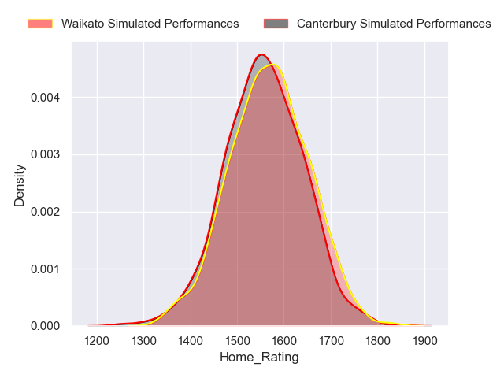
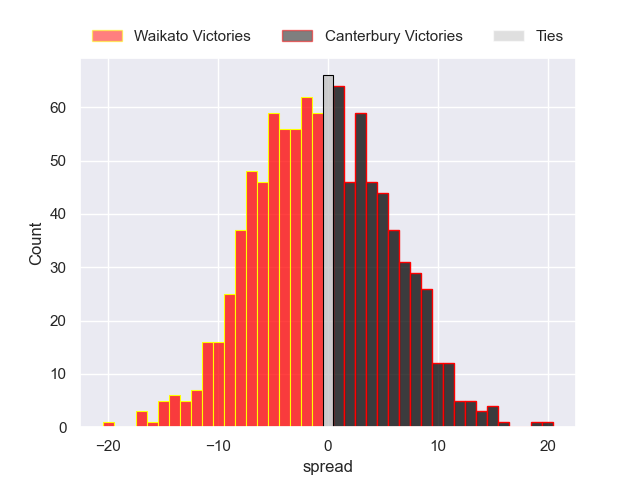
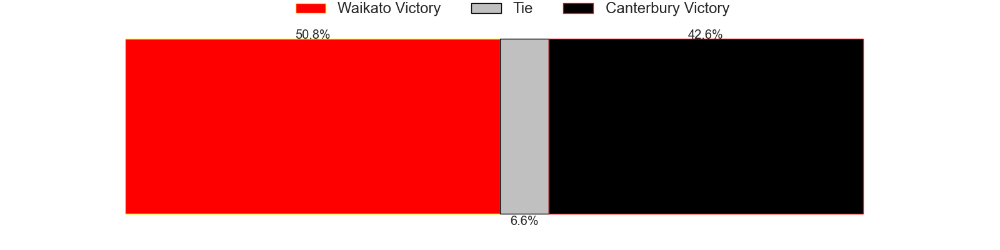
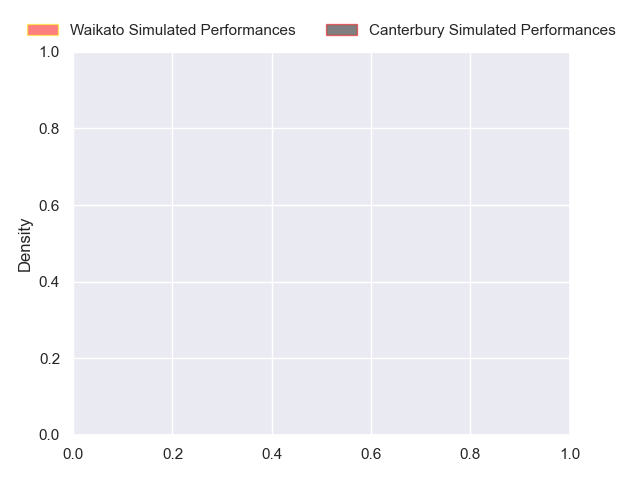
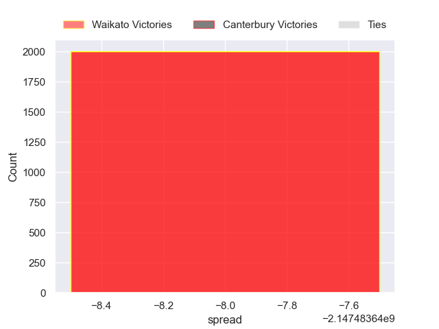

---  
layout: page  
title: Waikato at Canterbury  
date: 2024-10-05 18:00:00 -0500  
categories: "NPC 2024" match projection  
---
# Waikato at Canterbury

# Club Level Predictions

The first set of predictions treats a club as the smallest object, as the club develops its members, organizes a gameplan, and deploys its players as needed for each match. This club model has a prediction of 0.391, which translates to predicting Waikato to win by 0.6.

Our Over/Under is 45.5 - and combined with the spread above, we have a predicted scoreline of 23 to 23

Each club has a rating and a rating deviation (similar to a Glicko rating), and expected performances can be generated. This allows for simulated matches and spreads like the ones below.
## Projected Performances - Club Model

## Projected Spreads - Club Model

## Projected Results - Club Model

# Player Level Predictions

Treating teams instead as an entity made up of the currently active players, I have ratings for each player in an altogether different system. These can be combined to form team ratings once teamsheets are announced, weighting starters a bit higher than the reserves. After the match is played, players can be weighted by their minutes on the field, allowing for an accurate measure of the team's composition. With these compiled team ratings, we can make predictions, measure inaccuracy, and update the individual player ratings.
## Prediction without Player Minutes: Waikato by nan

Waikato by nan on a neutral pitch

## Projected Performances - Player Model

## Projected Spreads - Player Model

## Projected Results - Player Model

| Away Player            |   Away Percentile |   Number |   Home Percentile | Home Player        |
|:-----------------------|------------------:|---------:|------------------:|:-------------------|
| Ollie Norris           |               nan |        1 |               nan | Finlay Brewis      |
| Manaaki Boyle-Tiatia   |               nan |        2 |               nan | George Bell        |
| Gabe Robinson          |               nan |        3 |               nan | Joe Moody          |
| Joshua Balme           |               nan |        4 |               nan | Sam Darry          |
| Laghlan McWhannell     |               nan |        5 |               nan | Zach Gallagher     |
| Samipeni Finau         |               nan |        6 |               nan | Corey Kellow       |
| Patrick McCurran       |               nan |        7 |               nan | Tom Christie       |
| Malachi Wrampling-Alec |               nan |        8 |               nan | Billy Harmon       |
| Xavier Roe             |               nan |        9 |               nan | Nic Shearer        |
| D'Angelo Leuila        |               nan |       10 |               nan | Rameka Poihipi     |
| nan                    |               nan |       11 |               nan | Ngatungane Punivai |
| Quinn Tupaea           |               nan |       12 |               nan | Dallas McLeod      |
| Bailyn Sullivan        |               nan |       13 |               nan | Braydon Ennor      |
| Jole Naufahu           |               nan |       14 |               nan | Chay Fihaki        |
| Tepaea Cook-Savage     |               nan |       15 |               nan | Issac Hutchinson   |
| Pita Anae Ah-Sue       |               nan |       16 |               nan | Ben Funnell        |
| nan                    |               nan |       17 |               nan | Tau Junior Fifita  |
| nan                    |               nan |       18 |               nan | Seb Calder         |
| nan                    |               nan |       19 |               nan | Tahlor Cahill      |
| nan                    |               nan |       20 |               nan | Cullen Grace       |
| nan                    |               nan |       21 |               nan | Willi Heinz        |
| nan                    |               nan |       22 |               nan | Jone Rova          |
| nan                    |               nan |       23 |               nan | Ryan Crotty        |

