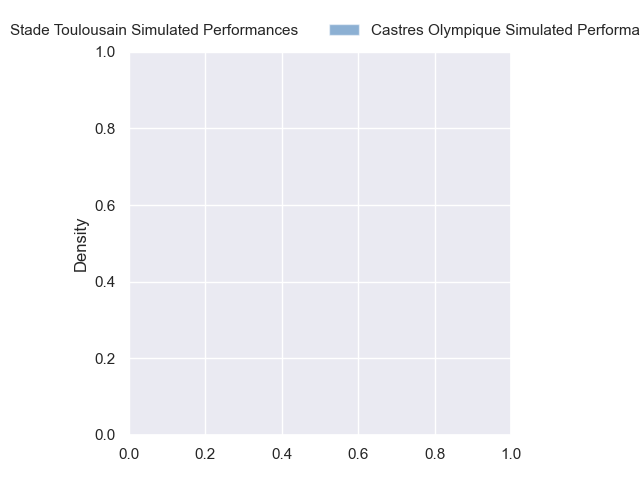
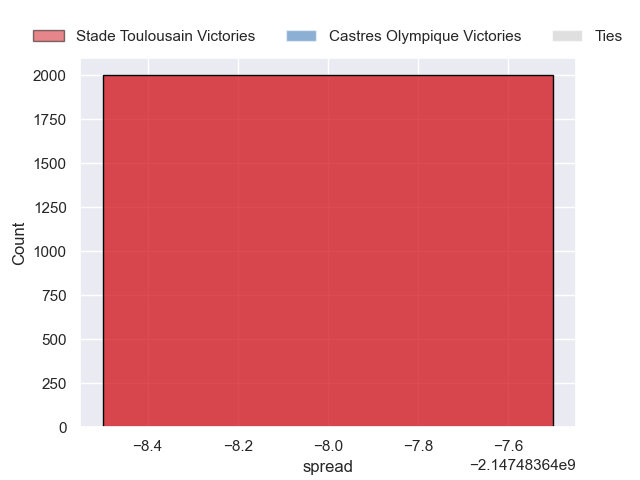

---  
layout: page  
title: Stade Toulousain at Castres Olympique  
date: 2024-10-05 18:00:00 -0500  
categories: "Top 14 2024" match projection  
---
# Stade Toulousain at Castres Olympique

# Club Level Predictions

The first set of predictions treats a club as the smallest object, as the club develops its members, organizes a gameplan, and deploys its players as needed for each match. This club model has a prediction of 0.299, which translates to predicting Stade Toulousain to win by 4.0.

Our Over/Under is 46.5 - and combined with the spread above, we have a predicted scoreline of 25 to 22

Each club has a rating and a rating deviation (similar to a Glicko rating), and expected performances can be generated. This allows for simulated matches and spreads like the ones below.
## Projected Performances - Club Model

## Projected Spreads - Club Model

## Projected Results - Club Model

# Player Level Predictions

Treating teams instead as an entity made up of the currently active players, I have ratings for each player in an altogether different system. These can be combined to form team ratings once teamsheets are announced, weighting starters a bit higher than the reserves. After the match is played, players can be weighted by their minutes on the field, allowing for an accurate measure of the team's composition. With these compiled team ratings, we can make predictions, measure inaccuracy, and update the individual player ratings.
## Prediction without Player Minutes: Stade Toulousain by nan

Stade Toulousain by nan on a neutral pitch

## Projected Performances - Player Model

## Projected Spreads - Player Model

## Projected Results - Player Model

| Away Player          |   Away Percentile |   Number |   Home Percentile | Home Player           |
|:---------------------|------------------:|---------:|------------------:|:----------------------|
| Rodrigue Neti        |            nan    |        1 |            nan    | Quentin Walcker       |
| Peato Mauvaka        |             98.46 |        2 |            nan    | Gaetan Barlot         |
| Joel Merkler         |             82.08 |        3 |            nan    | Will Collier          |
| Richie Arnold        |            nan    |        4 |            nan    | Guillaume Ducat       |
| Emmanuel Meafou      |            nan    |        5 |            nan    | Florent Vanverberghe  |
| Francois Cros        |            nan    |        6 |            nan    | Mathieu Babillot      |
| Anthony Jelonch      |             98.63 |        7 |            nan    | Baptiste Delaporte    |
| Theo Ntamack         |            nan    |        8 |            nan    | Abraham Papali'i      |
| Paul Graou           |            nan    |        9 |            nan    | Santiago Arata        |
| Thomas Ramos         |            nan    |       10 |            nan    | Louis Le Brun         |
| Matthis Lebel        |            nan    |       11 |            nan    | Remy Baget            |
| Pierre-Louis Barassi |            nan    |       12 |            nan    | Jack Goodhue          |
| Dimitri Delibes      |            nan    |       13 |            nan    | Adrien Seguret        |
| Setareki Bituniyata  |             78.47 |       14 |            nan    | Christian Ambadiang   |
| Blair Kinghorn       |            nan    |       15 |            nan    | Geoffrey Palis        |
| Guillaume Cramont    |            nan    |       16 |             34.7  | Loris Zarantonello    |
| David Ainu'u         |            nan    |       17 |            nan    | Lois Guerois-Galisson |
| Thibaud Flament      |            nan    |       18 |            nan    | Leone Nakarawa        |
| Joshua Brennan       |            nan    |       19 |             60.1  | Baptiste Cope         |
| Naoto Saito          |            nan    |       20 |            nan    | Jeremy Fernandez      |
| Paul Costes          |            nan    |       21 |             76.01 | Pierre Popelin        |
| Nelson Épée          |            nan    |       22 |            nan    | Theo Chabouni         |
| Dorian Aldegheri     |            nan    |       23 |            nan    | Nicolas Corato        |

