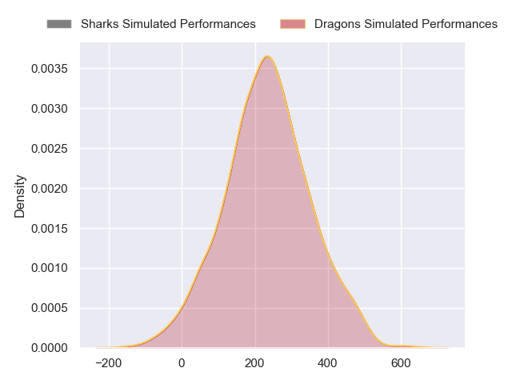
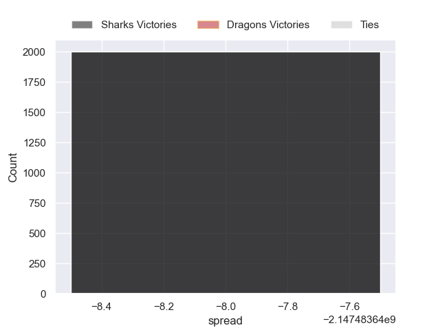

---  
layout: page  
title: Sharks at Dragons  
date: 2024-10-05 18:00:00 -0500  
categories: "United Rugby Championship 2024" match projection  
---
# Sharks at Dragons

# Club Level Predictions

The first set of predictions treats a club as the smallest object, as the club develops its members, organizes a gameplan, and deploys its players as needed for each match. This club model has a prediction of 0.248, which translates to predicting Sharks to win by 5.9.

Our Over/Under is 49.5 - and combined with the spread above, we have a predicted scoreline of 28 to 22

Each club has a rating and a rating deviation (similar to a Glicko rating), and expected performances can be generated. This allows for simulated matches and spreads like the ones below.
## Projected Performances - Club Model

## Projected Spreads - Club Model

## Projected Results - Club Model

# Player Level Predictions

Treating teams instead as an entity made up of the currently active players, I have ratings for each player in an altogether different system. These can be combined to form team ratings once teamsheets are announced, weighting starters a bit higher than the reserves. After the match is played, players can be weighted by their minutes on the field, allowing for an accurate measure of the team's composition. With these compiled team ratings, we can make predictions, measure inaccuracy, and update the individual player ratings.
## Prediction without Player Minutes: Sharks by nan

Sharks by nan on a neutral pitch

## Projected Performances - Player Model

## Projected Spreads - Player Model

## Projected Results - Player Model

| Away Player       |   Away Percentile |   Number |   Home Percentile | Home Player        |
|:------------------|------------------:|---------:|------------------:|:-------------------|
| Ntuthuko Mchunu   |            nan    |        1 |              3.18 | Rhodri Jones       |
| Dylan Richardson  |            nan    |        2 |             26.48 | Brodie Coghlan     |
| Ruan Dreyer       |            nan    |        3 |             53.62 | Leon Brown         |
| Jason Jenkins     |            nan    |        4 |              0.97 | Matthew Screech    |
| Gerbrandt Grobler |            nan    |        5 |             34.94 | Ben Carter         |
| James Venter      |            nan    |        6 |             20.96 | Shane Lewis-Hughes |
| Vincent Tshituka  |            nan    |        7 |             40.72 | Taine Basham       |
| Manu Tshituka     |            nan    |        8 |             65.02 | Dan Lydiate        |
| Jaden Hendrikse   |            nan    |        9 |             88.95 | Rhodri Williams    |
| Siya Masuku       |            nan    |       10 |             76.38 | Lloyd Evans        |
| Ethan Hooker      |            nan    |       11 |              4.28 | Jared Rosser       |
| Andre Esterhuizen |            nan    |       12 |             68.34 | Aneurin Owen       |
| Jurenzo Julius    |            nan    |       13 |             67.5  | Harry Wilson       |
| Eduan Keyter      |            nan    |       14 |             24.78 | Rio Dyer           |
| Jordan Hendrikse  |            nan    |       15 |             15.27 | Angus O'Brien      |
| Fez Mbatha        |             91.77 |       16 |            nan    | Oli Burrows        |
| Trevor Nyakane    |             85.39 |       17 |             73.57 | Rodrigo Martinez   |
| Hanru Jacobs      |             67.98 |       18 |             21.86 | Chris Coleman      |
| Corne Rahl        |             15.46 |       19 |             13.53 | Joseph Davies      |
| Phepsi Buthelezi  |             69.46 |       20 |             52.22 | Ryan Woodman       |
| Cameron Wright    |              4.47 |       21 |             12.89 | Dane Blacker       |
| Lionel Cronje     |             97.42 |       22 |             29.89 | Will Reed          |
| Francois Venter   |             73.53 |       23 |             49.41 | Joe Westwood       |

