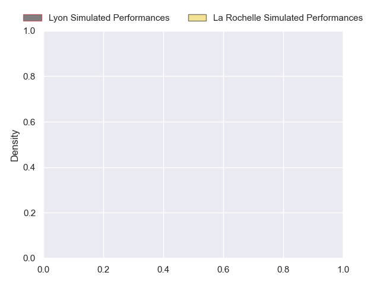
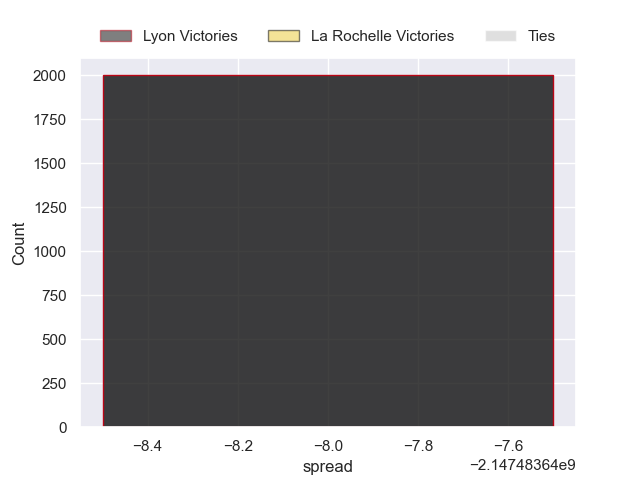

---  
layout: page  
title: Lyon at La Rochelle  
date: 2024-10-05 18:00:00 -0500  
categories: "Top 14 2024" match projection  
---
# Lyon at La Rochelle

# Club Level Predictions

The first set of predictions treats a club as the smallest object, as the club develops its members, organizes a gameplan, and deploys its players as needed for each match. This club model has a prediction of 0.643, which translates to predicting La Rochelle to win by 8.2.

Our Over/Under is 50.5 - and combined with the spread above, we have a predicted scoreline of 21 to 30

Each club has a rating and a rating deviation (similar to a Glicko rating), and expected performances can be generated. This allows for simulated matches and spreads like the ones below.
## Projected Performances - Club Model

## Projected Spreads - Club Model

## Projected Results - Club Model

# Player Level Predictions

Treating teams instead as an entity made up of the currently active players, I have ratings for each player in an altogether different system. These can be combined to form team ratings once teamsheets are announced, weighting starters a bit higher than the reserves. After the match is played, players can be weighted by their minutes on the field, allowing for an accurate measure of the team's composition. With these compiled team ratings, we can make predictions, measure inaccuracy, and update the individual player ratings.
## Prediction without Player Minutes: Lyon by nan

Lyon by 4.6 on a neutral pitch

## Projected Performances - Player Model

## Projected Spreads - Player Model

## Projected Results - Player Model

| Away Player         |   Away Percentile |   Number |   Home Percentile | Home Player         |
|:--------------------|------------------:|---------:|------------------:|:--------------------|
| Hamza Kaabeche      |            nan    |        1 |            nan    | Reda Wardi          |
| Sam Matavesi        |            nan    |        2 |            nan    | Nika Sutidze (2)    |
| Feao Fotuaika       |             66.58 |        3 |            nan    | Aleksandre Kuntelia |
| Theo William        |             26.93 |        4 |             80.68 | Ultan Dillane       |
| Killian Geraci      |             26.41 |        5 |            nan    | Kane Douglas        |
| Steeve Blanc-Mappaz |            nan    |        6 |            nan    | Matthias Haddad     |
| Marvin Okuya        |             50.08 |        7 |            nan    | Paul Boudehent      |
| Beka Shvangiradze   |            nan    |        8 |            nan    | Judicael Cancoriet  |
| Martin Page-Relo    |            nan    |        9 |            nan    | Tawera Kerr-Barlow  |
| Martin Meliande     |             11.07 |       10 |            nan    | Hugo Reus           |
| Vincent Rattez      |            nan    |       11 |            nan    | Thomas Berjon       |
| Josiah Maraku       |            nan    |       12 |            nan    | Jonathan Danty      |
| Alfred Parisien     |             79.4  |       13 |            nan    | Ulupano Seuteni     |
| Xavier Mignot       |             77.58 |       14 |            nan    | Jules Favre         |
| Davit Niniashvili   |            nan    |       15 |            nan    | Brice Dulin         |
| Yanis Charcosset    |             53.47 |       16 |            nan    | Quentin Lespiaucq   |
| Jerome Rey          |            nan    |       17 |            nan    | Thierry Païva       |
| Alban Roussel       |             66.51 |       18 |            nan    | Will Skelton        |
| Dylan Cretin        |            nan    |       19 |            nan    | Thomas Lavault      |
| Esteban Gonzalez    |            nan    |       20 |            nan    | Édouard Richer      |
| Paddy Jackson       |             85.98 |       21 |            nan    | Antoine Hastoy      |
| Semi Radradra       |            nan    |       22 |            nan    | Ihaia West          |
| Irakli Aptsiauri    |            nan    |       23 |            nan    | Uini Atonio         |

