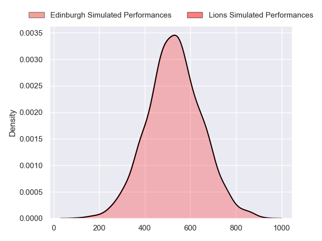
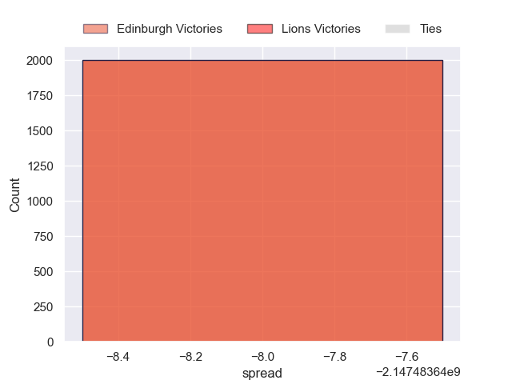

---  
layout: page  
title: Edinburgh at Lions  
date: 2024-10-05 18:00:00 -0500  
categories: "United Rugby Championship 2024" match projection  
---
# Edinburgh at Lions

# Club Level Predictions

The first set of predictions treats a club as the smallest object, as the club develops its members, organizes a gameplan, and deploys its players as needed for each match. This club model has a prediction of 0.565, which translates to predicting Lions to win by 5.6.

Our Over/Under is 61.5 - and combined with the spread above, we have a predicted scoreline of 28 to 33

Each club has a rating and a rating deviation (similar to a Glicko rating), and expected performances can be generated. This allows for simulated matches and spreads like the ones below.
## Projected Performances - Club Model

## Projected Spreads - Club Model

## Projected Results - Club Model

# Player Level Predictions

Treating teams instead as an entity made up of the currently active players, I have ratings for each player in an altogether different system. These can be combined to form team ratings once teamsheets are announced, weighting starters a bit higher than the reserves. After the match is played, players can be weighted by their minutes on the field, allowing for an accurate measure of the team's composition. With these compiled team ratings, we can make predictions, measure inaccuracy, and update the individual player ratings.
## Prediction without Player Minutes: Lions by 6.6

Lions by 2.8 on a neutral pitch

## Projected Performances - Player Model

## Projected Spreads - Player Model

## Projected Results - Player Model

| Away Player         |   Away Percentile |   Number |   Home Percentile | Home Player          |
|:--------------------|------------------:|---------:|------------------:|:---------------------|
| Pierre Schoeman     |            nan    |        1 |             56.8  | Juan Schoeman        |
| Ewan Ashman         |            nan    |        2 |             87.92 | PJ Botha             |
| Paul Hill           |             99.11 |        3 |             79.92 | Asenathi Ntlabakanye |
| Marshall Sykes      |             84.54 |        4 |             93.56 | Reinhard Nothnagel   |
| Grant Gilchrist     |             95.01 |        5 |             50.24 | Darrien Landsberg    |
| Jamie Ritchie       |            nan    |        6 |             92.12 | JC Pretorius         |
| Hamish Watson       |             42.86 |        7 |             46.8  | Jarod Cairns         |
| Magnus Bradbury     |             71.13 |        8 |             99.66 | Francke Horn         |
| Ben Vellacott       |             82.89 |        9 |             93.42 | Morne van den Berg   |
| Ben Healy           |            nan    |       10 |             47.6  | Kade Wolhuter        |
| Duhan van der Merwe |            nan    |       11 |             96.9  | Edwill van der Merwe |
| Matt Scott          |             91.29 |       12 |             45.23 | Rynhardt Jonker      |
| Ross Mccann         |            nan    |       13 |             18.43 | Erich Cronje         |
| Darcy Graham        |             41.15 |       14 |             88.2  | Rabz Maxwane         |
| Wes Goosen          |             93.45 |       15 |             97.82 | Quan Horn            |
| Patrick Harrison    |            nan    |       16 |            nan    | Franco Marais        |
| Boan Venter         |             15.5  |       17 |            nan    | Heiko Pohlmann       |
| D'Arcy Rae          |            nan    |       18 |             55.15 | Conraad van Vuuren   |
| Jamie Hodgson       |             92.27 |       19 |            nan    | Ruben Schoeman       |
| Ben Muncaster       |             34.36 |       20 |            nan    | Renzo Du Plessis     |
| Ali Price           |             85.53 |       21 |             96.05 | Sanele Nohamba       |
| Ross Thompson       |            nan    |       22 |             97.65 | Marius Louw          |
| Mosese Tuipulotu    |             44.89 |       23 |             81.41 | Henco van Wyk        |

