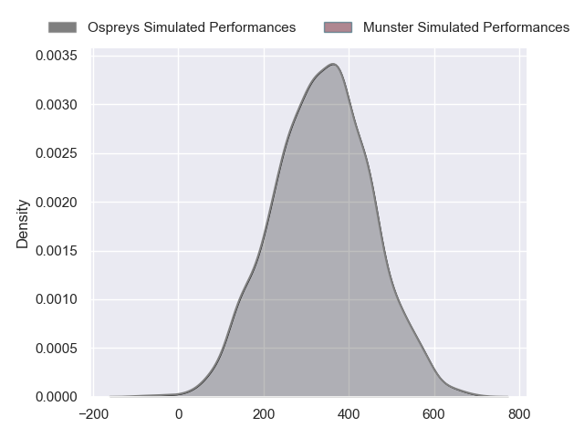
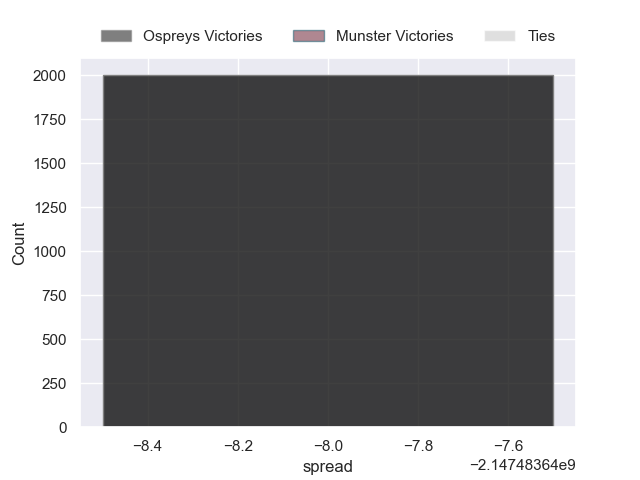

---  
layout: page  
title: Ospreys at Munster  
date: 2024-10-05 18:00:00 -0500  
categories: "United Rugby Championship 2024" match projection  
---
# Ospreys at Munster

# Club Level Predictions

The first set of predictions treats a club as the smallest object, as the club develops its members, organizes a gameplan, and deploys its players as needed for each match. This club model has a prediction of 0.627, which translates to predicting Munster to win by 7.9.

Our Over/Under is 53.5 - and combined with the spread above, we have a predicted scoreline of 23 to 31

Each club has a rating and a rating deviation (similar to a Glicko rating), and expected performances can be generated. This allows for simulated matches and spreads like the ones below.
## Projected Performances - Club Model

## Projected Spreads - Club Model

## Projected Results - Club Model

# Player Level Predictions

Treating teams instead as an entity made up of the currently active players, I have ratings for each player in an altogether different system. These can be combined to form team ratings once teamsheets are announced, weighting starters a bit higher than the reserves. After the match is played, players can be weighted by their minutes on the field, allowing for an accurate measure of the team's composition. With these compiled team ratings, we can make predictions, measure inaccuracy, and update the individual player ratings.
## Prediction without Player Minutes: Ospreys by nan

Munster by 14.1 on a neutral pitch

## Projected Performances - Player Model

## Projected Spreads - Player Model

## Projected Results - Player Model

| Away Player            |   Away Percentile |   Number |   Home Percentile | Home Player      |
|:-----------------------|------------------:|---------:|------------------:|:-----------------|
| Steff Thomas           |            nan    |        1 |            nan    | Jeremy Loughman  |
| Dewi Lake              |             62.21 |        2 |             94.34 | Niall Scannell   |
| Tom Botha              |             71.16 |        3 |            nan    | Oli Jager        |
| Huw Owen-Sutton        |             71.82 |        4 |            nan    | Jean Kleyn       |
| Adam Beard             |             96.14 |        5 |             99.51 | Tadhg Beirne     |
| James Ratti            |             76.81 |        6 |             98.03 | Peter O'Mahony   |
| Jac Morgan             |             93.92 |        7 |            nan    | John Hodnett     |
| Morgan Morris          |              6.53 |        8 |             84.19 | Jack O'Donoghue  |
| Reuben Morgan-Williams |             73.95 |        9 |            nan    | Craig Casey      |
| Dan Edwards            |             63.1  |       10 |             56.83 | Jack Crowley     |
| Ryan Conbeer           |             15.19 |       11 |            nan    | Shay Mccarthy    |
| Phil Cokanasiga        |             70.35 |       12 |            nan    | Bryan Fitzgerald |
| Owen Watkin            |             98.83 |       13 |            nan    | Tom Farrell      |
| Iestyn Hopkins         |             65.82 |       14 |            nan    | Calvin Nash      |
| Max Nagy               |             85.09 |       15 |            nan    | Mike Haley       |
| Sam Parry              |             74.29 |       16 |             92.03 | Diarmuid Barron  |
| Garyn Phillips         |            nan    |       17 |            nan    | John Ryan        |
| Ben Warren             |            nan    |       18 |             98.6  | Stephen Archer   |
| Lewis Jones            |            nan    |       19 |            nan    | Fineen Wycherley |
| Harri Deaves           |             91.63 |       20 |            nan    | Gavin Coombes    |
| Luke Davies            |             68.95 |       21 |             99.47 | Conor Murray     |
| Jack Walsh             |             56    |       22 |            nan    | Tony Butler      |
| Keiran Williams        |             90.28 |       23 |            nan    | Jack Daly        |

