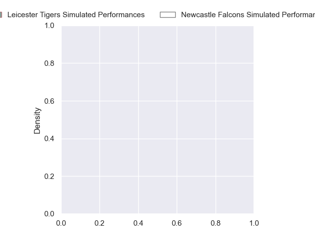
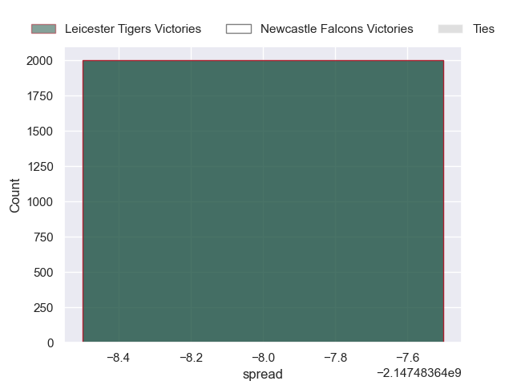

---  
layout: page  
title: Leicester Tigers at Newcastle Falcons  
date: 2024-10-05 18:00:00 -0500  
categories: "Premiership 2024" match projection  
---
# Leicester Tigers at Newcastle Falcons

# Club Level Predictions

The first set of predictions treats a club as the smallest object, as the club develops its members, organizes a gameplan, and deploys its players as needed for each match. This club model has a prediction of 0.203, which translates to predicting Leicester Tigers to win by 8.6.

Our Over/Under is 49.5 - and combined with the spread above, we have a predicted scoreline of 29 to 21

Each club has a rating and a rating deviation (similar to a Glicko rating), and expected performances can be generated. This allows for simulated matches and spreads like the ones below.
## Projected Performances - Club Model

## Projected Spreads - Club Model

## Projected Results - Club Model

# Player Level Predictions

Treating teams instead as an entity made up of the currently active players, I have ratings for each player in an altogether different system. These can be combined to form team ratings once teamsheets are announced, weighting starters a bit higher than the reserves. After the match is played, players can be weighted by their minutes on the field, allowing for an accurate measure of the team's composition. With these compiled team ratings, we can make predictions, measure inaccuracy, and update the individual player ratings.
## Prediction without Player Minutes: Newcastle Falcons by 1.9

Leicester Tigers by 6.2 on a neutral pitch

## Projected Performances - Player Model

## Projected Spreads - Player Model

## Projected Results - Player Model

| Away Player           |   Away Percentile |   Number |   Home Percentile | Home Player         |
|:----------------------|------------------:|---------:|------------------:|:--------------------|
| Nicky Smith           |            nan    |        1 |              1.78 | Adam Brocklebank    |
| Charlie Clare         |            nan    |        2 |              1.03 | Jamie Blamire       |
| Will Hurd             |            nan    |        3 |             43.33 | Richard Palframan   |
| George Martin         |            nan    |        4 |             11.27 | John Hawkins        |
| Ollie Chessum         |            nan    |        5 |             25.76 | Kiran McDonald      |
| Hanro Liebenberg      |            nan    |        6 |             29.89 | Philip van der Walt |
| Tommy Reffell         |            nan    |        7 |             96.72 | Tom Gordon          |
| Kyle Hatherell        |            nan    |        8 |              1.37 | Callum Chick        |
| Jack van Poortvliet   |            nan    |        9 |              0.53 | Sam Stuart          |
| Jamie Shillcock       |            nan    |       10 |            nan    | Ethan Grayson       |
| Ollie Hassell-Collins |            nan    |       11 |             20.06 | Ben Stevenson       |
| Joe Woodward          |             37.02 |       12 |            nan    | Sammy Arnold        |
| Izaia Perese          |            nan    |       13 |             69.01 | Connor Doherty      |
| Anthony Watson        |            nan    |       14 |             89.38 | Ben Redshaw         |
| Freddie Steward       |            nan    |       15 |             12    | Elliott Obatoyinbo  |
| Archie Vanes          |             66.58 |       16 |             76.86 | Ollie Fletcher      |
| James Cronin          |             91.36 |       17 |             24.27 | Luan de Bruin       |
| Dan Cole              |             55.91 |       18 |             82.34 | Murray McCallum     |
| Harry Wells           |            nan    |       19 |            nan    | Pedro Rubiolo       |
| Emeka Ilione          |             66.83 |       20 |             26.11 | Freddie Lockwood    |
| Ben Youngs            |             81.58 |       21 |            nan    | Joe Davis           |
| Ben Volavola          |             44.28 |       22 |             81.24 | Oliver Spencer      |
| Will Wand             |             61.64 |       23 |             84.36 | Louis Brown         |

