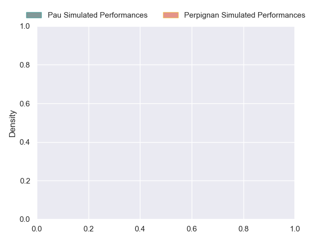
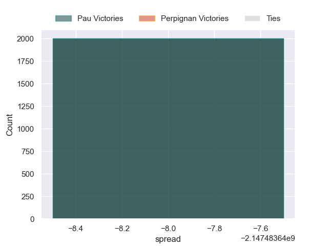

---  
layout: page  
title: Pau at Perpignan  
date: 2024-10-05 18:00:00 -0500  
categories: "Top 14 2024" match projection  
---
# Pau at Perpignan

# Club Level Predictions

The first set of predictions treats a club as the smallest object, as the club develops its members, organizes a gameplan, and deploys its players as needed for each match. This club model has a prediction of 0.441, which translates to predicting Pau to win by -1.3.

Our Over/Under is 40.5 - and combined with the spread above, we have a predicted scoreline of 20 to 21

Each club has a rating and a rating deviation (similar to a Glicko rating), and expected performances can be generated. This allows for simulated matches and spreads like the ones below.
## Projected Performances - Club Model

## Projected Spreads - Club Model

## Projected Results - Club Model

# Player Level Predictions

Treating teams instead as an entity made up of the currently active players, I have ratings for each player in an altogether different system. These can be combined to form team ratings once teamsheets are announced, weighting starters a bit higher than the reserves. After the match is played, players can be weighted by their minutes on the field, allowing for an accurate measure of the team's composition. With these compiled team ratings, we can make predictions, measure inaccuracy, and update the individual player ratings.
## Prediction without Player Minutes: Pau by nan

Perpignan by 2.9 on a neutral pitch

## Projected Performances - Player Model

## Projected Spreads - Player Model

## Projected Results - Player Model

| Away Player         |   Away Percentile |   Number |   Home Percentile | Home Player           |
|:--------------------|------------------:|---------:|------------------:|:----------------------|
| Daniel Bibi Biziwu  |            nan    |        1 |            nan    | Giorgi Beria          |
| Romain Ruffenach    |             67.87 |        2 |            nan    | Seilala Lam           |
| Harry Williams      |            nan    |        3 |            nan    | Kieran Brookes        |
| Hugo Auradou        |             47.5  |        4 |            nan    | Adrien Warion         |
| Thomas Jolmes       |            nan    |        5 |            nan    | So'otala Fa'aso'o     |
| Lekima Tagitagivalu |            nan    |        6 |            nan    | Alan Brazo            |
| Sacha Zegueur       |            nan    |        7 |            nan    | Noé Della Schiava     |
| Beka Gorgadze       |            nan    |        8 |             10.65 | Lucas Velarte         |
| Dan Robson          |            nan    |        9 |            nan    | Tom Ecochard          |
| Joe Simmonds        |            nan    |       10 |            nan    | Antoine Aucagne       |
| Aaron Grandidier    |            nan    |       11 |            nan    | Lucas Dubois          |
| Nathan Decron       |            nan    |       12 |            nan    | Jeronimo de la Fuente |
| Olivier Klemenczak  |              5.86 |       13 |            nan    | Apisai Naqalevu       |
| Clement Laporte     |            nan    |       14 |            nan    | Jefferson Joseph      |
| Jack Maddocks       |            nan    |       15 |            nan    | Louis Dupichot        |
| Youri Delhommel     |            nan    |       16 |            nan    | Ignacio Ruiz          |
| Guram Papidze       |            nan    |       17 |            nan    | Akato Fakatika        |
| Remi Picquette      |            nan    |       18 |            nan    | Marvin Orie           |
| Joel Kpoku          |            nan    |       19 |            nan    | Joaquin Oviedo        |
| Thibault Daubagna   |            nan    |       20 |            nan    | Gela Aprasidze        |
| Tumua Manu          |            nan    |       21 |            nan    | Tommaso Allan         |
| Theo Attissogbe     |            nan    |       22 |            nan    | Eneriko Buliruarua    |
| Jon Zabala          |             68.74 |       23 |            nan    | Pietro Ceccarelli     |

