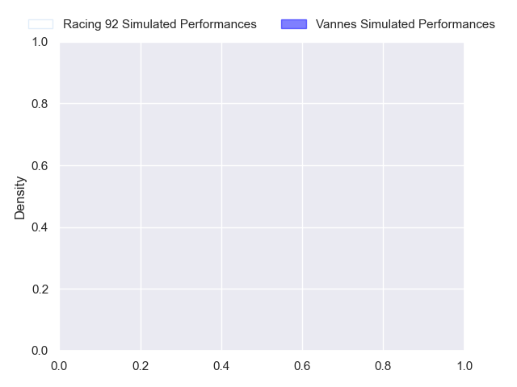
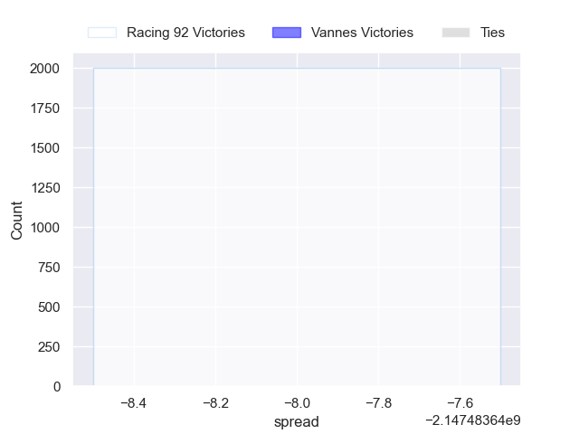

---  
layout: page  
title: Racing 92 at Vannes  
date: 2024-10-05 18:00:00 -0500  
categories: "Top 14 2024" match projection  
---
# Racing 92 at Vannes

# Club Level Predictions

The first set of predictions treats a club as the smallest object, as the club develops its members, organizes a gameplan, and deploys its players as needed for each match. This club model has a prediction of 0.311, which translates to predicting Racing 92 to win by 3.2.

Our Over/Under is 54.5 - and combined with the spread above, we have a predicted scoreline of 29 to 25

Each club has a rating and a rating deviation (similar to a Glicko rating), and expected performances can be generated. This allows for simulated matches and spreads like the ones below.
## Projected Performances - Club Model

## Projected Spreads - Club Model

## Projected Results - Club Model

# Player Level Predictions

Treating teams instead as an entity made up of the currently active players, I have ratings for each player in an altogether different system. These can be combined to form team ratings once teamsheets are announced, weighting starters a bit higher than the reserves. After the match is played, players can be weighted by their minutes on the field, allowing for an accurate measure of the team's composition. With these compiled team ratings, we can make predictions, measure inaccuracy, and update the individual player ratings.
## Prediction without Player Minutes: Racing 92 by nan

Racing 92 by nan on a neutral pitch

## Projected Performances - Player Model

## Projected Spreads - Player Model

## Projected Results - Player Model

| Away Player         |   Away Percentile |   Number |   Home Percentile | Home Player              |
|:--------------------|------------------:|---------:|------------------:|:-------------------------|
| Eddy Ben Arous      |             98.09 |        1 |               nan | Mako Vunipola            |
| Robin Couly         |            nan    |        2 |               nan | Cyril Blanchard          |
| Thomas Laclayat     |            nan    |        3 |               nan | Santiago Medrano         |
| Junior Kpoku        |            nan    |        4 |               nan | Christiaan Van Der Merwe |
| Boris Palu          |            nan    |        5 |               nan | Fabrice Metz             |
| Cameron Woki        |            nan    |        6 |               nan | Joe Edwards              |
| Ibrahim Diallo      |            nan    |        7 |               nan | Francisco Gorrissen      |
| Hacjivah Dayimani   |            nan    |        8 |               nan | Sione Kalamafoni         |
| Nolann Le Garrec    |            nan    |        9 |               nan | Jules Le Bail            |
| Owen Farrell        |            nan    |       10 |               nan | Maxime Lafage            |
| Vinaya Habosi       |             47.05 |       11 |               nan | Filipo Nakosi            |
| Sam James           |            nan    |       12 |               nan | Alex Arrate              |
| Gael Fickou         |            nan    |       13 |               nan | Francis Saili            |
| Josua Tuisova       |            nan    |       14 |               nan | Salesi Rayasi            |
| Max Spring          |            nan    |       15 |               nan | Paul Surano              |
| Feleti Kaitu'U      |            nan    |       16 |               nan | Théo Béziat              |
| Guram Gogichashvili |            nan    |       17 |               nan | Thomas Moukoro           |
| Fabien Sanconnie    |             39.13 |       18 |               nan | Anton Bresler            |
| Maxime Baudonne     |            nan    |       19 |               nan | Kitione Kamikamica       |
| Jordan Joseph       |            nan    |       20 |               nan | Alexandre Gouaux         |
| Antoine Gibert      |             94.1  |       21 |               nan | Thibault Debaes          |
| Dan Lancaster       |            nan    |       22 |               nan | Tani Vili                |
| Gia Kharaishvili    |             36.59 |       23 |               nan | Pagakalasio Tafili       |

