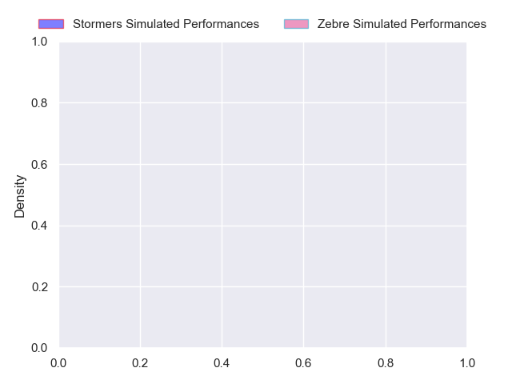
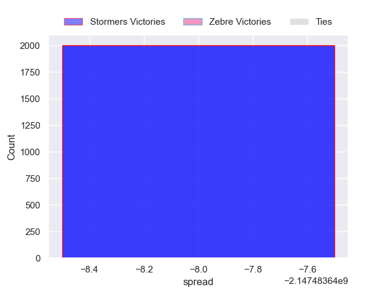

---  
layout: page  
title: Stormers at Zebre  
date: 2024-10-05 18:00:00 -0500  
categories: "United Rugby Championship 2024" match projection  
---
# Stormers at Zebre

# Club Level Predictions

The first set of predictions treats a club as the smallest object, as the club develops its members, organizes a gameplan, and deploys its players as needed for each match. This club model has a prediction of 0.167, which translates to predicting Stormers to win by 10.2.

Our Over/Under is 43.5 - and combined with the spread above, we have a predicted scoreline of 27 to 17

Each club has a rating and a rating deviation (similar to a Glicko rating), and expected performances can be generated. This allows for simulated matches and spreads like the ones below.
## Projected Performances - Club Model

## Projected Spreads - Club Model

## Projected Results - Club Model

# Player Level Predictions

Treating teams instead as an entity made up of the currently active players, I have ratings for each player in an altogether different system. These can be combined to form team ratings once teamsheets are announced, weighting starters a bit higher than the reserves. After the match is played, players can be weighted by their minutes on the field, allowing for an accurate measure of the team's composition. With these compiled team ratings, we can make predictions, measure inaccuracy, and update the individual player ratings.
## Prediction without Player Minutes: Stormers by 5.5

Stormers by 9.9 on a neutral pitch

## Projected Performances - Player Model

## Projected Spreads - Player Model

## Projected Results - Player Model

| Away Player          |   Away Percentile |   Number |   Home Percentile | Home Player            |
|:---------------------|------------------:|---------:|------------------:|:-----------------------|
| Sti Sithole          |             80.69 |        1 |            nan    | Danilo Fischetti       |
| Joseph Dweba         |             65.3  |        2 |            nan    | Tommaso Di Bartolomeo  |
| Neethling Fouche     |             84.5  |        3 |              4.19 | Matteo Nocera          |
| Jd Schickerling      |             51.05 |        4 |             93.24 | Matteo Canali          |
| Ruben van Heerden    |             82.13 |        5 |              2.42 | Leonard Krumov         |
| Marcel Theunissen    |             39.24 |        6 |             51.23 | Davide Ruggeri         |
| Ben-Jason Dixon      |            nan    |        7 |            nan    | Samuele Locatelli      |
| Keketso Morabe       |             33.68 |        8 |             44.5  | Giacomo Ferrari        |
| Paul de Wet          |             83.95 |        9 |             16.32 | Alessandro Fusco       |
| Jurie Matthee        |             39.85 |       10 |            nan    | Giacomo Da Re          |
| Leolin Zas           |             89.68 |       11 |              9.14 | Simone Gesi            |
| Daniel du Plessis    |             93.63 |       12 |            nan    | Fetuli Paea            |
| Ruhan Nel            |             45.9  |       13 |             95.31 | Luca Morisi            |
| Suleiman Hartzenberg |             74.34 |       14 |            nan    | Jacopo Trulla          |
| Damian Willemse      |             97.45 |       15 |             90.91 | Geronimo Prisciantelli |
| Andre-Hugo Venter    |             78.15 |       16 |             81.75 | Luca Bigi              |
| Brok Harris          |            100    |       17 |             42.57 | Luca Rizzoli           |
| Sazi Sandi           |            nan    |       18 |             22.24 | Juan Pitinari          |
| Adre Smith           |             83.09 |       19 |            nan    | Andrea Zambonin        |
| Louw Nel             |            nan    |       20 |             42.27 | Giovanni Licata        |
| Dewaldt Duvenage     |            nan    |       21 |            nan    | Gonzalo Garcia         |
| Warrick Gelant       |             98.91 |       22 |             43.72 | Scott Gregory          |
| Angelo Davids        |             95.72 |       23 |              6.64 | Giovanni Montemauri    |

