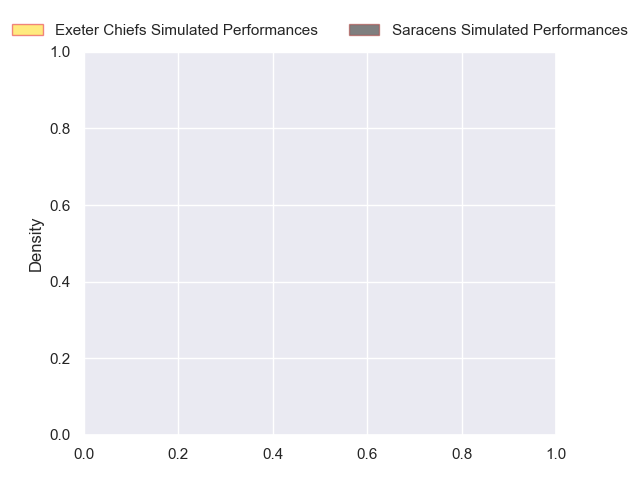
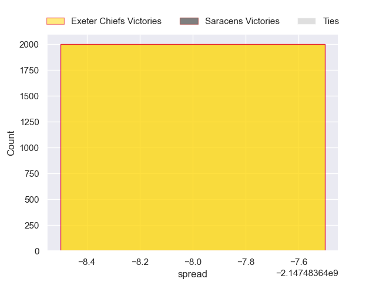

---  
layout: page  
title: Exeter Chiefs at Saracens  
date: 2024-10-06 18:00:00 -0500  
categories: "Premiership 2024" match projection  
---
# Exeter Chiefs at Saracens

# Club Level Predictions

The first set of predictions treats a club as the smallest object, as the club develops its members, organizes a gameplan, and deploys its players as needed for each match. This club model has a prediction of 0.615, which translates to predicting Saracens to win by 7.3.

Our Over/Under is 59.5 - and combined with the spread above, we have a predicted scoreline of 26 to 33

Each club has a rating and a rating deviation (similar to a Glicko rating), and expected performances can be generated. This allows for simulated matches and spreads like the ones below.
## Projected Performances - Club Model

## Projected Spreads - Club Model

## Projected Results - Club Model

# Player Level Predictions

Treating teams instead as an entity made up of the currently active players, I have ratings for each player in an altogether different system. These can be combined to form team ratings once teamsheets are announced, weighting starters a bit higher than the reserves. After the match is played, players can be weighted by their minutes on the field, allowing for an accurate measure of the team's composition. With these compiled team ratings, we can make predictions, measure inaccuracy, and update the individual player ratings.
## Prediction without Player Minutes: Exeter Chiefs by nan

Saracens by 3.9 on a neutral pitch

## Projected Performances - Player Model

## Projected Spreads - Player Model

## Projected Results - Player Model

| Away Player          |   Away Percentile |   Number |   Home Percentile | Home Player          |
|:---------------------|------------------:|---------:|------------------:|:---------------------|
| nan                  |            nan    |        1 |            nan    | Rhys Carré           |
| nan                  |            nan    |        2 |             99.74 | Jamie George         |
| nan                  |            nan    |        3 |            nan    | Marco Riccioni       |
| nan                  |            nan    |        5 |            nan    | Hugh Tizard          |
| nan                  |            nan    |        6 |            nan    | Theo McFarland       |
| nan                  |            nan    |        7 |            nan    | Ben Earl             |
| Greg Fisilau         |             73.88 |        8 |            nan    | Tom Willis           |
| nan                  |            nan    |        9 |            nan    | Ivan van Zyl         |
| Will Haydon-Wood     |            nan    |       10 |            nan    | Fergus Burke         |
| Ben Hammersley       |             66.16 |       11 |            nan    | Rotimi Segun         |
| Joe Hawkins          |             47.07 |       12 |            nan    | Nick Tompkins        |
| Olly Woodburn        |             95.48 |       13 |             85.76 | Alex Lozowski        |
| Immanuel Feyi-Waboso |             92.77 |       14 |            nan    | Tobias Elliott       |
| Josh Hodge           |              1.82 |       15 |            nan    | Elliot Daly          |
| Jack Innard          |            nan    |       16 |            nan    | Theo Dan             |
| Kwenzo Blose         |            nan    |       17 |            nan    | Eroni Mawi           |
| nan                  |            nan    |       18 |             54.38 | Ollie Hoskins        |
| Rusiate Tuima        |             36.23 |       19 |            nan    | Andy Christie        |
| Martin Moloney       |            nan    |       20 |            nan    | Juan Martin Gonzalez |
| Tom Cairns           |             90.79 |       21 |            nan    | Toby Knight          |
| Harvey Skinner       |             45.76 |       22 |            nan    | nan                  |
| Will Rigg            |             94.47 |       23 |            nan    | nan                  |

