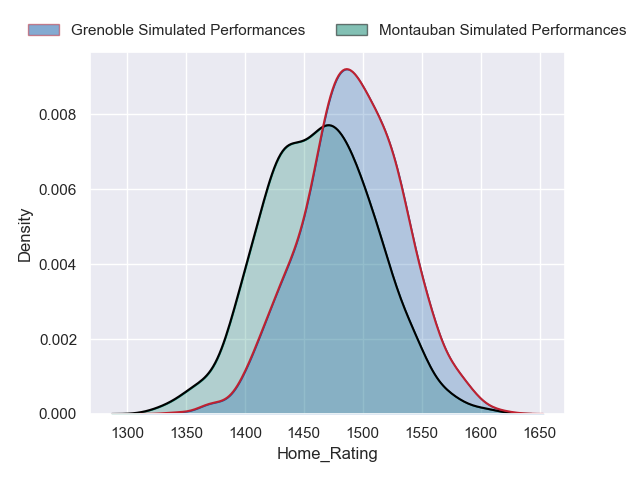
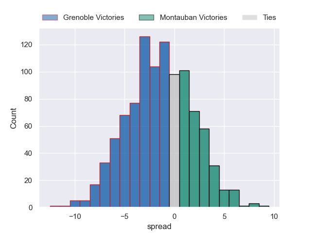
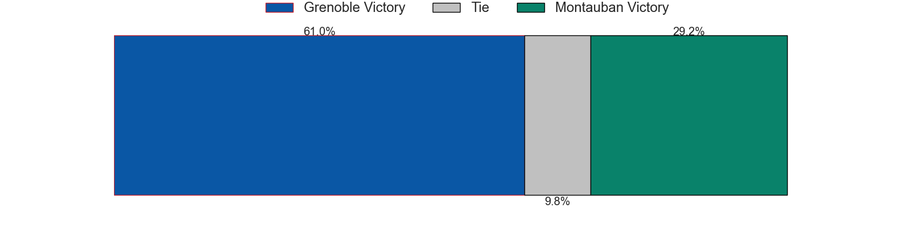
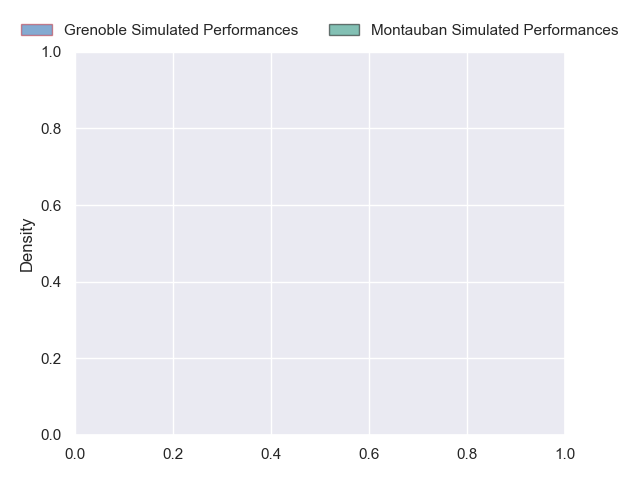
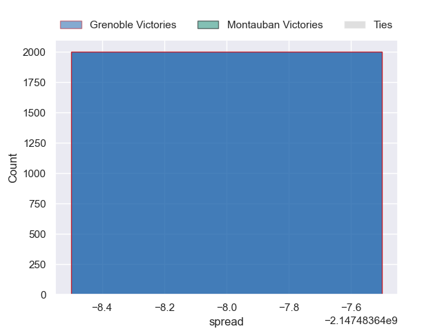

---  
layout: page  
title: Grenoble at Montauban  
date: 2024-10-24 18:00:00 -0500  
categories: "Pro D2 2024" match projection  
---
# Grenoble at Montauban

# Club Level Predictions

The first set of predictions treats a club as the smallest object, as the club develops its members, organizes a gameplan, and deploys its players as needed for each match. This club model has a prediction of 0.359, which translates to predicting Grenoble to win by 1.4.

Our Over/Under is 44.5 - and combined with the spread above, we have a predicted scoreline of 23 to 21

Each club has a rating and a rating deviation (similar to a Glicko rating), and expected performances can be generated. This allows for simulated matches and spreads like the ones below.
## Projected Performances - Club Model

## Projected Spreads - Club Model

## Projected Results - Club Model

# Player Level Predictions

Treating teams instead as an entity made up of the currently active players, I have ratings for each player in an altogether different system. These can be combined to form team ratings once teamsheets are announced, weighting starters a bit higher than the reserves. After the match is played, players can be weighted by their minutes on the field, allowing for an accurate measure of the team's composition. With these compiled team ratings, we can make predictions, measure inaccuracy, and update the individual player ratings.
## Prediction without Player Minutes: Grenoble by nan

Grenoble by 0.1 on a neutral pitch

## Projected Performances - Player Model

## Projected Spreads - Player Model

## Projected Results - Player Model

| Away Player             |   Away Percentile |   Number |   Home Percentile | Home Player       |
|:------------------------|------------------:|---------:|------------------:|:------------------|
| Zack Gauthier           |            nan    |        1 |               nan | Léo Aouf          |
| Bastien Soury           |            nan    |        2 |               nan | Kévin Firmin      |
| Giorgi Pertaia          |            nan    |        3 |               nan | Facundo Pomponio  |
| Pierce Phillips         |            nan    |        4 |               nan | Clément Bitz      |
| Giorgi Javakhia         |            nan    |        5 |               nan | Lewis Bean        |
| Antonin Berruyer        |            nan    |        6 |               nan | Fred Quercy       |
| Jose Madeira            |            nan    |        7 |               nan | Tjiuee Uanivi     |
| Richard Hardwick        |            nan    |        8 |               nan | Tyrone Viiga      |
| Eric Escande            |            nan    |        9 |               nan | Joe Powell        |
| Marc Palmier            |            nan    |       10 |               nan | Thomas Fortunel   |
| Gerswin Mouton          |            nan    |       11 |               nan | Yvan Reilhac      |
| Giorgi Kveseladze       |            nan    |       12 |               nan | Simon Renda       |
| Julien Heriteau         |            nan    |       13 |               nan | Maxime Espeut     |
| Wilfried Hulleu         |            nan    |       14 |               nan | Stephane Ahmed    |
| Hugo Trouilloud         |            nan    |       15 |               nan | Thomas Larregain  |
| Lilian Rossi            |            nan    |       16 |               nan | Ru-Hann Greyling  |
| Giorgi Mamaiashvili (2) |            nan    |       17 |               nan | Thomas Bué        |
| Thomas Ployet           |             31.54 |       18 |               nan | Victor Moreaux    |
| Victor Guillaumond      |            nan    |       19 |               nan | Sikhumbuzo Notshe |
| Pio Muarua              |            nan    |       20 |               nan | Yoan Cottin       |
| Max Clément             |            nan    |       21 |               nan | Jérôme Bosviel    |
| Geoffrey Cros           |            nan    |       22 |               nan | Josua Vici        |
| Cody Thomas             |            nan    |       23 |               nan | Mirian Burduli    |

