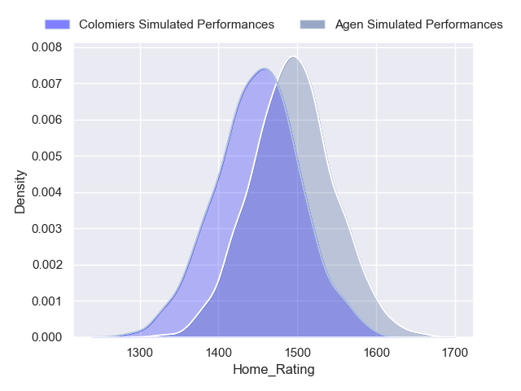
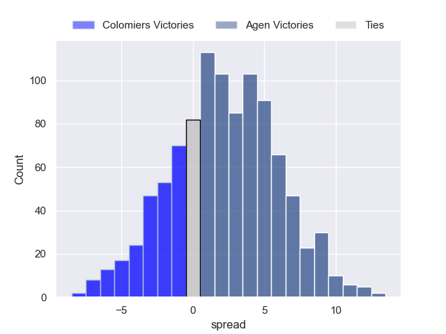
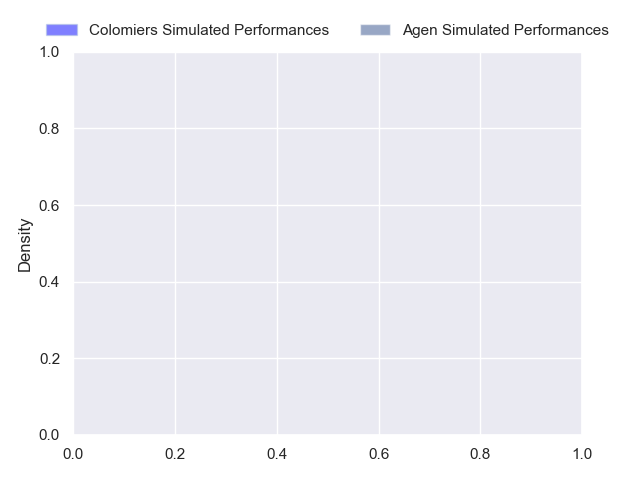
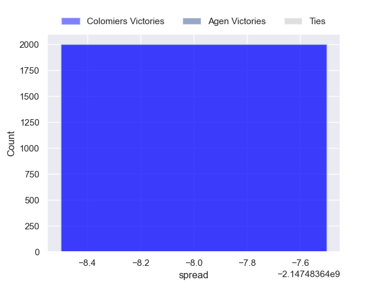

---  
layout: page  
title: Colomiers at Agen  
date: 2024-10-25 18:00:00 -0500  
categories: "Pro D2 2024" match projection  
---
# Colomiers at Agen

# Club Level Predictions

The first set of predictions treats a club as the smallest object, as the club develops its members, organizes a gameplan, and deploys its players as needed for each match. This club model has a prediction of 0.469, which translates to predicting Colomiers to win by -2.2.

Our Over/Under is 51.5 - and combined with the spread above, we have a predicted scoreline of 25 to 27

Each club has a rating and a rating deviation (similar to a Glicko rating), and expected performances can be generated. This allows for simulated matches and spreads like the ones below.
## Projected Performances - Club Model

## Projected Spreads - Club Model

## Projected Results - Club Model

# Player Level Predictions

Treating teams instead as an entity made up of the currently active players, I have ratings for each player in an altogether different system. These can be combined to form team ratings once teamsheets are announced, weighting starters a bit higher than the reserves. After the match is played, players can be weighted by their minutes on the field, allowing for an accurate measure of the team's composition. With these compiled team ratings, we can make predictions, measure inaccuracy, and update the individual player ratings.
## Prediction without Player Minutes: Colomiers by nan

Colomiers by 0.3 on a neutral pitch

## Projected Performances - Player Model

## Projected Spreads - Player Model

## Projected Results - Player Model

| Away Player        |   Away Percentile |   Number |   Home Percentile | Home Player         |
|:-------------------|------------------:|---------:|------------------:|:--------------------|
| Guillaume Tartas   |               nan |        1 |               nan | Mamuka Mstoiani     |
| Théo Lachaud       |               nan |        2 |               nan | Santiago Socino     |
| Michaël Simutoga   |               nan |        3 |               nan | Alex Burin          |
| Maxime Granouillet |               nan |        4 |               nan | Vincent Farré       |
| Jack Whetton       |               nan |        5 |               nan | William Demotte     |
| Alexis Caumel      |               nan |        6 |               nan | Julien Lebian       |
| Aldric Lescure     |               nan |        7 |               nan | Arnaud Duputs       |
| Caleb Timu         |               nan |        8 |               nan | Valentin Gayraud    |
| Ugo Séguéla        |               nan |        9 |               nan | Jack Maunder        |
| Brett Herron       |               nan |       10 |               nan | Billy Searle        |
| Ugo Pacome         |               nan |       11 |               nan | Iban Etcheverry     |
| Baptiste Serrano   |               nan |       12 |               nan | Kolinio Ramoka      |
| Enzo Salles        |               nan |       13 |               nan | Peyo Muscarditz     |
| Vincent Pinto      |               nan |       14 |               nan | Lucas Martins       |
| Max Auriac         |               nan |       15 |               nan | Franck Pourteau     |
| Pablo Dimcheff     |               nan |       16 |               nan | Pierre Jouvin       |
| Eliès El Ansari    |               nan |       17 |               nan | Florent Guion       |
| Louis Descoux      |               nan |       18 |               nan | Evan Olmstead       |
| Anthony Coletta    |               nan |       19 |               nan | Fotu Lokotui        |
| Paolo Parpagiola   |               nan |       20 |               nan | Théo Idjellidaine   |
| Mathis Galthié     |               nan |       21 |               nan | Clément Garrigues   |
| Dorian Laborde     |               nan |       22 |               nan | Romain Darchen      |
| Marco Fepulea'i    |               nan |       23 |               nan | Lasha Macharashvili |

