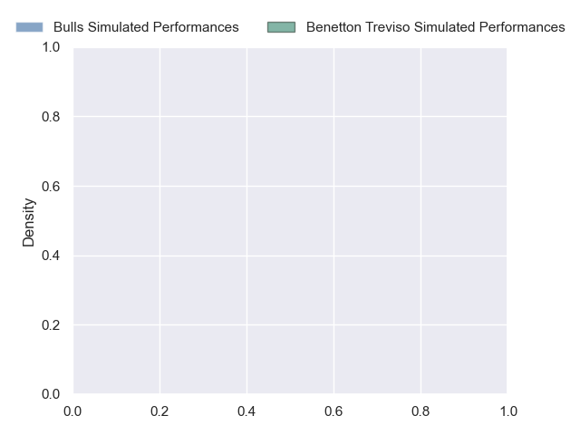
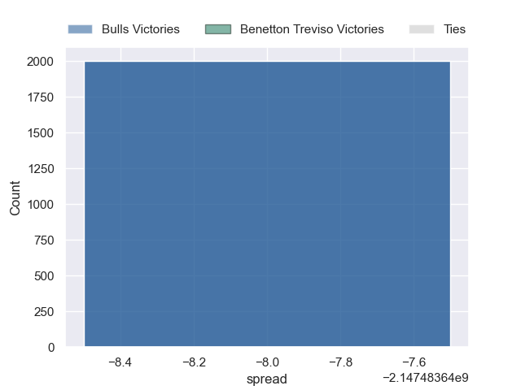

---  
layout: page  
title: Bulls at Benetton Treviso  
date: 2024-10-25 18:00:00 -0500  
categories: "United Rugby Championship 2024" match projection  
---
# Bulls at Benetton Treviso

# Club Level Predictions

The first set of predictions treats a club as the smallest object, as the club develops its members, organizes a gameplan, and deploys its players as needed for each match. This club model has a prediction of 0.314, which translates to predicting Bulls to win by 3.3.

Our Over/Under is 51.5 - and combined with the spread above, we have a predicted scoreline of 27 to 24

Each club has a rating and a rating deviation (similar to a Glicko rating), and expected performances can be generated. This allows for simulated matches and spreads like the ones below.
## Projected Performances - Club Model

## Projected Spreads - Club Model

## Projected Results - Club Model

# Player Level Predictions

Treating teams instead as an entity made up of the currently active players, I have ratings for each player in an altogether different system. These can be combined to form team ratings once teamsheets are announced, weighting starters a bit higher than the reserves. After the match is played, players can be weighted by their minutes on the field, allowing for an accurate measure of the team's composition. With these compiled team ratings, we can make predictions, measure inaccuracy, and update the individual player ratings.
## Prediction without Player Minutes: Bulls by nan

Bulls by nan on a neutral pitch

## Projected Performances - Player Model

## Projected Spreads - Player Model

## Projected Results - Player Model

| Away Player         |   Away Percentile |   Number |   Home Percentile | Home Player         |
|:--------------------|------------------:|---------:|------------------:|:--------------------|
| Alulutho Tshakweni  |            nan    |        1 |               nan | Mirco Spagnolo      |
| Johan Grobbelaar    |            nan    |        2 |               nan | Siua Maile          |
| Wilco Louw          |            nan    |        3 |               nan | Simone Ferrari      |
| Cobus Wiese         |            nan    |        4 |               nan | Niccolo Cannone     |
| JF van Heerden      |             70.26 |        5 |               nan | Federico Ruzza      |
| Marcell Coetzee     |            nan    |        6 |               nan | Alessandro Izekor   |
| Reinhardt Ludwig    |            nan    |        7 |               nan | Michele Lamaro      |
| Elrigh Louw         |            nan    |        8 |               nan | Lorenzo Cannone     |
| Embrose Papier      |            nan    |        9 |               nan | Alessandro Garbisi  |
| Boeta Chamberlain   |            nan    |       10 |               nan | Tomas Albornoz      |
| Kurt-Lee Arendse    |            nan    |       11 |               nan | Matt Gallagher      |
| David Kriel         |            nan    |       12 |               nan | Juan Ignacio Brex   |
| Canan Moodie        |            nan    |       13 |               nan | Tommaso Menoncello  |
| Aphiwe Dyantyi      |              9.24 |       14 |               nan | Paolo Odogwu        |
| Devon Williams      |             97.33 |       15 |               nan | Rhyno Smith         |
| Akker van der Merwe |            nan    |       16 |               nan | Bautista Bernasconi |
| Dylan Smith         |             96.21 |       17 |               nan | Thomas Gallo        |
| Francois Klopper    |            nan    |       18 |               nan | Enzo Avaca          |
| Ruan Vermaak        |            nan    |       19 |               nan | Eli Snyman          |
| Cameron Hanekom     |            nan    |       20 |               nan | Sebastian Negri     |
| Keagan Johannes     |            nan    |       21 |               nan | Manuel Zuliani      |
| Stedman Gans        |            nan    |       22 |               nan | Andy Uren           |
| Sebastian de Klerk  |            nan    |       23 |               nan | Jacob Umaga         |

