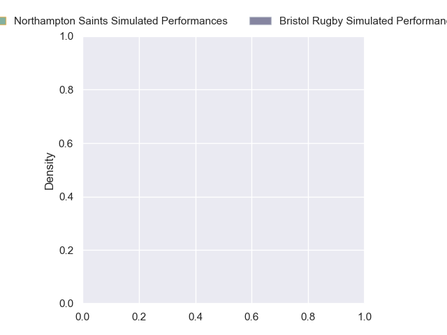
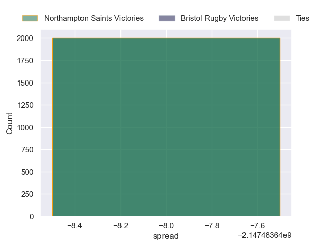

---  
layout: page  
title: Northampton Saints at Bristol Rugby  
date: 2024-10-25 18:00:00 -0500  
categories: "Gallagher Premiership 2024" match projection  
---
# Northampton Saints at Bristol Rugby

# Club Level Predictions

The first set of predictions treats a club as the smallest object, as the club develops its members, organizes a gameplan, and deploys its players as needed for each match. This club model has a prediction of 0.496, which translates to predicting Northampton Saints to win by -3.2.

Our Over/Under is 54.5 - and combined with the spread above, we have a predicted scoreline of 26 to 29

Each club has a rating and a rating deviation (similar to a Glicko rating), and expected performances can be generated. This allows for simulated matches and spreads like the ones below.
## Projected Performances - Club Model

## Projected Spreads - Club Model

## Projected Results - Club Model

# Player Level Predictions

Treating teams instead as an entity made up of the currently active players, I have ratings for each player in an altogether different system. These can be combined to form team ratings once teamsheets are announced, weighting starters a bit higher than the reserves. After the match is played, players can be weighted by their minutes on the field, allowing for an accurate measure of the team's composition. With these compiled team ratings, we can make predictions, measure inaccuracy, and update the individual player ratings.
## Prediction without Player Minutes: Northampton Saints by nan

Bristol Rugby by 0.1 on a neutral pitch

## Projected Performances - Player Model

## Projected Spreads - Player Model

## Projected Results - Player Model

| Away Player             |   Away Percentile |   Number |   Home Percentile | Home Player                |
|:------------------------|------------------:|---------:|------------------:|:---------------------------|
| Tom West                |             66.31 |        1 |            nan    | Jake Woolmore              |
| Curtis Langdon          |            nan    |        2 |            nan    | Gabriel Oghre              |
| Elliot Millar Mills     |            nan    |        3 |            nan    | Max Lahiff                 |
| Temo Mayanavanua        |            nan    |        4 |            nan    | James Dun                  |
| Alex Coles              |            nan    |        5 |            nan    | Joe Batley                 |
| Josh Kemeny             |            nan    |        6 |            nan    | Steven Luatua              |
| Tom Pearson             |            nan    |        7 |            nan    | Benjamin Grondona          |
| Henry Pollock           |            nan    |        8 |            nan    | Fitz Harding               |
| Tom James               |            nan    |        9 |            nan    | Kieran Marmion             |
| George Makepeace-Cubitt |            nan    |       10 |            nan    | AJ MacGinty                |
| Tom Seabrook            |              8.83 |       11 |            nan    | Gabriel Ibitoye            |
| Rory Hutchinson         |            nan    |       12 |            nan    | Benhard Janse van Rensburg |
| Tom Litchfield          |            nan    |       13 |             82.86 | Kalaveti Ravouvou          |
| James Ramm              |            nan    |       14 |            nan    | Jack Bates                 |
| George Hendy            |            nan    |       15 |            nan    | Richard Lane               |
| Craig Wright            |            nan    |       16 |            nan    | Harry Thacker              |
| Emmanuel Iyogun         |            nan    |       17 |             84.37 | Yann Thomas                |
| Luke Green              |            nan    |       18 |             69.65 | George Kloska              |
| Gavin Thornbury         |            nan    |       19 |            nan    | Joe Owen                   |
| Angus Scott-Young       |            nan    |       20 |             71.1  | Jake Heenan                |
| Archie McParland        |            nan    |       21 |            nan    | Sam Wolstenholme           |
| Charlie Savala          |             40.62 |       22 |            nan    | Sam Worsley                |
| Jake Garside            |            nan    |       23 |            nan    | Benjamin Elizalde          |

