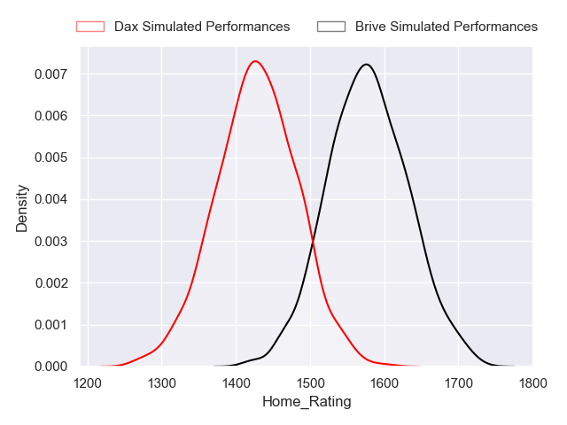
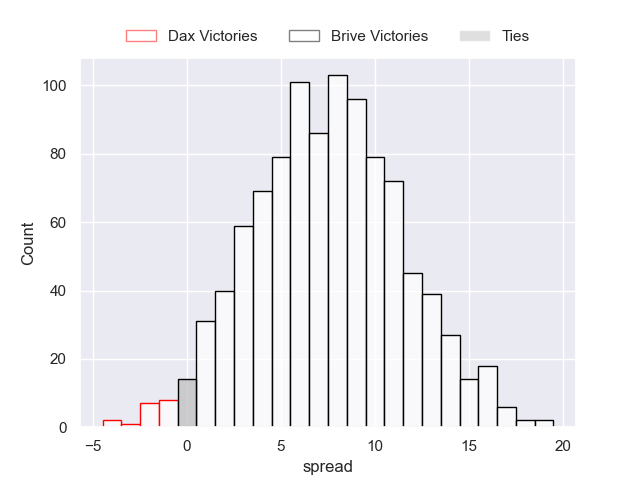
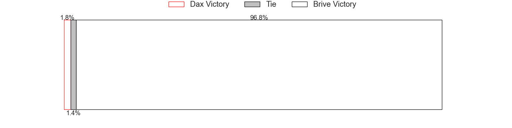
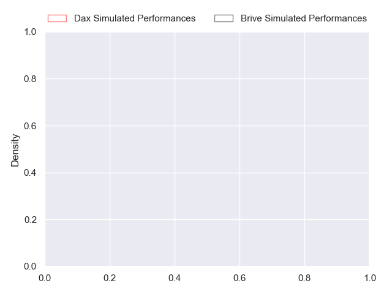
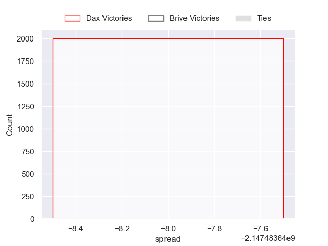
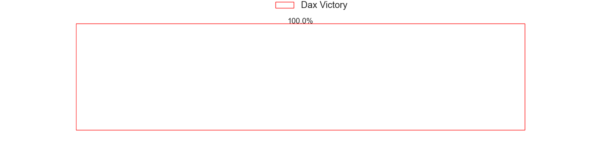

---  
layout: page  
title: Dax at Brive  
date: 2024-10-25 18:00:00 -0500  
categories: "Pro D2 2024" match projection  
---
# Dax at Brive

# Club Level Predictions

The first set of predictions treats a club as the smallest object, as the club develops its members, organizes a gameplan, and deploys its players as needed for each match. This club model has a prediction of 0.619, which translates to predicting Brive to win by 7.5.

Our Over/Under is 44.5 - and combined with the spread above, we have a predicted scoreline of 18 to 26

Each club has a rating and a rating deviation (similar to a Glicko rating), and expected performances can be generated. This allows for simulated matches and spreads like the ones below.
## Projected Performances - Club Model

## Projected Spreads - Club Model

## Projected Results - Club Model

# Player Level Predictions

Treating teams instead as an entity made up of the currently active players, I have ratings for each player in an altogether different system. These can be combined to form team ratings once teamsheets are announced, weighting starters a bit higher than the reserves. After the match is played, players can be weighted by their minutes on the field, allowing for an accurate measure of the team's composition. With these compiled team ratings, we can make predictions, measure inaccuracy, and update the individual player ratings.
## Prediction without Player Minutes: Dax by nan

Dax by 0.0 on a neutral pitch

## Projected Performances - Player Model

## Projected Spreads - Player Model

## Projected Results - Player Model

| Away Player           |   Away Percentile |   Number |   Home Percentile | Home Player               |
|:----------------------|------------------:|---------:|------------------:|:--------------------------|
| Dino Casadeï          |            nan    |        1 |               nan | Simon-Pierre Chauvac      |
| Louis Barrère         |            nan    |        2 |               nan | Lucas Da Silva            |
| Diogo Hasse Ferreira  |            nan    |        3 |               nan | Francisco Coria Marchetti |
| Brice Ferrer          |             39.29 |        4 |               nan | Tevita Ratuva             |
| Etienne Loiret        |            nan    |        5 |               nan | Konstantin Mikautadze     |
| Jean-Baptiste Barrère |            nan    |        6 |               nan | Retief Marais             |
| Jean Despiau          |            nan    |        7 |               nan | Samuel Maximin            |
| Sam Wasley            |            nan    |        8 |               nan | Ross Moriarty             |
| Simon Garrouteigt     |            nan    |        9 |               nan | Léo Carbonneau            |
| Hugo Cerisier         |            nan    |       10 |               nan | Curwin Bosch              |
| Guillaume Bouche      |            nan    |       11 |               nan | Thomas Zénon              |
| Noah Nene             |            nan    |       12 |               nan | Stuart Olding             |
| Bastien Daguerre      |            nan    |       13 |               nan | Georges Shvelidze         |
| Hugo Fourquet         |            nan    |       14 |               nan | Mathis Ferté              |
| Maxime Oltmann        |            nan    |       15 |               nan | Nic Krone (2)             |
| Kito Falatea          |            nan    |       16 |               nan | Benjamin Boudou           |
| Thibaud Dréan         |            nan    |       17 |               nan | Wesley Tapueluelu         |
| Lucas Guillaume       |             28.48 |       18 |               nan | Julien Delannoy           |
| Ratu Nacika           |            nan    |       19 |               nan | Matthieu Voisin           |
| Paul Ravier           |            nan    |       20 |               nan | Taniela Sadrugu           |
| Jope Naseara (2)      |            nan    |       21 |               nan | Maxime Sidobre            |
| Théo Gatelier         |            nan    |       22 |               nan | Guillaume Galletier       |
| David Lolohea         |            nan    |       23 |               nan | Marcel Van Der Merwe      |

