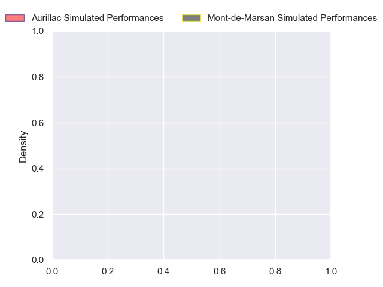
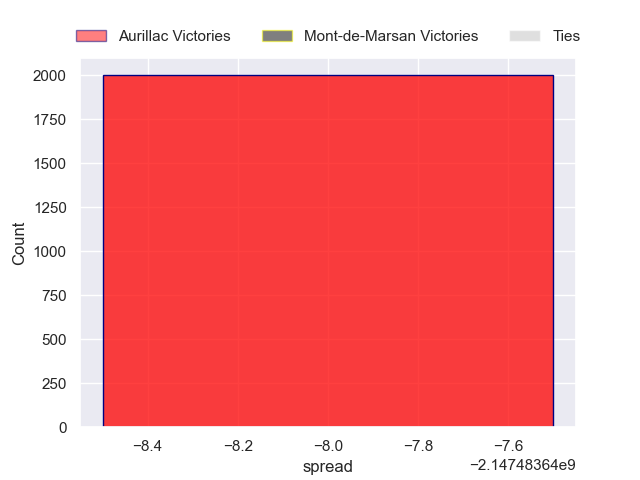

---  
layout: page  
title: Aurillac at Mont-de-Marsan  
date: 2024-10-25 18:00:00 -0500  
categories: "Pro D2 2024" match projection  
---
# Aurillac at Mont-de-Marsan

# Club Level Predictions

The first set of predictions treats a club as the smallest object, as the club develops its members, organizes a gameplan, and deploys its players as needed for each match. This club model has a prediction of 0.634, which translates to predicting Mont-de-Marsan to win by 8.0.

Our Over/Under is 47.5 - and combined with the spread above, we have a predicted scoreline of 20 to 28

Each club has a rating and a rating deviation (similar to a Glicko rating), and expected performances can be generated. This allows for simulated matches and spreads like the ones below.
## Projected Performances - Club Model

## Projected Spreads - Club Model

## Projected Results - Club Model

# Player Level Predictions

Treating teams instead as an entity made up of the currently active players, I have ratings for each player in an altogether different system. These can be combined to form team ratings once teamsheets are announced, weighting starters a bit higher than the reserves. After the match is played, players can be weighted by their minutes on the field, allowing for an accurate measure of the team's composition. With these compiled team ratings, we can make predictions, measure inaccuracy, and update the individual player ratings.
## Prediction without Player Minutes: Aurillac by nan

Mont-de-Marsan by 0.4 on a neutral pitch

## Projected Performances - Player Model

## Projected Spreads - Player Model

## Projected Results - Player Model

| Away Player             |   Away Percentile |   Number |   Home Percentile | Home Player           |
|:------------------------|------------------:|---------:|------------------:|:----------------------|
| Robbie Rodgers          |            nan    |        1 |               nan | Jean-Luc Innocente    |
| Luka Nioradze           |            nan    |        2 |               nan | Luka Begic            |
| Dominic Robertson-McCoy |             43.85 |        3 |               nan | Anthony Alves         |
| Koen Bloemen            |            nan    |        4 |               nan | Myles Edwards         |
| Mehdi Slamani           |            nan    |        5 |               nan | Aston Fortuin         |
| Eoghan Masterson        |            nan    |        6 |               nan | Aurélien Lafforgue    |
| Aleksandre Burduli      |            nan    |        7 |               nan | Ewan Bertheau         |
| Didier Tison            |            nan    |        8 |               nan | Michael Faleafa       |
| Mikheil Alania          |            nan    |        9 |               nan | Christophe Loustalot  |
| Ugo Seunes              |            nan    |       10 |               nan | Théo Cortes           |
| Juun Pieters            |            nan    |       11 |               nan | Eroni Sau             |
| Ofa Manuofetoa          |            nan    |       12 |               nan | Nacani Wakaya         |
| Karl Martin             |            nan    |       13 |               nan | Gatien Massé          |
| Axel Bévia              |            nan    |       14 |               nan | Alexandre de Nardi    |
| Dachi Papunashvili      |            nan    |       15 |               nan | Yoann Laousse Azpiazu |
| Basa Khonelidze         |            nan    |       16 |               nan | Florian Dufour        |
| Irakli Mchedlidze       |            nan    |       17 |               nan | Thomas Bultel         |
| Martial Rolland         |            nan    |       18 |               nan | Romain Durand         |
| Théo Cambon             |            nan    |       19 |               nan | Ioane Iashagashvili   |
| Louis-Antonin Agostini  |            nan    |       20 |               nan | Baptiste Canut        |
| David Delarue           |            nan    |       21 |               nan | Patricio Fernandez    |
| Hugo Bastard            |            nan    |       22 |               nan | Semi Lagivala (2)     |
| Valentin Welsch         |            nan    |       23 |               nan | Gheorghe Gajion       |

