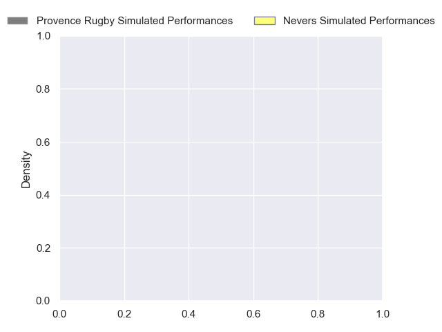
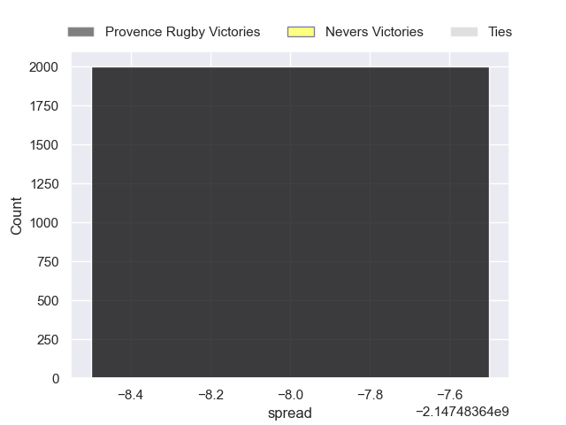

---  
layout: page  
title: Provence Rugby at Nevers  
date: 2024-10-25 18:00:00 -0500  
categories: "Pro D2 2024" match projection  
---
# Provence Rugby at Nevers

# Club Level Predictions

The first set of predictions treats a club as the smallest object, as the club develops its members, organizes a gameplan, and deploys its players as needed for each match. This club model has a prediction of 0.434, which translates to predicting Provence Rugby to win by -1.2.

Our Over/Under is 42.5 - and combined with the spread above, we have a predicted scoreline of 21 to 22

Each club has a rating and a rating deviation (similar to a Glicko rating), and expected performances can be generated. This allows for simulated matches and spreads like the ones below.
## Projected Performances - Club Model

## Projected Spreads - Club Model

## Projected Results - Club Model

# Player Level Predictions

Treating teams instead as an entity made up of the currently active players, I have ratings for each player in an altogether different system. These can be combined to form team ratings once teamsheets are announced, weighting starters a bit higher than the reserves. After the match is played, players can be weighted by their minutes on the field, allowing for an accurate measure of the team's composition. With these compiled team ratings, we can make predictions, measure inaccuracy, and update the individual player ratings.
## Prediction without Player Minutes: Provence Rugby by nan

Provence Rugby by 0.1 on a neutral pitch

## Projected Performances - Player Model

## Projected Spreads - Player Model

## Projected Results - Player Model

| Away Player        |   Away Percentile |   Number |   Home Percentile | Home Player      |
|:-------------------|------------------:|---------:|------------------:|:-----------------|
| Julius Nostadt     |            nan    |        1 |               nan | Kamaliele Tufele |
| Joseph Laget       |            nan    |        2 |               nan | Jonathan Maïau   |
| Enrique Pieretto   |            nan    |        3 |               nan | Cleopas Kundiona |
| Jérôme Dufour      |            nan    |        4 |               nan | Lasha Jaiani     |
| Izack Rodda        |            nan    |        5 |               nan | Kévin Noah       |
| Guillaume Piazzoli |            nan    |        6 |               nan | Julien Kazubek   |
| Charly Gambini     |             65.67 |        7 |               nan | Hugues Bastide   |
| Tornike Jalagonia  |            nan    |        8 |               nan | Jason Fraser     |
| Joris Cazenave     |            nan    |        9 |               nan | Simon Tarel      |
| Jules Plisson      |            nan    |       10 |               nan | Shaun Reynolds   |
| Léo Drouet         |            nan    |       11 |               nan | Arthur Mathiron  |
| Jimmy Gopperth     |            nan    |       12 |               nan | Nicolas Ragoevi  |
| Inga Finau         |            nan    |       13 |               nan | Rudy Derrieux    |
| Adrien Lapègue     |            nan    |       14 |               nan | Lucas Blanc      |
| Mathias Colombet   |            nan    |       15 |               nan | Dylan Jaminet    |
| Loick Jammes       |            nan    |       16 |               nan | Efi Ma'Afu       |
| Nicolás Toth       |            nan    |       17 |               nan | Aitor Kitutu     |
| Josh Tyrell        |            nan    |       18 |               nan | Ugo Vignolles    |
| Baptiste Belhadj   |            nan    |       19 |               nan | Luka Plataret    |
| Kévin Viallard     |            nan    |       20 |               nan | Rati Zazadze (2) |
| Eto Bainivalu      |            nan    |       21 |               nan | Hugo Bouyssou    |
| Atila Septar       |            nan    |       22 |               nan | Gabin Rocher     |
| Eliott Yemsi       |            nan    |       23 |               nan | Aselo Ikahehegi  |

