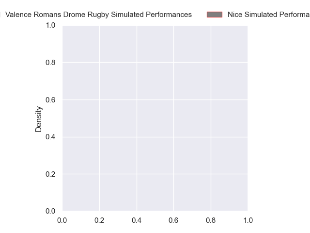
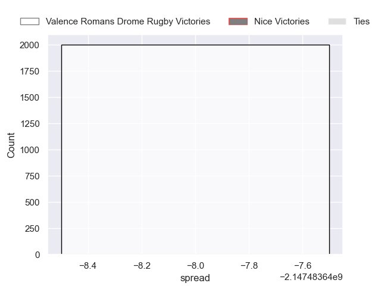
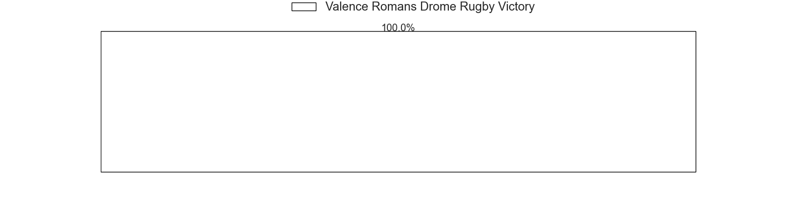

---  
layout: page  
title: Valence Romans Drome Rugby at Nice  
date: 2024-10-25 18:00:00 -0500  
categories: "Pro D2 2024" match projection  
---
# Valence Romans Drome Rugby at Nice

# Club Level Predictions

The first set of predictions treats a club as the smallest object, as the club develops its members, organizes a gameplan, and deploys its players as needed for each match. This club model has a prediction of 0.525, which translates to predicting Nice to win by 4.1.

Our Over/Under is 47.5 - and combined with the spread above, we have a predicted scoreline of 22 to 26

Each club has a rating and a rating deviation (similar to a Glicko rating), and expected performances can be generated. This allows for simulated matches and spreads like the ones below.
## Projected Performances - Club Model

## Projected Spreads - Club Model

## Projected Results - Club Model

# Player Level Predictions

Treating teams instead as an entity made up of the currently active players, I have ratings for each player in an altogether different system. These can be combined to form team ratings once teamsheets are announced, weighting starters a bit higher than the reserves. After the match is played, players can be weighted by their minutes on the field, allowing for an accurate measure of the team's composition. With these compiled team ratings, we can make predictions, measure inaccuracy, and update the individual player ratings.
## Prediction without Player Minutes: Valence Romans Drome Rugby by nan

Valence Romans Drome Rugby by 0.1 on a neutral pitch

## Projected Performances - Player Model

## Projected Spreads - Player Model

## Projected Results - Player Model

| Away Player       |   Away Percentile |   Number |   Home Percentile | Home Player        |
|:------------------|------------------:|---------:|------------------:|:-------------------|
| Andréa Pontanier  |            nan    |        1 |               nan | Facundo Gigena     |
| Cyril Deligny     |            nan    |        2 |               nan | Sione Anga'Aelangi |
| Vincent Vial      |            nan    |        3 |               nan | Luvuyo Pupuma      |
| Ryan Mccauley     |            nan    |        4 |               nan | Tom Murday         |
| Darren O'Shea     |            nan    |        5 |               nan | Martin Freytes     |
| Axel Bruchet      |            nan    |        6 |               nan | Arthur Vignolles   |
| Thembelani Bholi  |            nan    |        7 |               nan | Louis Suaud        |
| Matthieu Vachon   |            nan    |        8 |               nan | Jordan Taufua      |
| Thomas Lhuséro    |            nan    |        9 |               nan | Thibault Dufau     |
| Lucas Méret       |            nan    |       10 |               nan | Romain Riguet      |
| George Worth      |            nan    |       11 |               nan | Corentin Penc'Hoat |
| Louis Marrou      |            nan    |       12 |               nan | Alban Conduché     |
| Mathieu Guillomot |            nan    |       13 |               nan | Nathan Courtade    |
| Adam Vargas       |            nan    |       14 |               nan | Christiaan Erasmus |
| Joris De Moura    |            nan    |       15 |               nan | Paul Auradou       |
| Dorian Marco-Pena |            nan    |       16 |               nan | Pierre Strippoli   |
| Anthony Aléo      |            nan    |       17 |               nan | Julien Beaufils    |
| Éloi Massot       |            nan    |       18 |               nan | Clément Chartier   |
| Otar Giorgadze    |             74.17 |       19 |               nan | Thibaud Rey        |
| Mattéo Rodor      |            nan    |       20 |               nan | Ramiha Smiler      |
| Anatole Pauvert   |            nan    |       21 |               nan | Jules Solinas      |
| Sven Girlando     |            nan    |       22 |               nan | Mathis Viard       |
| Enzo Bailly       |            nan    |       23 |               nan | Nicolás Ciancio    |

