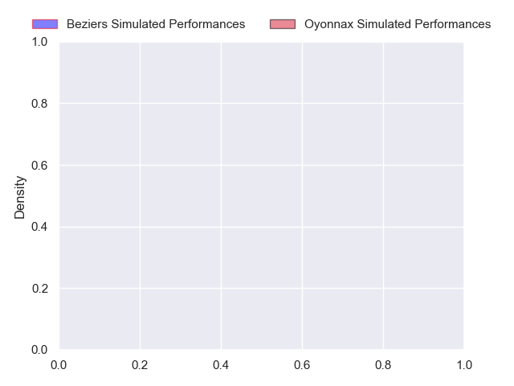
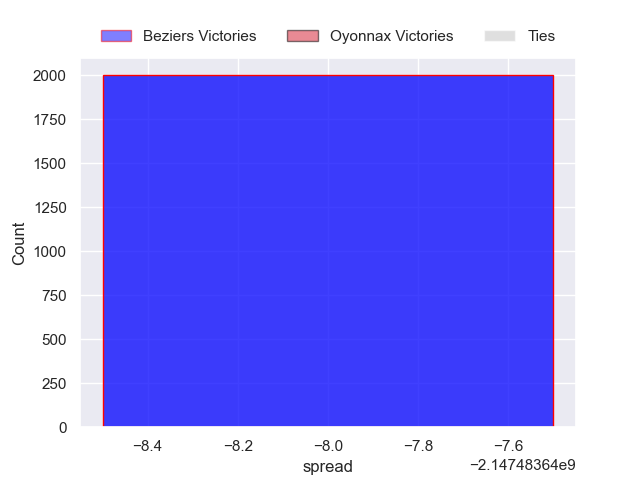
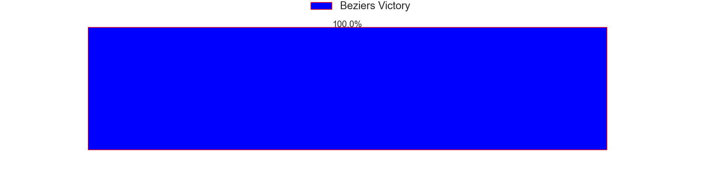

---  
layout: page  
title: Beziers at Oyonnax  
date: 2024-10-25 18:00:00 -0500  
categories: "Pro D2 2024" match projection  
---
# Beziers at Oyonnax

# Club Level Predictions

The first set of predictions treats a club as the smallest object, as the club develops its members, organizes a gameplan, and deploys its players as needed for each match. This club model has a prediction of 0.571, which translates to predicting Oyonnax to win by 6.0.

Our Over/Under is 44.5 - and combined with the spread above, we have a predicted scoreline of 19 to 25

Each club has a rating and a rating deviation (similar to a Glicko rating), and expected performances can be generated. This allows for simulated matches and spreads like the ones below.
## Projected Performances - Club Model

## Projected Spreads - Club Model

## Projected Results - Club Model

# Player Level Predictions

Treating teams instead as an entity made up of the currently active players, I have ratings for each player in an altogether different system. These can be combined to form team ratings once teamsheets are announced, weighting starters a bit higher than the reserves. After the match is played, players can be weighted by their minutes on the field, allowing for an accurate measure of the team's composition. With these compiled team ratings, we can make predictions, measure inaccuracy, and update the individual player ratings.
## Prediction without Player Minutes: Beziers by nan

Beziers by 12.4 on a neutral pitch

## Projected Performances - Player Model

## Projected Spreads - Player Model

## Projected Results - Player Model

| Away Player        |   Away Percentile |   Number |   Home Percentile | Home Player         |
|:-------------------|------------------:|---------:|------------------:|:--------------------|
| Marco Trauth       |             74.05 |        1 |              4.7  | Adrien Bordenave    |
| Wilmar Arnoldi     |            nan    |        2 |            nan    | Teddy Durand        |
| Yannick Arroyo     |            nan    |        3 |            nan    | Ali Oz              |
| Gillian Benoy      |            nan    |        4 |            nan    | Phoenix Battye      |
| Cam Dodson         |            nan    |        5 |            nan    | Ewan Johnson        |
| Otunuku Pauta      |            nan    |        6 |            nan    | Kevin Lebreton      |
| Clément Ancely     |            nan    |        7 |            nan    | Antoine Miquel      |
| Sias Koen          |            nan    |        8 |            nan    | Loic Godener        |
| Damien Añon        |            nan    |        9 |            nan    | Vasil Lobzhanidze   |
| Samuel Marques     |            nan    |       10 |             38.39 | Chris William Smith |
| Paul Réau          |            nan    |       11 |            nan    | Daniel Ikpefan      |
| Watisoni Votu      |            nan    |       12 |            nan    | Lucas Mensa         |
| Paul Recor         |            nan    |       13 |            nan    | Chris Farrell       |
| Pierre Courtaud    |            nan    |       14 |             12.01 | Gavin Stark         |
| Gabin Lorre        |            nan    |       15 |            nan    | Darren Sweetnam     |
| Yvann Lalevée      |            nan    |       16 |            nan    | Peniami Narisia     |
| Yahnis El Maslouhi |            nan    |       17 |            nan    | Oli Kebble          |
| Shahn Eru          |            nan    |       18 |            nan    | Hugo Fabregue       |
| William Van Bost   |            nan    |       19 |            nan    | Kevin Kornath       |
| Hugo Gomes Camacho |            nan    |       20 |            nan    | Yvan David          |
| Victor Dreuille    |            nan    |       21 |            nan    | Maxime Salles       |
| Baptiste Abescat   |            nan    |       22 |            nan    | Eddie Sawailau      |
| Christian Judge    |            nan    |       23 |             18.51 | Christopher Vaotoa  |

