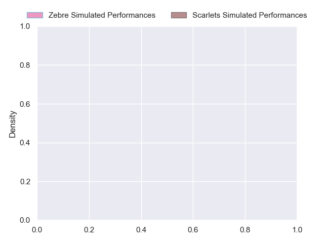
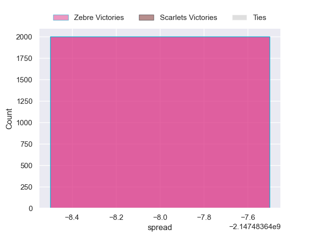

---  
layout: page  
title: Zebre at Scarlets  
date: 2024-10-25 18:00:00 -0500  
categories: "United Rugby Championship 2024" match projection  
---
# Zebre at Scarlets

# Club Level Predictions

The first set of predictions treats a club as the smallest object, as the club develops its members, organizes a gameplan, and deploys its players as needed for each match. This club model has a prediction of 0.635, which translates to predicting Scarlets to win by 8.1.

Our Over/Under is 49.5 - and combined with the spread above, we have a predicted scoreline of 21 to 29

Each club has a rating and a rating deviation (similar to a Glicko rating), and expected performances can be generated. This allows for simulated matches and spreads like the ones below.
## Projected Performances - Club Model

## Projected Spreads - Club Model

## Projected Results - Club Model

# Player Level Predictions

Treating teams instead as an entity made up of the currently active players, I have ratings for each player in an altogether different system. These can be combined to form team ratings once teamsheets are announced, weighting starters a bit higher than the reserves. After the match is played, players can be weighted by their minutes on the field, allowing for an accurate measure of the team's composition. With these compiled team ratings, we can make predictions, measure inaccuracy, and update the individual player ratings.
## Prediction without Player Minutes: Scarlets by 4.1

Zebre by 1.9 on a neutral pitch

## Projected Performances - Player Model

## Projected Spreads - Player Model

## Projected Results - Player Model

| Away Player            |   Away Percentile |   Number |   Home Percentile | Home Player          |
|:-----------------------|------------------:|---------:|------------------:|:---------------------|
| Danilo Fischetti       |            nan    |        1 |            nan    | Alec Hepburn         |
| Tommaso Di Bartolomeo  |            nan    |        2 |            nan    | Ryan Elias           |
| Juan Pitinari          |            nan    |        3 |            nan    | Henry Thomas         |
| Matteo Canali          |            nan    |        4 |              3.99 | Jac Price            |
| Andrea Zambonin        |            nan    |        5 |            nan    | Sam Lousi            |
| Davide Ruggeri         |            nan    |        6 |            nan    | Max Douglas          |
| Luca Andreani          |            nan    |        7 |            nan    | Josh MacLeod         |
| Giovanni Licata        |            nan    |        8 |            nan    | Taine Plumtree       |
| Alessandro Fusco       |            nan    |        9 |            nan    | Gareth Davies        |
| Giovanni Montemauri    |            nan    |       10 |            nan    | Sam Costelow         |
| Simone Gesi            |            nan    |       11 |            nan    | Blair Murray         |
| Damiano Mazza          |             79.42 |       12 |            nan    | Eddie James          |
| Luca Morisi            |            nan    |       13 |            nan    | Macs Page            |
| Ben Cambriani          |            nan    |       14 |            nan    | Tom Rogers           |
| Geronimo Prisciantelli |            nan    |       15 |            nan    | Ioan Lloyd           |
| Luca Bigi              |             78.77 |       16 |            nan    | Marnus van der Merwe |
| Muhamed Hasa           |             22.31 |       17 |            nan    | Kemsley Mathias      |
| Ion Neculai            |            nan    |       18 |            nan    | Sam Wainwright       |
| Leonard Krumov         |            nan    |       19 |            nan    | Alex Craig           |
| Giacomo Ferrari        |            nan    |       20 |            nan    | Jarrod Taylor        |
| Gonzalo Garcia         |            nan    |       21 |             39.16 | Efan Jones           |
| Enrico Lucchin         |             71.81 |       22 |            nan    | Ioan Nicholas        |
| Giacomo Da Re          |            nan    |       23 |            nan    | Johnny Williams      |

