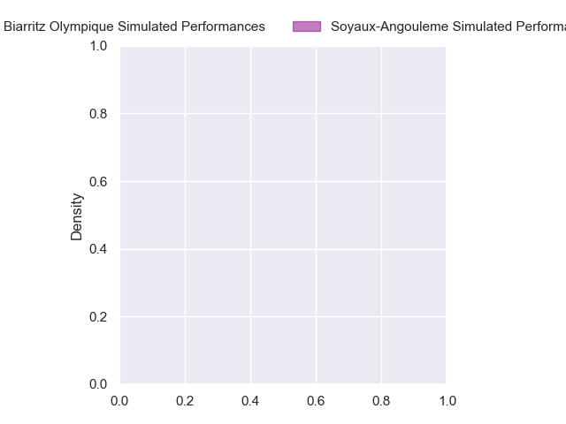
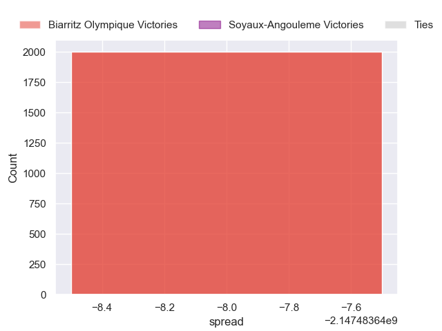

---  
layout: page  
title: Biarritz Olympique at Soyaux-Angouleme  
date: 2024-10-25 18:00:00 -0500  
categories: "Pro D2 2024" match projection  
---
# Biarritz Olympique at Soyaux-Angouleme

# Club Level Predictions

The first set of predictions treats a club as the smallest object, as the club develops its members, organizes a gameplan, and deploys its players as needed for each match. This club model has a prediction of 0.535, which translates to predicting Soyaux-Angouleme to win by 4.5.

Our Over/Under is 45.5 - and combined with the spread above, we have a predicted scoreline of 21 to 25

Each club has a rating and a rating deviation (similar to a Glicko rating), and expected performances can be generated. This allows for simulated matches and spreads like the ones below.
## Projected Performances - Club Model

## Projected Spreads - Club Model

## Projected Results - Club Model

# Player Level Predictions

Treating teams instead as an entity made up of the currently active players, I have ratings for each player in an altogether different system. These can be combined to form team ratings once teamsheets are announced, weighting starters a bit higher than the reserves. After the match is played, players can be weighted by their minutes on the field, allowing for an accurate measure of the team's composition. With these compiled team ratings, we can make predictions, measure inaccuracy, and update the individual player ratings.
## Prediction without Player Minutes: Biarritz Olympique by nan

Biarritz Olympique by 0.1 on a neutral pitch

## Projected Performances - Player Model

## Projected Spreads - Player Model

## Projected Results - Player Model

| Away Player         |   Away Percentile |   Number |   Home Percentile | Home Player          |
|:--------------------|------------------:|---------:|------------------:|:---------------------|
| Killian Taofifenua  |               nan |        1 |               nan | Paul Tailhades       |
| Clément Martinez    |               nan |        2 |               nan | Patxi Bidart         |
| Solomone Tukuafu    |               nan |        3 |               nan | Omar Dahir           |
| Levi Douglas        |               nan |        4 |               nan | Maxence Lemardelet   |
| Piula Fa'asalele    |               nan |        5 |               nan | Sikeli Nabou         |
| Ekain Imaz Agirre   |               nan |        6 |               nan | Gautier Gibouin      |
| Jessy Jegerlehner   |               nan |        7 |               nan | Clément Sentubéry    |
| Filimo Taofifenua   |               nan |        8 |               nan | Alex Masibaka (2)    |
| Kerman Aurrekoetxea |               nan |        9 |               nan | Adrien Bau           |
| Enzo Selponi        |               nan |       10 |               nan | Ben Botica           |
| Steeve Barry        |               nan |       11 |               nan | Eoghan Barrett       |
| Jonathan Joseph     |               nan |       12 |               nan | Mathis Lafon         |
| Yann David          |               nan |       13 |               nan | Ledua Mau            |
| Zach Kibirige       |               nan |       14 |               nan | Nathan Farissier     |
| Kylian Jaminet      |               nan |       15 |               nan | Jules Dubecq         |
| Yohan Beheregaray   |               nan |       16 |               nan | Rayne Barka          |
| Alexandre Plantier  |               nan |       17 |               nan | Georgy Balakarev (2) |
| Charlie Matthews    |               nan |       18 |               nan | Léo Morand-Bruyat    |
| Nafi Ma'Afu         |               nan |       19 |               nan | Enzo Morand-Bruyat   |
| Imanol Biscay       |               nan |       20 |               nan | Emmanuel Saubusse    |
| Mathieu Acebes      |               nan |       21 |               nan | Hubert Texier        |
| François Vergnaud   |               nan |       22 |               nan | George Tilsley       |
| Giorgi Nutsubidze   |               nan |       23 |               nan | Seydou Diakité       |

