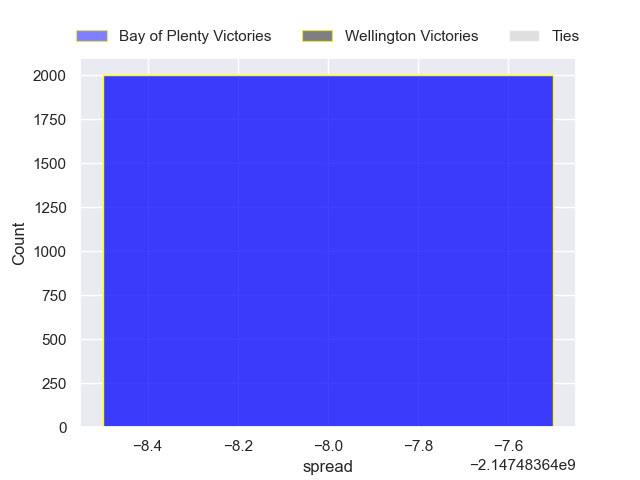

---  
layout: page  
title: Bay of Plenty at Wellington  
date: 2024-10-25 18:00:00 -0500  
categories: "National Provence Championship 2024" match projection  
---
# Bay of Plenty at Wellington

# Club Level Predictions

The first set of predictions treats a club as the smallest object, as the club develops its members, organizes a gameplan, and deploys its players as needed for each match. This club model has a prediction of 0.661, which translates to predicting Wellington to win by 6.2.

Each club has a rating and a rating deviation (similar to a Glicko rating), and expected performances can be generated. This allows for simulated matches and spreads like the ones below.
## Projected Performances - Club Model

## Projected Spreads - Club Model

## Projected Results - Club Model

# Player Level Predictions

Treating teams instead as an entity made up of the currently active players, I have ratings for each player in an altogether different system. These can be combined to form team ratings once teamsheets are announced, weighting starters a bit higher than the reserves. After the match is played, players can be weighted by their minutes on the field, allowing for an accurate measure of the team's composition. With these compiled team ratings, we can make predictions, measure inaccuracy, and update the individual player ratings.
## Prediction without Player Minutes: Bay of Plenty by nan

Bay of Plenty by nan on a neutral pitch

## Projected Performances - Player Model

## Projected Spreads - Player Model

## Projected Results - Player Model

| Away Player            |   Away Percentile |   Number |   Home Percentile | Home Player           |
|:-----------------------|------------------:|---------:|------------------:|:----------------------|
| Aidan Ross             |               nan |        1 |               nan | Xavier Numia          |
| Kurt Eklund            |               nan |        2 |               nan | Leni Apisai           |
| Benet Kumeroa          |               nan |        3 |               nan | Siale Lauaki          |
| Naitoa Ah Kuoi         |               nan |        4 |               nan | Hugo Plummer          |
| Aisake Vakasiuola      |               nan |        5 |               nan | Akira Ieremia         |
| Jacob Norris           |               nan |        6 |               nan | Caleb Delany          |
| Joe Johnston           |               nan |        7 |               nan | Du'Plessis Kirifi     |
| Nikora Broughton       |               nan |        8 |               nan | Brad Shields          |
| Te Toiroa Tahuriorangi |               nan |        9 |               nan | Kyle Preston          |
| Kaleb Trask            |               nan |       10 |               nan | Jackson Garden-Bachop |
| Reon Paul              |               nan |       11 |               nan | Losilosivale Filipo   |
| Uilisi Halaholo        |               nan |       12 |               nan | Riley Higgins         |
| Emoni Narawa           |               nan |       13 |               nan | Peter Umaga-Jensen    |
| Leroy Carter           |               nan |       14 |               nan | Julian Savea          |
| Cole Forbes            |               nan |       15 |               nan | Tjay Clarke           |
| Taine Kolose           |               nan |       16 |               nan | Hikawera Elliot       |
| Josh Bartlett          |               nan |       17 |               nan | Yota Kamimori         |
| Filipe Vakasiuola      |               nan |       18 |               nan | Bradley Crichton      |
| Kalin Felise           |               nan |       19 |               nan | Filo Paulo            |
| Semisi Paea            |               nan |       20 |               nan | Sione Halalilo        |
| Lucas Cashmore         |               nan |       21 |               nan | Nui Muriwai           |
| Fehi Fineanganofo      |               nan |       22 |               nan | Callum Harkin         |
| Codemeru Vai           |               nan |       23 |               nan | Stanley Solomon       |

