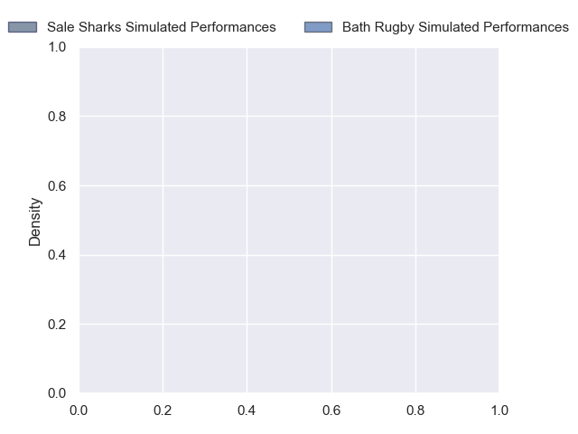
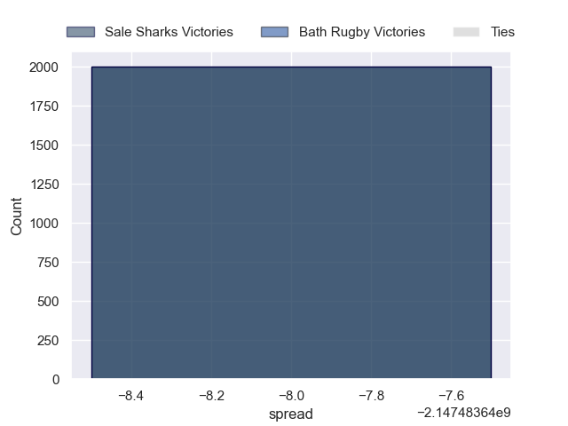

---  
layout: page  
title: Sale Sharks at Bath Rugby  
date: 2024-10-26 18:00:00 -0500  
categories: "Gallagher Premiership 2024" match projection  
---
# Sale Sharks at Bath Rugby

# Club Level Predictions

The first set of predictions treats a club as the smallest object, as the club develops its members, organizes a gameplan, and deploys its players as needed for each match. This club model has a prediction of 0.583, which translates to predicting Bath Rugby to win by 6.5.

Our Over/Under is 53.5 - and combined with the spread above, we have a predicted scoreline of 24 to 30

Each club has a rating and a rating deviation (similar to a Glicko rating), and expected performances can be generated. This allows for simulated matches and spreads like the ones below.
## Projected Performances - Club Model

## Projected Spreads - Club Model

## Projected Results - Club Model

# Player Level Predictions

Treating teams instead as an entity made up of the currently active players, I have ratings for each player in an altogether different system. These can be combined to form team ratings once teamsheets are announced, weighting starters a bit higher than the reserves. After the match is played, players can be weighted by their minutes on the field, allowing for an accurate measure of the team's composition. With these compiled team ratings, we can make predictions, measure inaccuracy, and update the individual player ratings.
## Prediction without Player Minutes: Bath Rugby by 10.6

Bath Rugby by 2.5 on a neutral pitch

## Projected Performances - Player Model

## Projected Spreads - Player Model

## Projected Results - Player Model

| Away Player          |   Away Percentile |   Number |   Home Percentile | Home Player      |
|:---------------------|------------------:|---------:|------------------:|:-----------------|
| Simon McIntyre       |            nan    |        1 |            nan    | Beno Obano       |
| Tadgh McElroy        |             23.08 |        2 |            nan    | Tom Dunn         |
| James Harper         |            nan    |        3 |            nan    | Thomas du Toit   |
| Ben Bamber           |            nan    |        4 |            nan    | Quinn Roux       |
| Hyron Andrews        |            nan    |        5 |            nan    | Ross Molony      |
| Ernst van Rhyn       |            nan    |        6 |            nan    | Ted Hill         |
| Sam Dugdale          |            nan    |        7 |            nan    | Guy Pepper       |
| Daniel du Preez      |            nan    |        8 |            nan    | Miles Reid       |
| Gus Warr             |            nan    |        9 |             81.55 | Louis Schreuder  |
| Robert du Preez      |            nan    |       10 |            nan    | Finn Russell     |
| Arron Reed           |            nan    |       11 |            nan    | Will Muir        |
| Sam Bedlow           |            nan    |       12 |            nan    | Will Butt        |
| Luke James           |            nan    |       13 |            nan    | Louie Hennessey  |
| Will Addison         |            nan    |       14 |            nan    | Joe Cokanasiga   |
| Joe Carpenter        |            nan    |       15 |            nan    | Tom de Glanville |
| Ethan Caine          |            nan    |       16 |            nan    | Niall Annett     |
| Tumy Onasanya        |             19.58 |       17 |             91.5  | Francois van Wyk |
| Asher Opoku-Fordjour |            nan    |       18 |            nan    | Billy Sela       |
| Le Roux Roets        |             38.32 |       19 |            nan    | Josh Bayliss     |
| Josh Beaumont        |            nan    |       20 |            nan    | Ethan Staddon    |
| Jean-Luc du Preez    |            nan    |       21 |            nan    | Tom Carr-Smith   |
| Nye Thomas           |            nan    |       22 |             57.14 | Orlando Bailey   |
| Tom Curtis           |            nan    |       23 |             64.17 | Jaco Coetzee     |

