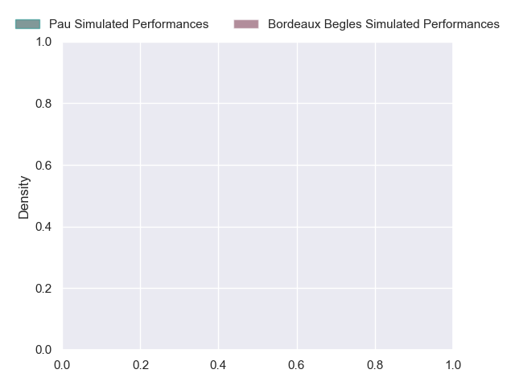
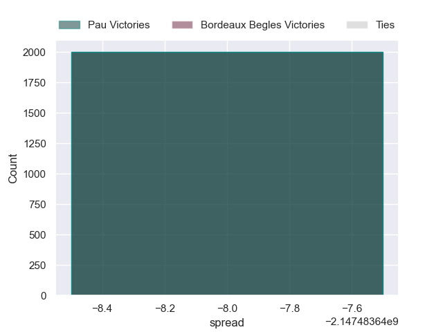

---  
layout: page  
title: Pau at Bordeaux Begles  
date: 2024-10-26 18:00:00 -0500  
categories: "Top 14 2024" match projection  
---
# Pau at Bordeaux Begles

# Club Level Predictions

The first set of predictions treats a club as the smallest object, as the club develops its members, organizes a gameplan, and deploys its players as needed for each match. This club model has a prediction of 0.653, which translates to predicting Bordeaux Begles to win by 8.5.

Our Over/Under is 58.5 - and combined with the spread above, we have a predicted scoreline of 25 to 33

Each club has a rating and a rating deviation (similar to a Glicko rating), and expected performances can be generated. This allows for simulated matches and spreads like the ones below.
## Projected Performances - Club Model

## Projected Spreads - Club Model

## Projected Results - Club Model

# Player Level Predictions

Treating teams instead as an entity made up of the currently active players, I have ratings for each player in an altogether different system. These can be combined to form team ratings once teamsheets are announced, weighting starters a bit higher than the reserves. After the match is played, players can be weighted by their minutes on the field, allowing for an accurate measure of the team's composition. With these compiled team ratings, we can make predictions, measure inaccuracy, and update the individual player ratings.
## Prediction without Player Minutes: Pau by nan

Pau by nan on a neutral pitch

## Projected Performances - Player Model

## Projected Spreads - Player Model

## Projected Results - Player Model

| Away Player         |   Away Percentile |   Number |   Home Percentile | Home Player          |
|:--------------------|------------------:|---------:|------------------:|:---------------------|
| nan                 |            nan    |        1 |               nan | Matis Perchaud       |
| nan                 |            nan    |        2 |               nan | Maxime Lamothe       |
| nan                 |            nan    |        3 |               nan | Sipili Falatea       |
| nan                 |            nan    |        4 |               nan | Jonny Gray           |
| Jimi Maximin        |            nan    |        5 |               nan | Cyril Cazeaux        |
| Lekima Tagitagivalu |            nan    |        6 |               nan | Marko Gazzotti       |
| Mehdi Tlili         |            nan    |        7 |               nan | Temo Matiu           |
| Loic Credoz         |            nan    |        8 |               nan | Pete Samu            |
| Thibault Daubagna   |            nan    |        9 |               nan | Maxime Lucu          |
| Axel Desperes       |            nan    |       10 |               nan | Matthieu Jalibert    |
| Aaron Grandidier    |            nan    |       11 |               nan | Louis Bielle-Biarrey |
| Nathan Decron       |            nan    |       12 |               nan | Ben Tapuai           |
| Olivier Klemenczak  |            nan    |       13 |               nan | nan                  |
| Aymeric Luc         |            nan    |       14 |               nan | Damian Penaud        |
| Theo Attissogbe     |            nan    |       15 |               nan | nan                  |
| Dan Jooste          |             41.23 |       16 |               nan | nan                  |
| Ignacio Calles      |            nan    |       17 |               nan | nan                  |
| Hugo Auradou        |            nan    |       18 |               nan | nan                  |
| Mickael Capelli     |            nan    |       19 |               nan | nan                  |
| Sacha Zegueur       |            nan    |       20 |               nan | nan                  |
| Dan Robson          |            nan    |       21 |               nan | nan                  |
| Emilien Gailleton   |            nan    |       22 |               nan | nan                  |
| Jon Zabala          |            nan    |       23 |               nan | nan                  |

